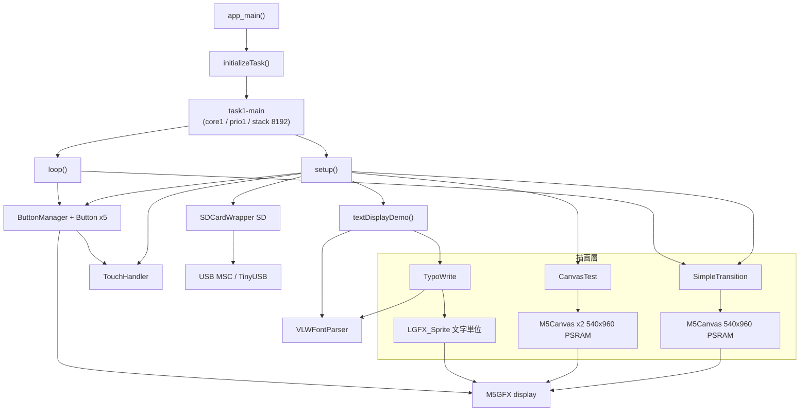

# ayame_sys プログラム仕様書

M5Paper S3（ESP32-S3 + 電子ペーパー）向け、日本語縦書き表示機能を持つアドベンチャーゲーム系システムの
`main/` コンポーネント仕様書。

- 対象ディレクトリ: `main/`
- 作成日: 2026-07-30
- 本書はリバースエンジニアリング（既存ソースの読み取り）によって作成したものであり、**コードの修正は行っていない**。
- 各メソッドの章末に、実装上の疑問点・非効率箇所を `Todo:` として記載している。

---

## 目次

1. [システム概要](#1-システム概要)
2. [ビルド構成](#2-ビルド構成)
3. [全体アーキテクチャ](#3-全体アーキテクチャ)
4. [hello_world_main.cpp — アプリケーション本体](#4-hello_world_maincpp--アプリケーション本体)
5. [SDcard — SDカード / USB MSC 管理](#5-sdcard--sdカード--usb-msc-管理)
6. [TouchHandler — タッチ入力処理](#6-touchhandler--タッチ入力処理)
7. [Button / ButtonManager — ボタンUI](#7-button--buttonmanager--ボタンui)
8. [VLWFontParser — VLWフォント解析](#8-vlwfontparser--vlwフォント解析)
9. [TypoWrite — 縦書き / 横書きテキスト描画](#9-typowrite--縦書き--横書きテキスト描画)
10. [SimpleTransition — 画面遷移エフェクト](#10-simpletransition--画面遷移エフェクト)
11. [CanvasTest — PSRAMダブルバッファ検証](#11-canvastest--psramダブルバッファ検証)
12. [全体課題サマリ](#12-全体課題サマリ)

---

## 1. システム概要

### 1.1 目的

電子ペーパー端末上で、日本語（縦書き対応）テキストと画面遷移演出を用いたアドベンチャーゲーム風の
表示を行うためのシステム基盤。現状は各サブシステムの**動作検証アプリ**の状態であり、
ゲームシナリオ本体やステートマシンは未実装。

### 1.2 ハードウェア構成

| 項目 | 値 | 備考 |
|---|---|---|
| SoC | ESP32-S3 | `CONFIG_IDF_TARGET="esp32s3"` |
| PSRAM | 有効 / Octal / 80MHz | `CONFIG_SPIRAM_MODE_OCT=y` |
| ディスプレイ | 電子ペーパー 540 × 960 | M5GFX 経由 |
| 色深度 | 1bpp（モノクロ） | `display.setColorDepth(1)` |
| EPD描画モード | `epd_quality` | 全画面リフレッシュ品質優先 |
| タッチパネル | M5GFX 内蔵ドライバ | `display.getTouch()` |
| SDカード | SPI接続（SPI2_HOST） | MISO=40 / MOSI=38 / SCK=39 / CS=47 |
| USB | TinyUSB（MSCデバイス） | SDカードをPCへ公開 |
| FreeRTOS tick | 100Hz | `vTaskDelay(1)` = 10ms |

### 1.3 主要機能

- SDカードのマウント、ファイル一覧取得、PNG表示
- USB MSC による SDカードのPC公開／解除
- 静電容量タッチのタッチ／リリース／スワイプ検出
- 矩形・角丸ボタンUI（Display直描画 / Canvas描画の両対応）
- VLW（Processing形式）フォントのメトリクス解析
- 日本語縦書き・横書き描画（小文字の縮小配置、縦書き専用グリフ差し替え、半角文字の90°回転）
- 電子ペーパー向け画面遷移エフェクト（フェード／スライド／ワイプ／中央展開／角展開）
- PSRAM上のM5Canvasによるダブルバッファリング性能検証

---

## 2. ビルド構成

### 2.1 `main/CMakeLists.txt`

| 区分 | 内容 |
|---|---|
| SRCS | `hello_world_main.cpp`, `SDcard.cpp`, `TouchHandler.cpp`, `Button.cpp`, `TypoWrite.cpp`, `VLWFontParser.cpp`, `SimpleTransition.cpp`, `CanvasTest.cpp` |
| PRIV_REQUIRES | `M5GFX` |
| REQUIRES | `fatfs`, `esp_lcd`, `driver`, `esp_timer`, `tinyusb`, `esp_tinyusb`, `esp_psram` |
| INCLUDE_DIRS | `.`, `fonts` |

`ScreenTransition.cpp` はビルド対象からコメントアウトされている（`SimpleTransition` に置換済み）。

> **Todo（ビルド構成）**
> - `ScreenTransition.cpp` / `.hpp` はビルド対象外だがファイルが残存。`ScreenTransition.old`（44KB）、
>   `TypoWrite.old.txt`（47KB）も同様。Git管理下の死蔵ファイルであり、削除または `archive/` への移動を検討。
> - `REQUIRES` に `tinyusb` と `esp_tinyusb` の両方が指定されている。ルート `CMakeLists.txt` で
>   `EXTRA_COMPONENT_DIRS` に IDF 同梱の `tinyusb/additions` を追加しつつ、`idf_component.yml` で
>   `espressif/esp_tinyusb: ^1.7.2` をマネージドコンポーネントとして取得しており、
>   TinyUSB の実体が二系統存在する構成になっている。どちらか一方に統一すべき。
> - `REQUIRES`（公開依存）に置く必要がないものが多い。`fatfs` / `driver` / `esp_timer` 等は
>   `PRIV_REQUIRES` で足りるため、ビルド依存グラフを不要に広げている。

### 2.2 フォントリソース

`main/fonts/` に VLW をCヘッダ化した配列が格納されている。

| ファイル | 用途 |
|---|---|
| `shippori_16.h` | **現在使用中**（`textDisplayDemo()` が参照） |
| `shippori.h`, `mplus2_16.h`, `mplus2_18.h`, `mplus2_32.h`, `genshin.h`, `myfont.h` | 未使用 |

`append/font/` 配下には VLW 生成用の Python スクリプト（`font_glyph_extractor.py`）、
TTF、および生成済み `.vlw` / `.h` が置かれている（ビルド対象外の作業用ディレクトリ）。

> **Todo（フォントリソース）**
> - 未使用フォントヘッダが6本ある。Cの配列として `.rodata` に載るのは
>   `#include` されたものだけなのでFlashは消費しないが、どれが正解かわからない状態。
>   使用中の1本を残し、他は `append/font/` へ移すのが望ましい。
> - `append/font/` に `maruminya_mini.h` と `marumiya_mini.h`（綴りの異なる同種ファイル）が併存している。

---

## 3. 全体アーキテクチャ



### 3.1 レイヤ構成

| レイヤ | クラス | 責務 |
|---|---|---|
| アプリ | `hello_world_main.cpp` | 初期化、シーン描画、イベント配線、メインループ |
| UI | `Button`, `ButtonManager` | ボタン描画と入力ディスパッチ |
| 入力 | `TouchHandler` | 生タッチ座標のイベント化（タッチ/リリース/スワイプ） |
| テキスト | `TypoWrite`, `VLWFontParser` | 日本語組版とフォントメトリクス |
| 演出 | `SimpleTransition` | Canvas → 画面の段階的転送 |
| 検証 | `CanvasTest` | PSRAM/描画性能の測定 |
| ストレージ | `SDCardWrapper` | FATFS マウント、ファイルI/O、USB MSC |

### 3.2 グローバルオブジェクト

| 名前 | 型 | 定義場所 |
|---|---|---|
| `display` | `M5GFX` | `hello_world_main.cpp` |
| `SD` | `SDCardWrapper` | `SDcard.cpp`（`extern` 宣言は `SDcard.hpp`） |
| `touchHandler` | `TouchHandler` | `hello_world_main.cpp` |
| `vlwParser` | `VLWFontParser` | `hello_world_main.cpp` |
| `buttonManager`, `btn*` | ポインタ | `setup()` 内で `new` |
| `canvasTest`, `simpleTransition` | ポインタ | `setup()` 内で `new` |

> **Todo（アーキテクチャ全体）**
> - `setup()` で `new` したオブジェクトを解放する経路が存在しない（電源が切れるまで常駐）。
>   組み込みでは許容される設計だが、`CanvasTest`（Canvas 2枚）は検証専用であり常駐させる必要がない。
>   `SimpleTransition` の1枚と合わせて Canvas 3枚を常時確保している。
> - 描画先の指定方法が3系統に分裂している（`Button::setDrawTarget()` / `TypoWrite::setDrawTarget()` /
>   `SimpleTransition::getMainCanvas()`）。全モジュールが同一の「現在のフレームバッファ」を
>   参照する仕組みがないため、`setup()` では全部が `display` 直描画になっており、
>   Canvas によるちらつき抑制の恩恵を受けていない。
> - 電子ペーパーであるにもかかわらず `display.fillScreen()` を各処理が個別に呼んでおり、
>   1操作あたり複数回の全画面リフレッシュが発生する。描画のバッチ化ポリシーが存在しない。

---

## 4. `hello_world_main.cpp` — アプリケーション本体

### 4.1 状態変数

| 変数 | 型 | 説明 |
|---|---|---|
| `currentTestMode` | `TestMode` | `NORMAL` / `CANVAS_MEMORY` / `CANVAS_DOUBLE` / `CANVAS_PERFORMANCE` / `SIMPLE_TRANSITION` |
| `currentSceneId` | `int` | 現在のシーン番号（1〜3を循環） |
| `MAX_SCENES` | `const int` | 3 |
| `IMAGE_FILE` | `const char*` | `"tes.png"` |

### 4.2 `app_main()` / `initializeTask()` / `runMainLoop()`

| 項目 | 内容 |
|---|---|
| 処理 | ログレベル設定 → `xTaskCreatePinnedToCore` でメインタスク生成 |
| タスク | 名前 `task1-main` / スタック 8192B / 優先度 1 / コア1固定 |
| ループ | `setup()` 1回 → `for(;;) { loop(); vTaskDelay(1); }` |

> **Todo**
> - `runMainLoop()` 末尾の `vTaskDelete(g_handle)` は `for(;;)` の後ろにあり**到達不能コード**。
> - `vTaskDelay(1)` は `CONFIG_FREERTOS_HZ=100` のため実質 **10ms** 周期。
>   `loop()` 内で `esp_timer_get_time()` による5秒間隔ポーリングをしているので実害は小さいが、
>   タッチの取りこぼし（後述のダブルポーリング問題）を悪化させる要因になる。
> - スタック 8192B のタスク内で `std::function` / `std::unordered_map` / `std::string` を
>   多用するモジュール（`TypoWrite`）を呼んでいる。`textDisplayDemo()` はスタック上に
>   `TypoWrite` を構築するため、スタック消費のワーストケースが読みにくい。
>   `uxTaskGetStackHighWaterMark()` での実測を推奨。
> - `esp_task_wdt.h` / `freertos/idf_additions.h` を include しているが未使用。

### 4.3 `setup()`

初期化順序:

1. `display.begin()` → `setEpdMode(epd_quality)` → `setColorDepth(1)` → `fillScreen(TFT_BLACK)`
2. `SD.init()` → `tes.png` が存在すれば `display.drawPngFile()` → `fillScreen()` → `listAndDisplayFiles()` → `SD.close()`
3. `CanvasTest` 生成 + `init()`（失敗時は `delete` して nullptr）
4. `SimpleTransition` 生成 + `init(true)` + 完了/ステップコールバック登録
5. `TouchHandler::init()` → 成功時のみ `ButtonManager` とボタン5個を生成
6. `textDisplayDemo()`

生成されるボタン:

| 変数 | 位置 (x,y,w,h) | ラベル | 役割 |
|---|---|---|---|
| `btnTest` | 10,350,100,40 | `テストボタン` | 動作確認・スワイプ検証 |
| `btnUSBMSC` | 120,350,100,40 | `USB MSC` | USB MSC の有効/無効トグル |
| `btnCanvasTest` | 230,350,100,40 | `Canvas Test` | Canvas 3種テストの連続実行 |
| `btnTransitionTest` | 340,350,100,40 | `Simple Trans` | トランジションデモ開始 |
| `btnCanvasStop` | 450,350,80,40 | `Stop Test` | テスト中断（初期状態は非表示） |

> **Todo**
> - **PNG表示が無意味になっている**: `display.drawPngFile()` の直後に無条件で
>   `display.fillScreen(TFT_BLACK)` を実行しているため、画像は表示された瞬間に消える。
>   電子ペーパーの全画面リフレッシュ2回分を無駄に消費している。
> - **色指定が全て無効**: `setColorDepth(1)`（1bpp モノクロ）の後に `TFT_BLUE` / `TFT_RED` /
>   `TFT_PURPLE` / `TFT_DARKGREEN` などのカラー値をボタンスタイルやシーン描画で指定している。
>   1bpp では黒/白に丸められるため、意図した見た目にならない。
> - **日本語ラベルが表示できない**: `btnTest` のラベルが `"テストボタン"` だが、`Button` は
>   `setFont()` が呼ばれない限り M5GFX のデフォルトフォント（ASCIIのみ）で描画するため豆腐になる。
>   `fonts::lgfxJapanGothic_16` 等の設定が必要。
> - `TouchHandler::init()` が失敗すると `buttonManager` が `nullptr` のまま残り、ボタンも生成されない。
>   その状態でも `textDisplayDemo()` は実行されるが、ユーザーは以後一切操作できない。
>   復旧手段やエラー表示の設計がない。
> - `SD.init()` 失敗時も `CanvasTest` 以降の初期化は続行するが、`listAndDisplayFiles()` を
>   後から呼ぶ各コールバックが毎回失敗ログを出す。SDの有無を保持するフラグがない。

### 4.4 `drawScene1()` / `drawScene2()` / `drawScene3()`

指定 `M5Canvas` に対して背景色・タイトル・図形・シナリオテキストを描画する。
シーン1=青、シーン2=深緑（森）、シーン3=紫（神秘空間）。

> **Todo**
> - 3関数の構造がほぼ同一（`fillSprite` → タイトル3行 → 図形 → 本文2行）。
>   シーン定義を「背景色・タイトル・本文・図形リスト」のデータ構造にして
>   1つの汎用描画関数に統合すべき。シーン追加のたびに関数が増える現状はスケールしない。
> - 座標が `SIMPLE_TRANSITION_WIDTH` / `SIMPLE_TRANSITION_HEIGHT` マクロ（540/960固定）で
>   ハードコードされている。引数の `canvas->width()` / `canvas->height()` を使うべき。
>   マクロは `SimpleTransition.hpp` のものであり、シーン描画が遷移モジュールの定数に依存している
>   のはレイヤ違反。
> - `canvas->setTextSize(1.5)` / `(3)` の混在。`setTextSize` は float を取るが、
>   ビットマップフォントの非整数倍拡大は品質が落ちる。
> - 日本語文字列（`"青い世界の始まり"` 等）を描画しているが、`TypoWrite` を経由せず
>   `canvas->drawString()` を直接呼んでいるため、こちらも日本語フォント未設定で豆腐になる。
> - シーン3の `TFT_CYAN + (i * 0x0820)` はRGB565の値を整数加算しており、
>   グラデーションとしての意味を持たない（キャリー越えで色が飛ぶ）。1bppでは無意味。

### 4.5 `drawSceneToMainCanvas(int sceneId)`

`simpleTransition->getMainCanvas()` を取得し、`switch` で該当シーン描画関数へ振り分ける。
未知のIDは警告ログを出してシーン1にフォールバック。

> **Todo**
> - `switch` によるID→関数のディスパッチは、シーン数に比例して分岐が増える。
>   `void (*)(M5Canvas*)` の配列または `std::array` にすれば `MAX_SCENES` との整合も取れる。
> - `MAX_SCENES = 3` と `switch` の `case 1..3` が二重管理になっている。

### 4.6 `advanceToNextScene(SimpleTransitionType)`

`currentSceneId` をインクリメント（`MAX_SCENES` 超で1に戻す）→ メインCanvasへ描画 →
`startTransition(type, 16)` で遷移開始。以降の進行は `loop()` に委譲。

> **Todo**
> - ステップ数に **16** を渡しているが、`SimpleTransition::startTransition()` 内部で
>   `std::min(steps, 8)` にクランプされるため、実際は常に8ステップ。
>   呼び出し側の意図（16段階）が silently 無視されている。
> - シーンの「描画」と「遷移開始」が密結合。シナリオ進行のためには
>   「次のシーンID決定」「描画」「遷移」を分離しておく必要がある。

### 4.7 `textDisplayDemo()`

`vlwParser.init(shippori, sizeof(shippori))` → デバッグ情報出力 → ローカルに `TypoWrite` を構築し、
縦書き設定（位置 400,0 / 領域 130×700 / 行間6 / 字間-8）で日本語サンプル文を描画。

> **Todo（本関数は最も無駄が大きい）**
> - **呼ばれるたびにフォントを再解析している**: 本関数は `setup()` と3つのボタンコールバックから
>   合計4箇所で呼ばれる。そのたびに `vlwParser.init()` が走り、`cleanup()` → `malloc()` →
>   全グリフヘッダの再パースが発生する。フォントデータは不変なので初期化は1回で十分。
>   ヒープの断片化要因にもなる。
> - **`TypoWrite` をローカル変数として毎回構築している**: コンストラクタで
>   `_smallToLargeMap`（22件）、`_verticalGlyphMap`（26件）、`_charAdjustments`（5件）の
>   `unordered_map` を毎回構築し、`LGFX_Sprite` を `new` し、デストラクタで破棄している。
>   さらにメトリクスキャッシュも毎回破棄されるため、キャッシュがほぼ機能しない。
>   グローバル or 静的インスタンスとして保持すべき。
> - `verticalWriter.setBackgroundColor(TFT_TRANSPARENT)` を呼んでいるが、`TypoWrite` には
>   `_transparentBg` を立てるAPIが存在しない（後述 9.4）。よって `TFT_TRANSPARENT` の値が
>   そのまま塗り色として使われ、意図した透過にならない。
> - フォント読み込みが二重: `vlwParser.init(shippori,...)` と
>   `verticalWriter.loadFontFromArray(shippori)` で同じデータを別経路（自作パーサとM5GFX）に
>   読ませている。メトリクス計算と実描画で別実装を使うため、両者の食い違いが
>   位置ずれの原因になりうる。
> - サンプル文がソースにハードコード。シナリオはSDカードから読む設計にすべき。
> - `setCharSpacing(-8)` のようなマジックナンバーが根拠不明のまま埋め込まれている。

### 4.8 `listAndDisplayFiles()`

`SD.listDir("/")` の結果を `display.printf()` で列挙表示し、`SD.freeDirInfo()` で解放。

> **Todo**
> - ローカル変数 `y` を加算して画面下端の判定に使っているが、実際の描画は
>   `display.println()` / `printf()` のカーソル自動送りに任せている。`y` は判定専用の
>   独立カウンタになっており、実際の描画位置とずれる。1行20px固定という仮定も
>   フォントサイズと連動していない。
> - ヘッダ行だけ `setCursor(10,10)` を指定し、以降はカーソル依存。
>   ファイル数が多いと `display.height()-20` の判定より先に画面外へ出る可能性がある。
> - `SD.listDir()` は `.` と `..` を除外しないため、それらも一覧に表示される。
> - エラー時のみ `fillScreen()` を呼び、成功時は呼ばない非対称な作り。
>   呼び出し側で既に `fillScreen()` している箇所と重複している。

### 4.9 タッチ／スワイプコールバック

`onTouchStart()` / `onTouchEnd()` / `onSwipe()` / `onButtonSwipeUp/Down/Left/Right()`。
いずれも `ESP_LOGI` 出力と、`currentTestMode == NORMAL` の場合のみ
画面下部への座標／方向テキスト描画を行う。

> **Todo**
> - 7つの関数がほぼ同一構造（ログ → モード判定 → 色設定 → `setCursor` → `printf`）。
>   色と表示行だけが違うため、共通ヘルパー
>   `showStatus(int lineFromBottom, uint32_t color, const char* fmt, ...)` に統合できる。
> - スワイプ4種は全て `display.height() - 160` の**同じ行**に描画するため、
>   前の表示を上書きする。末尾の空白パディングで消しているが、文字幅が変わると残留する。
> - 電子ペーパーでタッチごとに文字を描画すると、そのたびに部分リフレッシュが発生する。
>   デバッグ表示なのでビルドフラグで無効化できるようにすべき。
> - `onSwipe()` の `start` / `end` 引数が未使用。

### 4.10 ボタンコールバック

| 関数 | 処理 |
|---|---|
| `onTestButtonPressed/Released` | ログと画面へのメッセージ表示のみ |
| `onUSBMSCButtonPressed/Released` | `SD.enableUSBMSC()` / `disableUSBMSC()` のトグル、ラベル更新 |
| `onCanvasTestButtonPressed/Released` | メモリ→性能→ダブルバッファの3テストを**同期実行** |
| `onTransitionTestButtonPressed/Released` | `SIMPLE_TRANSITION` モードへ移行、シーン1を即時表示 |
| `onCanvasStopButtonPressed/Released` | モードに応じてトランジション停止 or Canvasテスト停止 |

> **Todo**
> - **`onCanvasTestButtonReleased()` の Stop ボタンが機能しない**: 本関数は
>   `ButtonManager::update()` → `loop()` と同じタスクで**同期的に**
>   `testMemoryUsage()` → `vTaskDelay(3000)` → `testDrawingPerformance()`（内部で計8秒待機）→
>   `runDoubleBufferTest()`（100フレーム × 33ms ≒ 3.3秒）を実行する。
>   この間 `loop()` は戻ってこないので `btnCanvasStop` のタッチは検出されず、
>   `canvasTest->stopTest()` を呼ぶ手段がない。`_testRunning` フラグによる中断機構が
>   構造的に無効化されている。テストは別タスク化するか、`loop()` から1ステップずつ
>   進めるステートマシンにすべき。
> - 全コールバックの先頭にある `if (currentTestMode != TestMode::NORMAL) return;` が
>   7回以上コピーされている。`ButtonManager` の入力受付自体を止める（`setEnabled(false)`）
>   ほうが素直。
> - `onCanvasTestButtonReleased()` は `btnCanvasStop` / `buttonManager` を null チェックなしで
>   参照している。生成タイミングは同一なので現状は安全だが、前提が暗黙。
> - Pressed 系コールバック4つはログ出力のみで実質空。登録の必要性を再検討。
> - `onCanvasStopButtonReleased()` の後段（テスト停止処理）は、上記の通り
>   `canvasTest->isTestRunning()` が true の状態でタッチを受け付けられないため**到達不能**。
> - 復帰処理 `fillScreen()` → `listAndDisplayFiles()` → `textDisplayDemo()` →
>   `drawButtons()` の4行が3箇所に重複。`redrawNormalScreen()` として括り出すべき。

### 4.11 `loop()`

処理優先順:

1. トランジション実行中なら `simpleTransition->update()` のみ実行して `return`
2. `SIMPLE_TRANSITION` モードならタッチで次シーンへ（遷移種別を9種順番に巡回）して `return`
3. 5秒間隔で USB MSC 接続状態をポーリング表示
4. `buttonManager->update()`
5. `NORMAL` かつ `!buttonManager` のときタッチ座標を表示

> **Todo**
> - **手順5は永久に実行されない**: 条件に `!buttonManager` が含まれるが、`buttonManager` が
>   nullptr になるのは `TouchHandler::init()` 失敗時のみで、その場合そもそも
>   タッチが取得できない。完全なデッドコード。
> - **タッチのダブルポーリング**: 手順4の `ButtonManager::update()` が内部で
>   `_touchHandler->update()` を呼び、手順5でも `touchHandler.update()` を呼んでいる。
>   `TouchHandler::update()` は呼ぶたびにハードウェアを読んで内部状態を更新し
>   イベントを1回だけ返す破壊的メソッドなので、2回呼ぶとイベントを取りこぼす。
>   手順2の `SIMPLE_TRANSITION` 分岐でも同様に独自に `update()` を呼んでおり、
>   タッチの所有者が定まっていない。`loop()` 先頭で1回だけ更新し、
>   結果を各所に配る設計にすべき。
> - 遷移種別の配列 `transitions[]` が `loop()` 内のローカル配列として毎回スタックに構築される
>   （9要素なので影響は小さいが `static constexpr` にすべき）。`transitionTypeIndex` は
>   `static` なので単調増加し、`int` オーバーフロー時に `%` が負を返す可能性がある。
> - USB MSC のポーリング表示は `currentTestMode == NORMAL && SD.isUSBMSCEnabled()` で
>   ガードされているが、`last_check` の更新は条件の外にあるため、
>   条件不成立でもタイマだけが進む。意図的かどうか不明。
> - 電子ペーパー向けとしては、`loop()` が10ms周期で回る必要性がない。
>   イベント駆動（タッチ割り込み待ち）にすれば消費電力が大幅に下がる。

---

## 5. `SDcard` — SDカード / USB MSC 管理

### 5.1 クラス構成

```
lgfx::v1::DataWrapper (M5GFX)
        └── SDCardWrapper      // グローバルインスタンス SD
```

`DataWrapper` を継承しているため、`display.drawPngFile(&SD, path, x, y)` のように
M5GFX の画像デコーダへ直接渡せる。

### 5.2 構造体

| 構造体 | メンバ | 説明 |
|---|---|---|
| `FileInfo` | `name[256]`, `isDirectory`, `size`, `lastModified` | 1エントリの情報 |
| `DirInfo` | `files*`, `count`, `path[256]` | ディレクトリ一覧（`malloc` 確保） |
| `SDConfig`（private） | ピン4本, `max_files`, `format_if_failed`, `mount_point` | 初期化設定 |

### 5.3 `init()` / `init(miso, mosi, sck, cs, max_files, format_if_failed)`

`spi_bus_initialize(SPI2_HOST)` → `SDSPI_HOST_DEFAULT()` → `esp_vfs_fat_sdspi_mount()`。
成功時はカード名・容量・セクタサイズをログ出力。既に初期化済みなら即 `true`。

> **Todo**
> - **失敗時に SPI バスを解放していない**: `esp_vfs_fat_sdspi_mount()` が失敗しても
>   `spi_bus_free(SPI2_HOST)` を呼ばないため、リトライすると
>   `spi_bus_initialize()` が `ESP_ERR_INVALID_STATE` を返して永久に失敗する。
>   カード未挿入時の挿抜リトライが不可能。
> - `max_transfer_sz = 4000` がマジックナンバー。`allocation_unit_size = 16*1024` と
>   整合しておらず、根拠がコメントされていない。
> - `_config` に設定を保存する処理が、成功/失敗を判定する前に行われる。
>   失敗しても壊れた設定が残る。
> - `SDSPI_HOST_DEFAULT()` のクロック設定を変更していないため、
>   カード相性で失敗した場合に低速リトライする手段がない。

### 5.4 `open(path)` / `close()` / `read()` / `skip()` / `seek()` / `tell()`

`DataWrapper` の抽象メソッド実装。`open()` はパスに `/sdcard` プレフィックスが無ければ付加する。
`read()` は `parent` と `fp_pre_read` / `fp_post_read` が設定されていればフックを呼ぶ
（M5GFX がバス排他制御に使用）。

> **Todo**
> - `read(buf, maximum_len, required_len)` は `required_len` を `(void)` で捨てている。
>   M5GFX 側が「最低 required_len バイト読めること」を期待するインタフェースなので、
>   短い読み込みが返った場合の挙動が仕様と食い違う可能性がある。
> - `seek(uint32_t position)` は `fseek` に渡す際に `long` へ暗黙変換される。
>   2GB超のオフセットで破綻する（実用上は問題になりにくい）。
> - `open()` は失敗時に `_file` が nullptr のままだが、`close()` を先に呼ぶため
>   直前に開いていたファイルが失われる。失敗時に元の状態へ戻す保証がない。
> - パス正規化ロジック（`strncmp` でプレフィックス判定 → `snprintf` で連結）が
>   `open` / `exists` / `mkdir` / `remove` / `size` / `listDir` の **6箇所に重複**している。
>   `bool buildFullPath(const char* path, char* out, size_t outSize)` として共通化すべき。

### 5.5 `exists()` / `mkdir()` / `remove()` / `size()`

いずれも「USB MSC 有効ならエラー返却」→「未初期化なら失敗」→「フルパス構築」→
「`stat`/`mkdir`/`remove` 実行」→「ログ出力」の同一パターン。

> **Todo**
> - 前述のパス構築重複に加え、`else` 側で `strncpy(full_path, path, sizeof(full_path))` を
>   使っているが、`strncpy` は切り詰め時に NUL 終端を保証しない。
>   256文字以上のパスでバッファオーバーランを起こす（`snprintf` に統一すべき）。
> - `size()` の戻り値が `uint32_t` で、`st.st_size`（`off_t`）を切り詰めている。
>   4GB超のファイルで誤った値を返す。
> - `exists()` は毎回 `ESP_LOGI` で結果を出力する。ファイル探索ループから呼ばれると
>   ログが溢れる。`ESP_LOGD` が適切。
> - `mkdir()` は中間ディレクトリを作らない（`mkdir -p` 相当がない）。

### 5.6 `listDir(path)` / `freeDirInfo(dirInfo)`

`opendir` → 全エントリを数える → `closedir` → **再度 `opendir`** → `malloc` →
`readdir` + `stat` でメタ情報取得。`freeDirInfo()` で `files` と本体を `free`。

> **Todo**
> - **ディレクトリを2回走査している**: 件数カウント目的で全体を読み、閉じてから開き直している。
>   FATFS + SPI では走査コストが高い。`realloc` による動的拡張、または
>   固定上限（例: 64件）の1パス走査に変更すべき。
> - **2回の走査間の不整合**: 1回目と2回目でエントリ数が変わっても
>   `dirInfo->count` は1回目の値のまま。減っていた場合、末尾要素は**未初期化メモリ**として
>   呼び出し側に渡る（`index < file_count` のループを抜けても `count` を補正していない）。
> - 2回目の `opendir()` の戻り値を**チェックしていない**。失敗すると `readdir(nullptr)` になる。
> - `strncpy(dirInfo->path, path, sizeof(...))` と
>   `strncpy(files[i].name, entry->d_name, sizeof(...))` はいずれも NUL 終端非保証。
> - `.` / `..` を除外しないため、呼び出し側が毎回フィルタする必要がある。
> - `malloc`/`free` を直接使っており、`DirInfo` の解放を呼び出し側の規律に依存している。
>   `std::vector<FileInfo>` を返すか、RAIIラッパにすれば `freeDirInfo()` は不要になる。
> - `ESP_LOGI(..., "%d files found", dirInfo->count)` の `count` は `size_t` なので
>   書式指定子は `%zu` が正しい。

### 5.7 `initMSC()` / `enableUSBMSC()` / `disableUSBMSC()` / `isUSBMSCConnected()`

`tinyusb_driver_install()` → `tinyusb_msc_storage_init_sdmmc()` → `tud_init()` →
`tinyusb_msc_storage_unmount()` の順で、SDカードをUSBホストに明け渡す。
無効化時は `tinyusb_msc_storage_mount()` → `tud_disconnect()`。

> **Todo**
> - **TinyUSB の二重初期化**: `tinyusb_driver_install()` は内部で TinyUSB タスクを起動し
>   `tud_init()` 相当を済ませている。その後に明示的に `tud_init(TUD_OPT_RHPORT)` を
>   呼んでいるのは重複で、実装によっては未定義動作になる。
> - **無効化が対称でない**: `disableUSBMSC()` は `tud_disconnect()` するだけで
>   `tinyusb_driver_uninstall()` を呼ばない。そのため再度 `enableUSBMSC()` すると
>   `tinyusb_driver_install()` が `ESP_ERR_INVALID_STATE` で失敗し、
>   **有効化→無効化→有効化のトグルが2回目で壊れる**。
>   `initMSC()` の実行済みフラグを持つか、uninstall を対で呼ぶ必要がある。
> - **MSCコールバック5関数が完全な死蔵コード**: `onMscRead()` / `onMscWrite()` /
>   `onMscIsReady()` / `onMscGetBlockCount()` / `onMscGetBlockSize()` は
>   プロトタイプ宣言と実装があるだけで、どこにも登録・参照されていない
>   （`tinyusb_msc_storage_init_sdmmc()` が内部処理するため不要になった残骸）。
>   約60行が無駄で、`-Wunused-function` の警告源。削除すべき。
> - `onMscGetBlockCount()` が `card->csd.capacity` を返しているが、これはセクタ数であり
>   実装意図としては正しい一方、`onMscRead/Write` の `offset` 引数は無視されている。
>   将来コールバックを有効化する場合は不正なデータ転送になる。
> - `disableUSBMSC()` は `tinyusb_msc_storage_mount()` の失敗を「続行する」とコメントして
>   無視するが、その結果 `_usbMscEnabled = false` になり、アプリは
>   マウントされていないSDへアクセスしようとする。
> - グローバルインスタンス `SD` のデストラクタで `disableUSBMSC()` と
>   `esp_vfs_fat_sdcard_unmount()` を呼んでいるが、静的オブジェクトのデストラクタは
>   ESP-IDF の通常動作では実行されない（`app_main` から戻らない）。実質デッドコード。

---

## 6. `TouchHandler` — タッチ入力処理

### 6.1 型定義

| 型 | 値 |
|---|---|
| `ExtendedTouchPoint` | `x`, `y`, `timestamp`（ms） |
| `SwipeDirection` | `None` / `Up` / `Down` / `Left` / `Right` |
| `TouchEvent` | `None` / `Touch` / `Release` / `Swipe` |

### 6.2 `init(display)`

`display->touch() != nullptr` でタッチパネルの存在を確認するだけ。

> **Todo**
> - キャリブレーションを行わないため `_calibrated` は常に `false`。
>   `isCalibrated()` は常に false を返すゲッターとして残っている。
> - `_touchCalibration[8]` は `calibrate()` 以外から参照されず、`calibrate()` 自体が
>   どこからも呼ばれない。キャリブレーション値の永続化（NVS保存/復元）も未実装なので、
>   `calibrate()` を呼んでも再起動で失われる。

### 6.3 `update()`

1. `_wasTouched = _touched`
2. `_touched = _display->getTouch(&_rawPoint) > 0`
3. タッチ中かつ前回未タッチ → `TouchEvent::Touch` + `_onTouchStart` 呼び出し
4. 非タッチかつ前回タッチ → `TouchEvent::Release`、`detectSwipe()` でスワイプ判定。
   スワイプなら `_lastEvent` を `Swipe` に**上書き**して `_onSwipe` を呼び、
   その後 `_onTouchEnd` も呼ぶ
5. 戻り値 = `_lastEvent != None`

> **Todo**
> - **Release と Swipe が排他になっている**: スワイプ成立時に `_lastEvent` を
>   `Swipe` へ上書きするため、`isReleaseEvent()` が false になる。
>   結果として `ButtonManager::update()` のリリース処理が走らず、
>   **ボタンを押したまま少し指が動くと `onReleased` コールバックが発火しない**
>   （ボタンが押下状態の描画で固まる）。イベントはビットフラグにするか、
>   Release と Swipe を別々に通知すべき。
> - **破壊的メソッドである点が呼び出し側に伝わっていない**: 1ループで2回呼ぶと
>   2回目は必ず `None` を返し、`_wasTouched` も潰れる（4.11 のダブルポーリング問題）。
>   `poll()` と `getEvent()` に分離するのが望ましい。
> - `ESP_LOGI` でタッチ開始・終了・スワイプを毎回出力している。
>   高頻度イベントなので `ESP_LOGD` が適切。
> - `_touchEndPoint = _lastPoint` は「離した瞬間」ではなく「最後にタッチが取れた座標」。
>   命名と実体がずれている。
> - `timestamp` を記録しているが、タップ/ロングプレスの判別など時間を使う処理は未実装。
>   スワイプ判定も距離のみで、速度を見ていない。
> - デバウンス処理がない。電子ペーパー端末のタッチではノイズによる
>   単発イベントが起こりうる。

### 6.4 `detectSwipe(start, end)`

dx, dy の絶対値がともに `_minSwipeDistance`（既定30、main で50に設定）未満なら `None`。
それ以外は絶対値の大きい軸の符号で4方向に判定。

> **Todo**
> - 判定条件が `absDx < min && absDy < min` の AND なので、
>   「dx=45, dy=5」でも（min=50 のとき）`None` になるが、
>   「dx=45, dy=55」だと `absDy >= min` で条件を抜け、`absDx > absDy` が false のため
>   `Down` と判定される。斜め入力の扱いが直感に反する。
>   採用する軸の距離のみを閾値と比較すべき。
> - 斜め45度付近で `absDx > absDy` の1票差で方向が決まるため、判定が不安定。
>   アスペクト比（例: 主軸が副軸の1.5倍以上）による判定を推奨。
> - `abs()` は `<cstdlib>` を明示 include せず、M5GFX 経由の推移的 include に依存している。

### 6.5 `calibrate()` / `drawCircleAtTouch()`

`calibrate()` は `display->calibrateTouch()` を呼び、結果8個をログ出力。
`drawCircleAtTouch()` はデバッグ用に現在座標へ円を描画。

> **Todo**
> - 両メソッドともプロダクションコードから呼ばれていない（`drawCircleAtTouch` の
>   呼び出し箇所は 4.11 のデッドコード内のみ）。
> - `calibrate()` はキャリブレーション値を返さず、ログにしか出さないため
>   呼び出し側が保存できない。ゲッターが必要。

---

## 7. `Button` / `ButtonManager` — ボタンUI

### 7.1 `ButtonStyle`

背景／テキスト／枠線それぞれに Normal / Pressed / Disabled の3色、
`borderWidth`、`cornerRadius` を持つ。`defaultStyle()` が既定値を返す。

> **Todo**
> - 9個の色メンバが `uint32_t` で並んでおり、構造体初期化が位置依存のため
>   代入ミスを検出できない（`defaultStyle()` のコメントで補っているだけ）。
>   状態ごとにネストした構造体にするか、指定初期化子を使うべき。
> - 1bpp ディスプレイでは9色のうち区別できるのは実質2色。
>   モノクロ向けには「反転」「網掛け」などのパターン指定が必要。

### 7.2 `Button` メンバ

`_x/_y/_width/_height`、`_label[64]`、`_state`、`_style`、`_display`、`_drawTarget`、
`_font`、`_textSize`、`_visible`、押下/離上コールバック、スワイプ4方向コールバック。

> **Todo**
> - `_label` が `char[64]` 固定。1インスタンスあたり64バイトを常時消費し、
>   最大32ボタンで2KB。`std::string` か `const char*` 参照でよい。
> - `_font` が `lgfx::IFont*`（非const）。M5GFX の `setFont()` は
>   `const IFont*` を取るため、const 性が不必要に緩い。
> - スワイプコールバックを4本個別に持つため、`std::function` 4個 ＋ タッチ2個 =
>   1ボタンあたり6個の `std::function`（各16〜32バイト）を保持する。
>   `SwipeDirection` を引数に取る1本に統合できる（`handleSwipe()` が既に
>   方向を受け取っているので、そのまま渡せば済む）。

### 7.3 `Button::draw()` / `drawToCanvas()` / `drawToDisplay()`

`_state` に応じて3色を選択 → `_drawTarget != nullptr` なら Canvas、
それ以外は `_display` に描画。角丸/矩形の分岐、枠線の多重描画、
`middle_center` でのラベル中央寄せを行う。

> **Todo**
> - **`drawToCanvas()` と `drawToDisplay()` が完全な重複**（約50行 × 2）。
>   `lgfx::LGFX_Sprite` と `M5GFX` はともに `lgfx::LovyanGFX` を基底に持つため、
>   `void drawTo(lgfx::LovyanGFX* target, ...)` の1本に統合できる。
>   `TypoWrite` では実際に `static_cast<lgfx::LovyanGFX*>` で統一しており、
>   モジュール間で方針が一致していない。
> - 枠線を `borderWidth` 回のループで1pxずつ描いている。
>   `drawRect` を N 回呼ぶより、外形塗り→内側塗りの2回で済む。
>   角丸の場合、内側の `cornerRadius` を一定にしているため
>   線幅が太いと角の形が崩れる。
> - `setTextDatum(top_left)` で「元に戻す」としているが、これは
>   呼び出し前の値ではなく決め打ちの復帰。描画対象の状態を破壊している。
> - `draw()` が状態変化のたびに即座に呼ばれる（`update()` 内、`ButtonManager::update()` 内）。
>   電子ペーパーでは1回ごとに部分リフレッシュが走るため、押下→離上で2回点滅する。
>   ダーティフラグを立てて `loop()` 末尾で一括描画すべき。

### 7.4 `Button::update(touchPoint, isTouched)`

領域内タッチで `Pressed` へ遷移＋`_onPressed` 発火、離上で `Normal` へ戻し `_onReleased` 発火。
戻り値は状態変化の有無。

> **Todo**
> - **このメソッドは実質使われていない**: 呼び出し元は
>   `ButtonManager::handleTouch()` のみで、`handleTouch()` は「非推奨」と
>   ヘッダに明記され、どこからも呼ばれていない。
>   一方 `ButtonManager::update()` が同等のロジックを**インラインで再実装**している。
>   同じ状態遷移が2箇所にあり、`update()` 側だけが
>   「離上位置がボタン内かどうか」を判定するという差異まで生じている
>   （`Button::update()` は領域外で離しても `_onReleased` を発火する）。
>   `Button::update()` に一本化すべき。
> - 領域外へドラッグして離した場合の扱いが2実装で異なるため、
>   仕様として「どちらが正しいか」が定義されていない。

### 7.5 `Button::containsPoint()` / `handleSwipe()` / インラインゲッタ・セッタ

`containsPoint()` は `_visible` も条件に含む。`handleSwipe()` は方向別に
コールバックを呼び、処理したら true。

> **Todo**
> - `containsPoint()` が `_visible` を判定に含めるのは名前と実体の乖離。
>   「点が矩形内か」と「可視か」は別の関心事。呼び出し側は既に
>   `isVisible()` を別途チェックしており、判定が二重になっている。
> - `handleSwipe()` の `switch` 4分岐は、コールバックを配列
>   （`SwipeCallback _onSwipe[4]`）にすればインデックス参照1行で済む。
> - `getOnPressed()` / `getOnReleased()` が `std::function` を**値で返す**。
>   `ButtonManager::update()` は
>   `_buttons[i]->getOnPressed()(_buttons[i])` と呼ぶため、
>   毎イベントで `std::function` のコピー（ヒープ確保を伴う可能性あり）が発生する。
>   `const&` を返すか、`invokePressed()` のようなメソッドにすべき。
> - `setState()` が状態を変えても再描画しないため、呼び出し側が `draw()` を
>   忘れると表示と実体がずれる。

### 7.6 `ButtonManager`

`Button*` を最大32個保持。`addButton()` / `removeButton()` / `clearButtons()` /
`drawButtons()` / `drawButtonsToTarget()` / `update()` / `handleTouch()` /
`getButton()` / `findButtonByLabel()`。

> **Todo**
> - **所有権が不明**: `clearButtons()` と デストラクタは配列を nullptr で埋めるだけで
>   `delete` しない。一方 `main` も `delete` しないため、ボタンは解放されない。
>   「非所有」と決めるならコメントで明記し、`main` 側に解放責任を持たせるべき。
> - `MAX_BUTTONS = 32` の固定配列（ポインタ128バイト）。`std::vector` でよい。
> - `drawButtonsToTarget()` は全ボタンの描画先を一時変更 → 描画 → 復元する。
>   各 `setDrawTarget()` が `ESP_LOGI` を出すため、5ボタンで**10行のログ**が出る。
>   さらに `_drawTarget` メンバ自体は変更しないので、`drawButtons()` 末尾の
>   ログは「display に描いた」と誤表示する。呼び出し元は存在しない（死蔵）。
> - `update()` の押下ループに `break` がない。座標が重なるボタンがあれば
>   複数が同時に押下扱いになる。
> - `update()` は `TouchHandler::update()` を内部で呼ぶため、
>   「ボタン管理」と「入力ポーリング」の責務が混ざっている。
>   イベントを引数で受け取る形（`update(const TouchEvent&, const ExtendedTouchPoint&)`）に
>   すべき。これが 4.11 のダブルポーリング問題の根本原因。
> - `findButtonByLabel()` は `strcmp` の線形探索。ラベルは表示用文字列であり
>   識別子ではないため、ID による検索にすべき（ラベルは実行中に
>   `setLabel("Testing...")` などで書き換えられ、検索が破綻する）。
> - `handleTouch()` は非推奨のまま残置。削除候補。

---

## 8. `VLWFontParser` — VLWフォント解析

### 8.1 VLW フォーマット

| 領域 | サイズ | 内容 |
|---|---|---|
| ファイルヘッダ | 24B（6 × uint32 BE） | glyphCount, version(=11), fontSize, padding, ascent, descent |
| グリフヘッダ × N | 28B（7 × uint32 BE） | unicode, height, width, setWidth, topExtent, leftExtent, padding |
| ビットマップ | width × height B | 8bit グレースケール（グリフ順に連続） |

すべてビッグエンディアン。

### 8.2 `init(fontData, dataSize)`

`cleanup()` → `parseHeader()` → `buildGlyphTable()` → `calculateFontMetrics()` の順。
成功時 `_initialized = true` とし `debugPrintFontInfo()` を出力。

> **Todo**
> - 末尾で無条件に `debugPrintFontInfo()` を呼ぶため、初期化のたびに
>   20行以上のログが出る。呼び出し側（`textDisplayDemo()`）も別途
>   `debugPrintFontInfo()` を呼んでいるので**2重出力**になっている。
> - `fontData` のポインタを保持するだけで所有権を持たない。
>   呼び出し側が寿命を保証する必要があるが、その旨のドキュメントがない
>   （現状は `.rodata` の配列なので問題なし）。

### 8.3 `parseHeader()`

24バイトを読み、glyphCount（1〜65536）と必要ファイルサイズの妥当性を検証。
version が11以外は警告のみ、fontSize が0なら16で代替。

> **Todo**
> - `readUint32BE()` は範囲外アクセス時に**エラーログを出して 0 を返す**。
>   `parseHeader()` は戻り値が0か否かを区別できないため、
>   壊れたファイルでも「ascent=0」として通過しうる。
>   例外的な値を返すのではなく成功/失敗を別に返すべき。
> - `offset` を4ずつ手動で加算する記述が6回続く。構造体への
>   一括読み込み＋バイトスワップにすればずれの混入を防げる。

### 8.4 `buildGlyphTable()`

`glyphCount × sizeof(GlyphInfo)` を `malloc` し、全グリフヘッダを解析。
ビットマップオフセットを累積計算し、ファイル境界を超えないか検証。

> **Todo**
> - **`malloc` の失敗以外にも早期 return があるがメモリを解放していない**:
>   境界チェックで `return false` する際 `_glyphTable` を `free` しない。
>   呼び出し元 `init()` が `cleanup()` を呼ぶので実害はないが、
>   このメソッド単体では leak する構造。
> - `GlyphInfo` は 1グリフ 28バイト。日本語フォントで 3000 グリフなら **84KB** を
>   内部RAMから確保する。PSRAM（`heap_caps_malloc(MALLOC_CAP_SPIRAM)`）を
>   使うべき。しかも `textDisplayDemo()` が呼ばれるたびに再確保される（4.7参照）。
> - `malloc` + 手動 `free` の管理。`std::unique_ptr` か `std::vector` が適切。
> - `glyph.unicode` を `uint16_t` へキャストしているため、BMP外（U+10000以降）の
>   グリフを含むフォントでは値が壊れる。検出も警告もしていない。
> - `ESP_LOGD` を全グリフに対して出力する。デバッグレベル有効時は
>   数千行のログで起動が実質停止する。

### 8.5 `calculateFontMetrics()`

全グリフを走査して `maxCharWidth` / `maxCharHeight` を求め、
U+3000（全角スペース）の `setWidth` を代表幅とする（無ければ U+0020 の2倍）。
`fontHeight = ascent + |descent|`。

> **Todo**
> - U+3000 が U+0020 より先に走査されるか後になるかで結果が変わる。
>   U+0020 側の条件が `representativeWidth == fontSize`（＝まだ未設定）なので、
>   グリフ順が「U+0020 → U+3000」なら正しく上書きされるが、
>   逆順なら U+0020 の分岐は評価されない。**グリフの並び順に依存**しており脆い。
>   走査後に優先順で決定すべき。
> - `representativeWidth` の初期値が `fontSize`（ポイント値）。
>   ピクセル幅とポイントサイズを同一視しており、単位が混ざっている。
> - `maxCharWidth` / `maxCharHeight` を計算しているが、`TypoWrite` は
>   これらを使わず自前で U+3000 のメトリクスを引いている（9.9参照）。
>   計算した値の利用者がいない。

### 8.6 `findGlyph(unicode)`

グリフテーブルを**線形検索**する。コメントに「大きなフォントではバイナリサーチを検討」とある。

> **Todo**
> - **最も重大な性能問題**: 線形検索であり、`getCharWidth()` /
>   `getCharHeight()` / `getCharSetWidth()` / `hasChar()` / `getCharMetrics()` が
>   それぞれ独立に `findGlyph()` を呼ぶ。
>   `TypoWrite::getCharMetrics()` は1文字につき3回呼ぶため、
>   グリフ数 N・文字数 M のテキストで **O(3 × N × M)**。
>   3000グリフ × 50文字なら45万回の比較。
>   VLW のグリフは通常 unicode 昇順に並んでいるので二分探索（O(log N)）が可能。
>   あるいは `std::unordered_map<uint16_t, const GlyphInfo*>` を
>   `buildGlyphTable()` で構築すべき。
> - `TypoWrite` 側のメトリクスキャッシュ（256件）で緩和されているが、
>   キャッシュは `TypoWrite` インスタンスごとに破棄されるため（4.7参照）
>   実効性が低い。

### 8.7 `getCharMetrics()` / `getCharWidth()` / `getCharHeight()` / `getCharSetWidth()` / `hasChar()`

グリフが見つかればその値、見つからなければフォント全体の既定値を返す。

> **Todo**
> - **`getCharHeight()` の定義が他と不整合**: `glyph->height + glyph->topExtent` を返す。
>   `height` はビットマップ高、`topExtent` はベースラインからの距離であり、
>   両者の和には幾何的な意味がない（`topExtent` が負なら高さが縮む）。
>   一方 `getCharMetrics()` は `metrics.height = glyph->height` とそのまま返す。
>   **同じ「高さ」を2つの異なる定義で提供している**ため、
>   `TypoWrite` の縦書き行送りがずれる原因になりうる。
> - `getCharMetrics()` のフォールバック時のみ `ESP_LOGD` を出す。
>   欠落文字が多いテキストでログが溢れる。
> - 5つのアクセサが個別に `findGlyph()` を呼ぶ。`getCharMetrics()` を1回呼んで
>   構造体から取り出す使い方に統一すれば検索回数が1/3〜1/5になる。

### 8.8 `calculateTextWidth()` / `utf8ToUnicode()`

UTF-8 を1〜3バイトまでデコードして幅を集計 / Unicode配列へ変換。

> **Todo**
> - UTF-8 デコードロジックが `calculateTextWidth()` と `utf8ToUnicode()` で
>   **重複**しており、さらに `TypoWrite::utf8ToUnicode()` にも
>   **3つ目の実装**がある（境界チェックの有無が三者で異なる）。
>   共通ユーティリティに切り出すべき。
> - 4バイト文字（サロゲートペア対象）は `i += 4` でスキップするだけ。
>   絵文字などが無言で消える。
> - `calculateTextWidth()` は改行を考慮せず全文字を横方向に合算する。
>   複数行テキストでは意味のない値を返す。
> - `TypoWrite` はこの2メソッドを使っておらず、独自実装を持つ。未使用API。

### 8.9 `debugPrintFontInfo()`

フォント全体情報と代表6文字（U+0020, U+0041, U+3042, U+3000, U+3001, U+3002）の
メトリクスを出力。

> **Todo**
> - 8.2 の通り `init()` から自動で呼ばれるため、意図しない大量ログの原因。
> - `hasChar()` → `getCharMetrics()` の2回検索を6文字分行う（線形検索12回）。

---

## 9. `TypoWrite` — 縦書き / 横書きテキスト描画

### 9.1 責務

VLWフォントを用いた日本語組版。横書き／縦書きの切替、
小文字（ぁぃぅ等）の縮小オフセット配置、縦書き専用グリフへの差し替え（`、`→`︑`）、
半角文字の90°回転、文字種別ごとのスケール／位置微調整を行う。

### 9.2 型定義

| 型 | 内容 |
|---|---|
| `TextDirection` | `HORIZONTAL` / `VERTICAL` |
| `TextAlignment` | `LEFT` / `CENTER` / `RIGHT` |
| `CharCategory` | `NORMAL` / `BRACKET` / `HORIZONTAL_BAR` / `PUNCTUATION` / `SMALL_CHAR` / `OTHER_SPECIAL` |
| `SmallCharSettings` | `scale`(0.75), `offsetX`(0.35), `offsetY`(-0.1) |
| `CharMetrics` | `width`, `height`, `setWidth`, `baseline` |
| `CharTypeAdjustment` | `widthScale`, `heightScale`, `spacingOffset`, `verticalOffset`, `horizontalOffset` |

### 9.3 マッピングテーブル（`initializeAllTables()`）

| テーブル | 件数 | 内容 |
|---|---|---|
| `_smallToLargeMap` | 22 | ぁ→あ、ャ→ヤ、ヵ→カ 等 |
| `_verticalGlyphMap` | 26 | 、→︑ 、「→﹁ 、ー→︱ 等（U+FE1x / U+FE3x / U+FE4x） |
| `_charAdjustments` | 5 | カテゴリ別の微調整値 |

> **Todo**
> - **`_charAdjustments` の5カテゴリの値が全て同一**
>   （`widthScale=1.1, heightScale=1.1, spacingOffset=0, verticalOffset=0, horizontalOffset=0`）。
>   カテゴリ判定（`getCharCategory()`）、テーブル引き（`getCharAdjustment()`）、
>   `TypoWriteConstants` の5つの名前空間という仕組み全体が、
>   結果として **「全文字を1.1倍する」以外の効果を持たない**。
>   意味のある値を入れるか、仕組みを撤去して単一のスケール値にすべき。
> - **副作用として全文字が低速パスを通る**: `widthScale = 1.1 != 1.0` のため、
>   `drawEnhancedCharacter()` の「スケール不要なら直接描画」判定が常に false になり、
>   **1文字ごとにスプライト生成 → 塗りつぶし → 文字描画 → pushSprite** の
>   重い経路を通る（9.6参照）。`1.0` にすれば最速パスに乗る。
> - テーブルは3つとも定数データだが、`unordered_map` としてコンストラクタで
>   毎回ヒープ上に構築される。53エントリ分のノード確保が
>   インスタンス生成ごとに発生する。`static const` なテーブル
>   （ソート済み配列＋二分探索、または `constexpr` テーブル）にすべき。
> - `_verticalGlyphMap` は縦書き専用グリフ（U+FE10〜FE4F）へ変換するが、
>   使用中の `shippori_16` にこれらのグリフが含まれている保証がない。
>   欠落時は `VLWFontParser` の既定値にフォールバックし、豆腐や空白になる。
>   フォント側にグリフがあるかを `hasChar()` で確認してから変換すべき。
> - `CharCategory::OTHER_SPECIAL` は列挙型に存在するが、
>   `getCharCategory()` が返すことはなく `_charAdjustments` にも登録がない。デッドな列挙子。
> - `ESP_LOGI` の `%d` に `size_t`（`.size()`）を渡している（3箇所）。`%zu` が正しい。

### 9.4 コンストラクタ / デストラクタ

`_font = &fonts::lgfxJapanGothic_16`、`_fontSize = 1.0`、`_lineSpacing = 2` 等で初期化し、
`initializeAllTables()` を実行、`_charSprite = new lgfx::LGFX_Sprite(_display)`。
デストラクタで `deleteSprite()` + `delete`。

> **Todo**
> - **`_transparentBg` を設定するAPIが存在しない**: メンバは `false` で初期化され、
>   以後どこからも変更されない。`setBackgroundColor(TFT_TRANSPARENT)` は
>   `_bgColor` に `TFT_TRANSPARENT` の数値を代入するだけで
>   `_transparentBg` は false のまま。結果:
>   - `drawText()` が `fillRect(..., TFT_TRANSPARENT)` で領域を塗る
>   - 各文字の背景も `TFT_TRANSPARENT` 相当の色で塗られる
>   透過描画は事実上未実装。`setTransparentBackground(bool)` が必要。
> - `_charSprite` は `new` するが `createSprite()` は呼ばない（サイズ0のまま）。
>   最初の描画時に遅延生成される設計だが、生成失敗時の扱いがない。
> - コンストラクタで `_display` の null チェックをしていない。
>   `new lgfx::LGFX_Sprite(nullptr)` になりうる。
> - `_alignment` を初期化しているが、描画処理で参照されない（9.13参照）。

### 9.5 `setDrawTarget()` / `setVLWParser()` / `setDirection()` / `setAlignment()` / `setPosition()` / `setArea()` / `setColor()` / `setBackgroundColor()` / `setWrap()`

いずれも単純な代入＋ログ出力。

> **Todo**
> - **`setColumnSpacing(int)` はヘッダに宣言があるが `TypoWrite.cpp` に定義がない**。
>   現在どこからも呼ばれていないためリンクエラーになっていないが、
>   呼んだ瞬間に undefined reference になる。
>   結果として `_columnSpacing` は**常に0**で、縦書きの列間隔を制御できない
>   （`drawVerticalTextEnhanced()` は `_columnSpacing` を加算しているが常に0）。
> - `setVLWParser()` はパーサを差し替えても `_metricsCache` をクリアしない。
>   別フォントのメトリクスが残る。`setFontSize()` / `setFont()` /
>   `loadFontFromArray()` はクリアしているので、扱いが不統一。
> - 全セッターが `ESP_LOGD` / `ESP_LOGI` を出す。`textDisplayDemo()` は
>   9個のセッターを呼ぶため、1回の描画準備で9行のログが出る。
> - `setArea()` / `setPosition()` に負値・0のバリデーションがない。

### 9.6 `drawEnhancedCharacter()` / `drawDirectCharacter()` / `drawScaledCharacter()`

- `drawEnhancedCharacter()`: スケールが 1.0/1.0 なら `drawDirectCharacter()`、
  そうでなければ `drawScaledCharacter()`。
- `drawDirectCharacter()`: 描画先へフォント設定 → `drawString()`（最速パス）。
- `drawScaledCharacter()`: `_charSprite` に1文字描いて `pushSprite()`。

> **Todo**
> - **`drawScaledCharacter()` は名前に反してスケーリングしていない**:
>   スプライトサイズを `metrics.width * widthScale + 4` で確保し、
>   `setTextSize(_fontSize)`（スケール未適用）で文字を描き、
>   最後に `pushSprite(target, x, y, _bgColor)` で**等倍転送**している。
>   `widthScale` / `heightScale` はスプライトの確保サイズにしか影響せず、
>   見た目は `drawDirectCharacter()` と同じ。
>   拡大するなら `pushRotateZoom()` か `setTextSize(_fontSize * scale)` が必要。
>   → 現状「全文字 1.1倍」の設定は、**余計なスプライト経由のコストだけを払って
>   見た目は変わらない**という最悪の組み合わせになっている。
> - **スプライトの再生成コストが高い**: 現在のスプライトより大きい文字が来ると
>   `deleteSprite()` → `createSprite()` を実行する。異なる文字幅が混在する
>   日本語テキストでは、1文字ごとに数回のヒープ確保/解放が起こりうる。
>   最大文字サイズ（`VLWFontParser::getMaxCharWidth/Height()` が既に計算済み）で
>   一度だけ確保し、以後は `fillSprite()` で再利用すべき。
> - スプライトを縮小する経路がないため、一度大きくなったら解放まで大きいまま。
> - `drawDirectCharacter()` が**1文字ごとに** `loadFont()` / `setFont()` /
>   `setTextSize()` / `setTextColor()` を呼び、`_isCustomFont` なら
>   `unloadFont()` まで実行する。`loadFont()` は VLW ヘッダの再解析を伴う
>   可能性があり、文字列描画のループで呼ぶべき処理ではない。
>   描画開始前に1回設定すれば足りる。
> - `unicodeToUtf8()` が1文字ごとに `std::string` を構築（ヒープ確保の可能性）。
>   `char buf[4]` で済む。
> - `_x + x` の加算が `drawDirectCharacter()` 内で行われる一方、
>   呼び出し側（`drawHorizontalTextEnhanced()`）は領域相対座標を渡している。
>   絶対座標／相対座標の境界が関数ごとに異なり、追いにくい。

### 9.7 `drawEnhancedCharacterWithRotation()` / `drawScaledCharacterWithRotation()`

回転もスケールも不要なら直接描画。そうでなければスプライトに描いて
`pushRotateZoom(target, cx, cy, rotation, avgScale, avgScale, transp)`。

> **Todo**
> - **二重スケーリング**: スプライト内には `setTextSize(_fontSize)` で
>   すでに `_fontSize` 倍の文字が描かれている。それを `pushRotateZoom()` で
>   さらに `avgScale` 倍するため、合計 `_fontSize × avgScale` 倍になる。
>   一方 `drawScaledCharacter()`（回転なし版）は等倍転送。
>   **回転する文字と回転しない文字でサイズが揃わない**。
>   これが「微調整がうまくいかない」（コミットメッセージ `aaee1c6`）の
>   原因である可能性が高い。
> - `avgScale = (widthScale + heightScale) / 2` として縦横のスケールを平均化。
>   `pushRotateZoom()` は X/Y 個別のズーム率を取れるので、平均化は不要な情報損失。
> - スプライトサイズに `+20` のマージンを、`drawScaledCharacter()` では `+4` を
>   加えている。根拠不明のマジックナンバーで、値が不一致。
> - 文字を `(10, 10)` に描画しつつ、中心を `sprite_width / 2` で計算している。
>   `+20` マージンの半分（10）とは一致するが、スプライトサイズが
>   `metrics.width * avgScale + 20` なので中心は文字の中心とずれる。
>   回転の中心がずれるため、90°回転した半角文字の位置が不正確になる。
> - メソッド冒頭でスケール1.0/回転0の早期 return をしているが、
>   呼び出し元 `drawEnhancedCharacterWithRotation()` でも同じ判定をしている（重複）。
> - 回転角は `90.0f` 固定（`shouldRotateInVertical()` の戻り値で0/90を選ぶだけ）。
>   `float rotation` を引数に取る汎用性は使われていない。

### 9.8 `drawHorizontalTextEnhanced()`

`utf8ToUnicode()` → 1文字ずつ、改行処理／メトリクス取得／調整値適用／
折り返し判定／範囲チェック／描画／カーソル送り。

> **Todo**
> - 送り幅に `metrics.setWidth`（＝送り幅）ではなく
>   `adjusted_width`（＝`metrics.width × 1.1`、字形の実幅）を使っている。
>   プロポーショナルフォントでは字間が詰まりすぎる／空きすぎる。
>   一方 `calculateTextSize()` は `setWidth` を使っており、
>   **描画実装とサイズ計算で送り幅の定義が違う**。
>   `getTextWidth()` の値で中央揃えすると位置がずれる。
> - 折り返し判定 `_currentX + adjusted_width > _width` の後に、
>   改行後の位置で範囲チェック（`_currentY + adjusted_height > _height`）をして
>   `break` する。行の途中で高さを超えた場合、その行が中途半端に描かれる。
> - 縦書き版にはある小文字処理（`isSmallChar` による縮小）が横書きには無い。
>   コメントに「横書きでは小文字フォントをそのまま使用」とあるが、
>   `_enableSmallCharHandling` フラグは方向に関係なく共有されており、
>   フラグの意味が方向依存になっている。
> - 単語単位の折り返し（禁則処理・行頭の句読点回避）が未実装。
>   日本語組版としては最低限「行頭に `、` `。` `」` を置かない」処理が必要。

### 9.9 `drawVerticalTextEnhanced()`

右上を起点に下方向へ描画。改行で左の列へ移動。
小文字は対応する大文字へ変換して縮小＋オフセット、縦書き専用グリフへ差し替え、
半角文字は90°回転。

> **Todo**
> - **座標計算が読み解けないほど複雑**:
>   `draw_x = _currentX + adjustment.horizontalOffset - getMaxCharWidth()
>   + metrics.width * small_char_offsetX`
>   `_currentX` は開始時に `_width - getMaxCharWidth()` なので、
>   `draw_x` には `getMaxCharWidth()` が**2回減算**される。
>   結果として1文字目が領域左端寄りに描かれる。意図的とは考えにくい。
> - `getMaxCharWidth()` / `getLineHeight()` を**ループ内で毎文字呼ぶ**
>   （改行時、折り返し判定時、座標計算時）。中身は
>   `getCharMetrics(0x3000)` で、キャッシュヒットしても
>   `unordered_map` 検索が走る。ループ外で1回求めれば済む。
> - 列送りが `getMaxCharWidth() + _columnSpacing + _lineSpacing`。
>   `_columnSpacing` は常に0（9.5参照）で、かつ「列間」に `_lineSpacing`（行間）を
>   足している。縦書きにおける「行間」と「列間」の用語が混同されている。
> - 回転文字で `std::swap(adjusted_width, adjusted_height)` するが、
>   `adjusted_width` はその後 `draw_x` の計算に使われず捨てられる。
>   swap の効果は行送りにしか及ばない。
> - 小文字は「大文字に変換して縮小」という方式。フォントに小文字グリフが
>   存在する場合（`shippori` には通常含まれる）、そのまま描くほうが正しい字形になる。
>   なぜ変換が必要なのかがコードから読み取れない。
> - `metrics` は変換後の `display_char` で取得、`adjustment` は変換前の
>   `unicode_char` で取得、`rotation` も変換前で判定。
>   3つの文字コードが混在しており、どの段階のメトリクスを使うべきかの
>   規約がない。
> - 範囲外判定が `_currentX < 0` のみ。`_x` オフセットを考慮していないため、
>   領域左端ではなく絶対座標0を基準に打ち切っている。

### 9.10 `getCharMetrics(unicode)`

`_metricsCache`（上限256件）を引き、無ければ VLWParser 優先、
未設定時は M5GFX の `updateFontMetric()` でフォールバック。

> **Todo**
> - **VLWParser 経路で `findGlyph()` を3回呼ぶ**:
>   `getCharWidth()` / `getCharHeight()` / `getCharSetWidth()` がそれぞれ
>   線形検索する（8.6参照）。`getCharMetrics()` を1回呼べば済む。
> - **M5GFX フォールバック経路が `_display` の状態を破壊する**:
>   `_display->setFont(_font)` と `_display->setTextSize(_fontSize)` を
>   副作用として実行する。メトリクス取得（const的な操作）が
>   ディスプレイ設定を変えるのは危険。しかも `_drawTarget` が
>   スプライトの場合でも `_display` を触る。
> - フォールバック経路の `metrics.width` に `fm.x_advance`（送り幅）を代入している。
>   `width`（字形幅）と `setWidth`（送り幅）が同じ値になり、
>   VLW 経路とは意味が変わる。同じ構造体が経路によって違う意味を持つ。
> - `baseline` はフォールバック経路でのみ設定され、VLW 経路では 0 固定。
>   かつ `baseline` を読むコードが存在しない（未使用メンバ）。
> - キャッシュ上限256件を超えると**以降まったくキャッシュされない**。
>   LRU等の追い出しがないため、日本語では容易に上限に達し、
>   よく使う文字がキャッシュから漏れる。
> - キャッシュは `_fontSize` を掛けた後の値を保存する。
>   `setFontSize()` でクリアしているので整合はとれているが、
>   キャッシュのキーが文字コードのみである点は将来の破綻要因。

### 9.11 `getCharAdjustment()` / `getCharCategory()` / `isSmallChar()` / `getCorrespondingLargeChar()` / `shouldRotateInVertical()` / `convertToVerticalGlyph()`

カテゴリ判定と各種テーブル引き。

> **Todo**
> - **`getFixedCharAdjustment()` はヘッダに宣言があるが定義がない**（未実装）。
>   `getCharAdjustment()`（public）が同じ役割を果たしており、
>   宣言だけが残った残骸。
> - **`setCharacterAdjustment(false)` が機能しない**: 無効化時に返す既定値が
>   `TypoWriteConstants::Normal::*`（= `widthScale 1.1`）なので、
>   「調整OFF」でも1.1倍のままスプライト経路を通る。
>   無効時は `{1.0f, 1.0f, 0, 0, 0}` を返すべき。
> - `getCharCategory()` の括弧判定 `(unicode >= 0x3008 && unicode <= 0x3011)` は
>   すでに `0x300C〜0x300F` を含むため、直後の
>   `(unicode >= 0x300C && unicode <= 0x300F)` は**到達しない冗長条件**。
>   また `0x3008〜0x3011` の範囲には括弧でない文字も含まれる。
> - `isSmallChar()` / `getCorrespondingLargeChar()` は同じキーで
>   `_smallToLargeMap` を**2回検索**する（`drawVerticalTextEnhanced()` が
>   両方を続けて呼ぶ）。`find()` の結果を1回で使い回せる。
> - `shouldRotateInVertical()` は ASCII 全域（0x20〜0x7E）を回転対象にする。
>   数字は縦中横（回転せず並べる）が一般的な組版であり、
>   英字と数字を区別すべき。
> - `convertToVerticalGlyph()` は変換先グリフがフォントに存在するか確認しない（9.3参照）。

### 9.12 `drawText()` / `drawAreaBorder()`

`drawText()`: クリップ矩形設定 → 背景塗り（`!_transparentBg` 時）→ 枠線 →
方向別描画 → クリップ解除。
`drawAreaBorder()`: 外枠 + 四隅の十字マーク8本。

> **Todo**
> - `_transparentBg` が常に false のため（9.4参照）、`drawText()` は
>   毎回 `fillRect(_x,_y,_width,_height, TFT_TRANSPARENT)` を実行する。
>   `TFT_TRANSPARENT` を色値として塗りつぶすので、意図しない色になる。
> - `target->clearClipRect()` で解除するが、呼び出し前のクリップ矩形は
>   復元されない。
> - `drawAreaBorder()` の十字マークは領域**外側**（`_x - markSize`）にも
>   描画するが、その時点でクリップ矩形が有効なので実際には描かれない。
>   `markSize` はローカル変数として `5` を再定義しており、
>   `TypoWriteConstants::Border::MARK_SIZE`（同じく5）が未使用。
> - `TypoWriteConstants::Border::DEFAULT_COLOR = TFT_RED` だが、
>   `setBorderDisplay()` のデフォルト引数は `TFT_WHITE`。値が矛盾している。
>   ヘッダのコメントは「色は固定値 TFT_RED を使用」と書かれており、三重に不一致。
> - 描画完了後に電子ペーパーへの転送指示（`display()` 等）を行わない。
>   `_drawTarget` がスプライトの場合、呼び出し側が `pushSprite()` する必要があるが
>   ドキュメントされていない。

### 9.13 `drawTextCentered()` / `getTextWidth()` / `getTextHeight()` / `calculateTextSize()`

`calculateTextSize()` で寸法を求め、`_x` / `_y` を一時的に中央位置へずらして
`drawText()` を呼ぶ。

> **Todo**
> - **`_alignment` が描画に一切影響しない**: `setAlignment()` は値を保存し、
>   `drawTextCentered()` は `_alignment = CENTER` を代入するが、
>   `drawHorizontalTextEnhanced()` / `drawVerticalTextEnhanced()` は
>   `_alignment` を参照しない。`LEFT` / `CENTER` / `RIGHT` の
>   揃え機能は**未実装**（`drawTextCentered()` が座標を直接ずらすことで
>   中央揃えを近似しているだけ）。
> - `drawTextCentered()` の HORIZONTAL 分岐と VERTICAL 分岐が**同一の式**。
>   `if/else` の意味がない。縦書きは右上起点なので、本来は別の計算が必要。
> - `getTextWidth()` / `getTextHeight()` はそれぞれ `calculateTextSize()` を
>   フル実行する。両方必要な場合は文字列を2回走査することになる。
> - `calculateTextSize()` は `CharTypeAdjustment`（1.1倍）を考慮しない。
>   実描画は1.1倍で送るため、**計算値と実際の描画サイズが約10%ずれる**。
>   中央揃えがずれる直接原因。
> - 横書きの高さ計算 `line_count * (getCharMetrics(0x3000).height + _lineSpacing) - _lineSpacing`
>   は最終行の行間を引く正しい式だが、縦書きの幅計算では
>   `_columnSpacing` と `_lineSpacing` の両方を足しており（9.9と同じ混同）、
>   `- _lineSpacing` の補正も入っていて式の意図が読めない。
> - 縦書きの `max_char_width` は全文字を走査した最大値だが、
>   実描画は列ごとに `getMaxCharWidth()`（U+3000固定）で送っている。定義が不一致。

### 9.14 `clearArea()` / `loadFontFromArray()` / `setFontSize()` / `setFont()` / スペーシング設定

> **Todo**
> - `loadFontFromArray()` は `_display->loadFont()` を呼ぶが、
>   `_drawTarget`（スプライト）には読み込まない。`drawDirectCharacter()` は
>   描画先ごとに `loadFont()` を呼び直すので動作はするが、
>   `_display` に読み込んだフォントを `unloadFont()` する経路がない
>   （デストラクタでも解放しない）。フォント読み込みのリーク。
> - `loadFontFromArray()` 成功時に `_font = nullptr` とするため、
>   以後 M5GFX フォールバック経路（`getCharMetrics()` の
>   `_font->updateFontMetric()`）が **nullptr 参照でクラッシュする**。
>   `_useVLWParser` が false かつ `_isCustomFont` が true の組み合わせで発生。
>   `textDisplayDemo()` は両方設定しているので現状は回避されているが、
>   `setVLWParser()` を呼び忘れると即クラッシュする危険な状態。
> - `setFontSize()` はキャッシュをクリアするが、`_charSprite` は再確保しない。
>   サイズを大きくした後、小さいままのスプライトに描いて切れる可能性がある。

### 9.15 デバッグメソッド

`debugPrintSmallCharMap()` / `debugAnalyzeSmallChars()` /
`debugShowCharAdjustments()` / `debugShowFixedAdjustments()`。

> **Todo**
> - 4メソッドすべて**どこからも呼ばれていない**（約120行の死蔵コード）。
> - `debugShowCharAdjustments()`（テーブル値を表示）と
>   `debugShowFixedAdjustments()`（定数を直接表示）は同じ内容を
>   2つの経路で出力する重複実装。
> - `debugPrintSmallCharMap()` はひらがな用とカタカナ用で
>   `_smallToLargeMap` を**2回全走査**する。`unordered_map` なので
>   出力順も不定。
> - `debugShowCharAdjustments()` は `categoryNames[static_cast<int>(cat)]` で
>   配列にアクセスするが、範囲チェックがない。`CharCategory` に
>   要素が追加されたら範囲外アクセスになる。
> - `%d` に `size_t` を渡している箇所がある（`Total: %d mappings`）。

---

## 10. `SimpleTransition` — 画面遷移エフェクト

### 10.1 責務

PSRAM 上の `M5Canvas`（540×960）に完成画面を描いておき、
それを段階的に電子ペーパーへ転送することで遷移演出を行う。

### 10.2 遷移種別（`SimpleTransitionType`）

`NONE` / `FADE_IN` / `SLIDE_LEFT` / `SLIDE_RIGHT` / `SLIDE_UP` / `SLIDE_DOWN` /
`WIPE_HORIZONTAL` / `WIPE_VERTICAL` / `REVEAL_CENTER` / `REVEAL_CORNER`

### 10.3 使用フロー

1. `init(use_psram)` でメインCanvasを確保
2. `getMainCanvas()` に最終画面を描画
3. `startTransition(type, steps)`
4. `loop()` から `update()` を毎回呼ぶ（false が返れば完了）

### 10.4 `init(use_psram)`

PSRAM 空き容量を `WIDTH × HEIGHT × 2` バイトと比較し、
`M5Canvas` を `setPsram(true)` で確保。

> **Todo**
> - **必要メモリの計算が実際の色深度と一致しない**: `× 2`（RGB565前提）で
>   計算しているが、`M5Canvas` は親 `M5GFX` の色深度を継承する。
>   `main` は `display.setColorDepth(1)` を実行済みなので、
>   実際の確保は 1bpp（約65KB）になる。チェックが 1MB 分の空きを要求するため
>   過剰に厳しく、かつ `drawOptimizedRegion()` の `uint16_t` バッファ前提
>   （10.9参照）と矛盾する。
> - `createSprite()` の失敗時に `deleteSprite()` を呼ばずに `delete` している
>   （`M5Canvas` のデストラクタが処理するので実害は小さい）。
> - `_use_psram = false` の場合、内部RAMから約65KB〜1MBを確保しようとする。
>   ESP32-S3 の内部RAMでは 1bpp でも厳しい。フォールバックの妥当性が未検証。

### 10.5 `startTransition(type, steps)`

`_totalSteps = std::max(1, std::min(steps, 8))`、`_currentStep = 0`、`_isActive = true`。
`NONE` の場合は即 `showImmediate()` して完了コールバックを呼ぶ。

> **Todo**
> - **`steps == 1` でゼロ除算**: 各描画メソッドが
>   `progress = _currentStep / (float)(_totalSteps - 1)` を計算するため、
>   `_totalSteps == 1` で **0除算**（`0.0f/0.0f` = NaN）になる。
>   `std::max(1, ...)` が下限を1にしているので到達可能。
>   `startInstant()` は `NONE` なので早期 return で救われているが、
>   `startTransition(FADE_IN, 1)` は NaN 経路に入る。
> - 上限8へのクランプが silently 行われる（`main` は16を渡している。4.6参照）。
>   ログにも出ないため、呼び出し側は気づけない。
> - ヘッダの各プリセットのコメント（「6ステップ、約0.7秒」等）は実測根拠が不明。
>   1ステップごとに `fillScreen()` + 部分転送で電子ペーパーが2回リフレッシュするため、
>   実際には数秒かかると推定される。
> - `EPAPER_OPTIMAL_STEPS` / `EPAPER_FAST_STEPS` の2定数が**未使用**。
>   `getOptimalTypeForEPaper()` / `getOptimalStepsForEPaper()`（ヘッダ内 static）も
>   **どこからも呼ばれていない**。「自動最適化」を謳っているが実際には
>   `std::min(steps, 8)` しかしていない。

### 10.6 `update()`

ステップコールバック → 種別に応じた描画メソッド → `_currentStep++` →
完了なら `showImmediate()` + 完了コールバック。

> **Todo**
> - 完了時に `showImmediate()` で全画面を再転送する。
>   直前のステップで既に全体が表示されているため、
>   **全画面リフレッシュ1回分が完全に無駄**。
> - `_onStep` コールバックが `_currentStep` をインクリメント**前**に呼ばれるため、
>   初回は `(0, 8)` で始まり、最後は `(7, 8)` となる。100% が通知されない。
> - `default` 分岐で `showImmediate()` して終了するが、
>   `_type` に `NONE` が入る経路は `startTransition()` で潰されているため、
>   到達するのは列挙型に新種別を追加した場合のみ。

### 10.7 `drawFadeInStepOptimized()`

progress < 0.3 → 全画面黒、< 0.7 → 上部から段階表示、それ以上 → 全体表示。

> **Todo**
> - **前半2ステップが完全に無駄**: 8ステップ時、progress が 0.3 未満の
>   step 0, 1 では `fillScreen(TFT_BLACK)` **のみ**を実行する。
>   同じ黒画面を2回描くため、電子ペーパーの全画面リフレッシュ（数百ms〜1秒）を
>   2回分ムダに消費する。
> - フェードと呼びつつ実際は「上から下へのワイプ」。
>   1bpp では中間調が出せないので階調フェードは不可能だが、
>   ディザパターンによる疑似フェードは可能。名前と実装が乖離している。
> - `reveal_height` を `EPAPER_BLOCK_SIZE`（128）の倍数に丸めるため、
>   960 / 128 = 7.5 → 実質7段階しか表現できず、下部120pxは
>   最終ステップまで表示されない。
> - 中期の各ステップで `fillScreen(TFT_BLACK)` → 部分転送、を繰り返す。
>   既に表示済みの上部を毎回黒で消してから描き直すため、
>   **1ステップあたり2回の画面更新**が発生する。差分のみ転送すべき。

### 10.8 `drawSlideStepOptimized()` / `drawWipeStepOptimized()` / `drawRevealCenterStepOptimized()` / `drawRevealCornerStepOptimized()`

いずれも `fillScreen(TFT_BLACK)` → 領域計算（128の倍数に丸め）→ `drawOptimizedRegion()`。

> **Todo**
> - **SLIDE が SLIDE になっていない**: `drawOptimizedRegion(offset_x, offset_y, w, h)` は
>   Canvas の `(offset_x, offset_y)` を読んで画面の**同じ座標**へ転送する。
>   つまり「画面外から画像が移動してくる」のではなく
>   「固定位置の画像が端から現れる」＝ワイプになっている。
>   結果として `SLIDE_LEFT` と `WIPE_HORIZONTAL` は方向以外の違いがなく、
>   4つの SLIDE と2つの WIPE は実質同一の効果。
>   真のスライドには転送元と転送先の座標をずらす必要がある。
> - 4メソッドの構造が同一（progress計算 → ログ → fillScreen → 矩形計算 → 転送）。
>   「矩形を計算する関数」を種別ごとに差し替える形にすれば1本に統合できる。
> - `progress` 計算式（`_currentStep / (_totalSteps - 1)`）が
>   5メソッドすべてに**コピーされている**。0除算リスクも5箇所に複製されている。
> - `REVEAL_CENTER` / `REVEAL_CORNER` も 128 の倍数丸めのため、
>   540幅では 4段階（128/256/384/512）しか変化せず、8ステップ指定しても
>   半分のステップは前と同じ絵を描き直す（＝無駄なリフレッシュ）。
> - 全メソッドが毎ステップ `fillScreen(TFT_BLACK)` を実行する。
>   電子ペーパーで最も重い操作を、演出の各段階で必ず1回行う設計になっている。
>   「E-Paper最適化」というクラス名・コメントと実装が矛盾している。

### 10.9 `drawOptimizedRegion(x, y, w, h)`

領域を境界クランプ → `new uint16_t[w*h]` → `mainCanvas->readRect()` →
`display->pushImage()` → `delete[]`。

> **Todo**
> - **毎ステップで最大1MBのヒープを確保・解放している**:
>   `w × h` が 540×960 の場合 `518,400 × 2 = 約1MB`。
>   これを1ステップごとに `new` / `delete[]` する。
>   PSRAM 指定がないので**内部RAM**（`MALLOC_CAP_8BIT`）から確保しようとし、
>   ESP32-S3 の内部RAM（約512KB）では**確実に失敗する**。
> - **失敗時のフォールバックが機能しない**: `new` は既定で
>   `std::bad_alloc` を投げる（ESP-IDF では例外無効時に abort）。
>   `if (pixel_buffer)` の nullptr チェックは**到達しないデッドコード**であり、
>   用意された行単位フォールバックは実行されない。
>   `heap_caps_malloc(..., MALLOC_CAP_SPIRAM)` か `new (std::nothrow)` が必要。
> - **色深度の不整合**: `uint16_t` バッファ（RGB565前提）で `readRect` するが、
>   Canvas は 1bpp（10.4参照）。`readRect` は変換してくれるが、
>   1bpp → RGB565 → 1bpp の往復変換コストを払っている。
>   Canvas から画面へは `pushSprite(x, y, w, h)` 相当で
>   直接部分転送できるはずで、中間バッファ自体が不要。
> - バッファを毎回確保するのではなく、`init()` で1本確保して再利用すべき
>   （またはブロック単位に分割して固定サイズバッファで回す）。
> - 引数のクランプ順序（`x` を先にクランプしてから `w` を計算）は正しいが、
>   `std::min(x, WIDTH)` で `x == WIDTH` を許すため `w = 0` になり
>   無音で何も描かない。呼び出し側はエラーを検知できない。

### 10.10 `copyCanvasRegionOptimized()`

Canvas 間で領域をコピーする。

> **Todo**
> - **どこからも呼ばれていない死蔵コード**（約35行）。
>   作業用Canvasを使う設計から直接転送方式へ変更した際の残骸。
> - 10.9 と同じ `new uint16_t[]` 問題・デッドフォールバック問題を含む。
> - 境界チェックが `SIMPLE_TRANSITION_WIDTH/HEIGHT` 固定マクロ。
>   引数の `src` / `dst` の実サイズを見ていない。

### 10.11 `stop()` / `showImmediate()` / ゲッタ / プリセット

> **Todo**
> - `stop()` は `_isActive = false` にするだけで画面を復元しない。
>   遷移途中（半分黒）の状態で止まる。`main` の
>   `onCanvasStopButtonReleased()` が直後に `fillScreen()` + 再描画するため
>   結果的に破綻していないが、モジュール単体としては不完全。
> - `getProgress()` は `_currentStep / _totalSteps` を返すが、
>   内部の描画メソッドは `_currentStep / (_totalSteps - 1)` を使う。
>   **2つの進捗定義が併存**している。
> - プリセット8種（`startSceneChange()` 〜 `startStoryScroll()`）は
>   **すべて未使用**。`main` は `startTransition()` を直接呼んでいる。
> - `SIMPLE_TRANSITION_WIDTH/HEIGHT` がマクロ定義で、
>   他モジュール（`drawScene1〜3`）からも参照されている。
>   `CanvasTest.hpp` にも同値の `CANVAS_WIDTH/HEIGHT` が別マクロとして存在し、
>   画面サイズの定義が**2箇所に重複**している。共通ヘッダに集約すべき。

---

## 11. `CanvasTest` — PSRAMダブルバッファ検証

### 11.1 責務

PSRAM 上に 540×960 の `M5Canvas` を2枚確保し、
メモリ使用量・描画性能・ダブルバッファ切替を計測する検証用クラス。

### 11.2 `init()` / `setupCanvases()` / `cleanup()`

PSRAM 空き容量を `540×960×2×2`（約2MB）と比較 → Canvas 2枚確保 →
それぞれに青／赤の初期画面を描画。

> **Todo**
> - 10.4 と同様、`× 2`（RGB565前提）の計算が実際の色深度（1bpp）と一致しない。
> - **検証専用クラスが本番の常駐オブジェクトになっている**: `setup()` で
>   生成されたあと解放されず、Canvas 2枚分のPSRAMを永続的に占有する。
>   テスト実行時のみ生成・破棄すべき。
> - `setupCanvases()` の初期画面（「Canvas 1 - Blue Background」等）は
>   一度も画面へ転送されない。`runDoubleBufferTest()` が最初に
>   `fillSprite()` で上書きするため、描画が丸ごと無駄。
> - `init()` 中の `_canvas1` 生成失敗時は `delete _canvas1` のみ、
>   `_canvas2` 失敗時は `cleanup()` を呼ぶ、と後始末の方法が不統一。

### 11.3 `getCurrentCanvas()` / `getBackCanvas()` / `swapCanvases()` / `pushCurrentCanvas()` / `pushCanvas(index)`

> **Todo**
> - `swapCanvases()` と `pushCurrentCanvas()` / `pushCanvas()` が
>   それぞれ `ESP_LOGI` を出す。`runDoubleBufferTest()` は100回ループするので
>   **200行のINFOログ**が出る。`ESP_LOGD` にすべき。
> - `pushCanvas(int canvasIndex)` は `canvasIndex == 0` 以外をすべて
>   `_canvas2` として扱う。範囲チェックがない。
> - 「ダブルバッファリング」を名乗るが、電子ペーパーに `pushSprite()` するのは
>   同期的な全画面転送であり、ティアリング回避というダブルバッファの
>   本来の目的が成立しない。E-Paperでは「差分のみ部分更新」が正しい最適化。

### 11.4 `runDoubleBufferTest()`

バックバッファに背景・フレーム番号・移動する円・FPSを描画 → swap → push を
`TEST_FRAME_COUNT`(=100) 回、`vTaskDelay(33ms)` 付きで実行。

> **Todo**
> - **電子ペーパーで 30FPS を目標にする設計自体が不適切**:
>   540×960 の全画面転送は電子ペーパーでは数百ms以上かかる。
>   33ms の `vTaskDelay` は意味を持たず、実測は10FPS以下になる。
>   100フレームで数十秒〜数分、UIは完全に固まる（4.10参照）。
> - **`_testRunning` による中断が機能しない**: ループ条件に含めているが、
>   同一タスクで同期実行されるため `stopTest()` を呼ぶ経路が存在しない（4.10参照）。
> - **FPS の算出が誤っている**: `1000000.0f / (current_time - last_time)` は
>   「前回描画からの経過時間」の逆数であり、`vTaskDelay(33ms)` と
>   転送時間を含む。「描画性能」ではなくループ周期の逆数。
>   初回は `last_time` が測定開始時刻なので極端な値になる。
>   また `last_time` の更新が描画途中にあるため、測定区間が
>   1フレーム分ずれている。
> - `cos()` / `sin()` を使うが `<cmath>` を include していない
>   （M5GFX 経由の推移的 include に依存）。
> - `frame_count` を `%lu` で出力しているが型は `uint32_t`。
>   ESP32 では一致するが、`PRIu32` を使うべき。
> - 背景色 `0x0010` / `0x8800` が生のRGB565値。1bpp では区別できない。

### 11.5 `testMemoryUsage()`

PSRAM / 内部RAM の total・used・free をログと画面に出力。

> **Todo**
> - `snprintf` + `drawString` + `y += 30` の繰り返しが9回続く。
>   ラベルと値の配列にしてループ化できる。
> - `y` の加算幅（30 / 40 / 50）が手動調整のマジックナンバー。
>   `fontHeight` から算出すべき。
> - 最後の `y += 30` は使われない（デッドコード）。
> - `heap_caps_get_total_size(MALLOC_CAP_8BIT)` は内部RAMとPSRAMの
>   両方を含む可能性があり、「Internal RAM」というラベルが不正確。
>   `MALLOC_CAP_INTERNAL` を使うべき。

### 11.6 `testDrawingPerformance()`

4種の描画テスト（`fillSprite` / 1000本の線 / 100個の円 / 100個の矩形）を
`esp_timer_get_time()` で計測し、結果を画面に表示して2秒待機。

> **Todo**
> - **合計8秒間UIが固まる**（4テスト × `vTaskDelay(2000)`）。
>   さらに各回で全画面転送が入る。
> - `_testRunning` をチェックしないため、`stopTest()` が効かない
>   （そもそも呼べないが、他の2テストとの一貫性もない）。
> - `std::function` を含む構造体配列をスタックに構築している。
>   ラムダは状態を持たないので関数ポインタで足り、
>   `std::function` のオーバーヘッド（各32バイト前後）が不要。
> - 各テストの最後に `pushCurrentCanvas()` するが、計測は `pushSprite` を
>   含まない。「描画パフォーマンス」の測定対象がCanvas内描画のみで、
>   実際のボトルネックである画面転送を計測していない。
> - `esp_random()` を1回呼んで上位/下位ビットを別の座標に使い回している。
>   `rand_val % CANVAS_WIDTH` と `(rand_val >> 8) % 50` はビットが
>   重複しており、座標と半径に相関が出る。
> - 1回だけの計測。ウォームアップも平均化もないため、
>   キャッシュ状態に左右される。

### 11.7 `stopTest()` / `isInitialized()` / `isTestRunning()` / `getCanvasSize()`

> **Todo**
> - `getCanvasSize()` はマクロ定数を返すだけで、実際の
>   `_canvas1->width()` / `height()` を返さない。Canvas未生成でも値を返す。
> - `stopTest()` は前述の通り呼び出し経路がない。

---

## 12. 全体課題サマリ

優先度は「動作に影響する度合い × 修正コスト」で判断した目安。

### 12.1 機能不全（High）

| # | 箇所 | 内容 |
|---|---|---|
| 1 | `SimpleTransition::drawOptimizedRegion()` | 毎ステップ最大1MBを内部RAMから `new`。確保失敗が濃厚で、nullptrフォールバックは到達不能。PSRAM確保＋バッファ再利用が必要 |
| 2 | `TypoWrite::drawScaledCharacter()` | スケール引数が描画に反映されない。全文字が「効果のない重い経路」を通る |
| 3 | `TypoWrite` 透過背景 | `_transparentBg` を設定するAPIがなく、`TFT_TRANSPARENT` が塗り色として使われる |
| 4 | `SDCardWrapper::enableUSBMSC/disableUSBMSC` | `tinyusb_driver_uninstall()` を呼ばないため、有効化→無効化→有効化の2周目で失敗 |
| 5 | `SDCardWrapper::init()` | 失敗時に `spi_bus_free()` しないためリトライ不可 |
| 6 | `TouchHandler::update()` の多重呼び出し | `loop()` と `ButtonManager::update()` が同じ破壊的メソッドを呼びイベントを取りこぼす |
| 7 | `TouchHandler` Release/Swipe 排他 | スワイプ成立時に `onReleased` が発火せず、ボタンが押下表示のまま固まる |
| 8 | `onCanvasTestButtonReleased()` | 同期実行のため停止ボタンが押せず、`stopTest()` 機構が構造的に無効 |
| 9 | `TypoWrite::loadFontFromArray()` | `_font = nullptr` にするため、VLWParser未設定時に nullptr 参照でクラッシュしうる |
| 10 | `SDCardWrapper::listDir()` | 2パス走査間の不整合で未初期化メモリを返しうる。2回目の `opendir()` 未チェック |
| 11 | `SimpleTransition` progress 計算 | `_totalSteps == 1` で0除算（NaN） |
| 12 | 1bpp と色指定の不整合 | `setColorDepth(1)` 下で全モジュールがカラー値を指定。見た目が設計と一致しない |

### 12.2 性能・効率（Medium）

| # | 箇所 | 内容 |
|---|---|---|
| 13 | `VLWFontParser::findGlyph()` | 線形検索。1文字のメトリクス取得で3回呼ばれ O(3NM) になる。二分探索/ハッシュ化を推奨 |
| 14 | `textDisplayDemo()` | 呼ばれるたびにVLW再解析＋`TypoWrite`再構築（マップ53件＋スプライト）。インスタンスを常駐化すべき |
| 15 | `TypoWrite::drawDirectCharacter()` | 1文字ごとに `loadFont`/`setFont`/`setTextSize`/`setTextColor`/`unloadFont` |
| 16 | `TypoWrite::_charSprite` | 文字ごとに `deleteSprite`/`createSprite` が起こりうる。最大サイズで一度確保すべき |
| 17 | `SimpleTransition` 各ステップ | 毎ステップ `fillScreen()` ＋部分転送＝2回の画面更新。差分転送にすべき |
| 18 | `SimpleTransition::drawFadeInStepOptimized()` | progress<0.3 の2ステップが黒画面の再描画のみで完全に無駄 |
| 19 | `SimpleTransition::update()` 完了時 | 直前に表示済みの画面を `showImmediate()` で再転送 |
| 20 | 128px ブロック丸め | 540/960 に対して4〜7段階しか変化せず、残りのステップは同じ絵を再描画 |
| 21 | ログ出力量 | `ESP_LOGI` の多用（`swapCanvases` 100回、全セッター、`exists()` 毎回など） |
| 22 | Canvas 常駐 | `CanvasTest`（検証用2枚）＋`SimpleTransition`（1枚）を常時確保 |
| 23 | `VLWFontParser::buildGlyphTable()` | グリフテーブルを内部RAMに `malloc`。PSRAMを使うべき |
| 24 | `TypoWrite` メトリクスキャッシュ | 上限256件、超過後は一切キャッシュしない（追い出し戦略なし） |
| 25 | `Button` の `std::function` × 6 | スワイプ4本を1本に統合可能。`getOnPressed()` の値返しでコピー発生 |

### 12.3 重複・死蔵コード（Medium）

| # | 箇所 | 内容 |
|---|---|---|
| 26 | `Button::drawToCanvas()` / `drawToDisplay()` | 約50行 × 2 の完全重複。`lgfx::LovyanGFX*` で統合可能 |
| 27 | `Button::update()` と `ButtonManager::update()` | 同じ状態遷移の2重実装（挙動が微妙に異なる） |
| 28 | UTF-8デコード | `VLWFontParser` に2実装、`TypoWrite` に1実装（境界チェックが三者で異なる） |
| 29 | SDパス構築 | `strncmp`＋`snprintf` のパターンが6箇所に重複。`strncpy` の NUL 終端非保証も同数 |
| 30 | MSCコールバック5関数 | 登録されず未参照（約60行） |
| 31 | `SimpleTransition::copyCanvasRegionOptimized()` | 未使用（約35行） |
| 32 | `SimpleTransition` プリセット8種 / 最適化static 2種 / 定数2個 | すべて未使用 |
| 33 | `TypoWrite` デバッグ4メソッド | すべて未使用（約120行）。うち2つは内容が重複 |
| 34 | `TypoWrite::setColumnSpacing()` / `getFixedCharAdjustment()` | 宣言のみで**定義なし**。呼べばリンクエラー |
| 35 | `TouchHandler::calibrate()` / `_touchCalibration` / `isCalibrated()` | 未使用。永続化も未実装 |
| 36 | `ButtonManager::handleTouch()` / `drawButtonsToTarget()` | 未使用（前者は非推奨明記） |
| 37 | `loop()` 手順5 | `!buttonManager` 条件により到達不能 |
| 38 | `runMainLoop()` の `vTaskDelete()` | 到達不能 |
| 39 | `ScreenTransition.*` / `*.old` / `*.old.txt` / 未使用フォント6本 | 死蔵ファイル |
| 40 | シーン描画3関数 | 構造が同一。データ駆動に統合可能 |
| 41 | 画面サイズマクロ | `SIMPLE_TRANSITION_WIDTH/HEIGHT` と `CANVAS_WIDTH/HEIGHT` が重複定義 |

### 12.4 設計・仕様の不整合（Medium〜Low）

| # | 箇所 | 内容 |
|---|---|---|
| 42 | `TypoWrite::_charAdjustments` | 5カテゴリ全て同値。カテゴリ分類の仕組みが実質無効 |
| 43 | `setCharacterAdjustment(false)` | 無効化しても1.1倍が残る |
| 44 | `TypoWrite::_alignment` | `LEFT`/`CENTER`/`RIGHT` が描画に反映されない（未実装） |
| 45 | 送り幅の定義 | 描画は `width×1.1`、サイズ計算は `setWidth`。中央揃えが約10%ずれる |
| 46 | 「高さ」の定義 | `getCharHeight()` は `height + topExtent`、`getCharMetrics()` は `height` |
| 47 | 進捗の定義 | `getProgress()` は `/_totalSteps`、内部描画は `/(_totalSteps-1)` |
| 48 | SLIDE と WIPE | 転送元と転送先が同座標のため、SLIDE がスライドになっていない（実質全部ワイプ） |
| 49 | 縦書きの `draw_x` | `getMaxCharWidth()` が2回減算される |
| 50 | 「行間」と「列間」 | 縦書きで `_columnSpacing + _lineSpacing` を併用。用語が混同 |
| 51 | 枠線色 | 定数は `TFT_RED`、デフォルト引数は `TFT_WHITE`、コメントは「TFT_RED固定」 |
| 52 | `回転文字のスケール` | `pushRotateZoom` で二重に拡大され、非回転文字とサイズが揃わない |
| 53 | 描画先の指定方法 | 3モジュールで別API。統一された「現在のフレームバッファ」概念がない |
| 54 | `ButtonManager` の所有権 | `delete` しないが `main` もしない。方針が未定義 |
| 55 | `getCharMetrics()` の副作用 | メトリクス取得が `_display` のフォント設定を変更する |
| 56 | 縦書き専用グリフ | フォントに存在するか未確認のまま差し替える |
| 57 | 日本語フォント未設定 | `Button` ラベルとシーンテキストが豆腐になる |
| 58 | `getCharCategory()` の括弧判定 | `0x300C-0x300F` の条件が到達不能（先の範囲に包含） |
| 59 | `detectSwipe()` の閾値判定 | AND条件のため斜め入力の扱いが直感に反する |
| 60 | ビルド依存 | TinyUSB が IDF同梱とマネージドコンポーネントの二系統 |

### 12.5 未実装（今後の実装予定と思われるもの）

- ゲームシナリオのデータ構造とローダ（現状はソース内ハードコード）
- シーン遷移のステートマシン（現状はタッチで1→2→3の循環のみ）
- 禁則処理・行頭行末調整などの日本語組版ルール
- タッチキャリブレーション値のNVS永続化
- 省電力（ディープスリープ、タッチ割り込み起床）
- テキスト揃え（`TextAlignment`）の実装
- 電子ペーパーの部分更新（差分リフレッシュ）ポリシー

---

## 付録: メソッド索引

| ファイル | クラス | 公開メソッド数（概算） | 未使用/未実装 |
|---|---|---|---|
| `hello_world_main.cpp` | (なし) | 関数22 | `loop()` 手順5 |
| `SDcard.cpp/.hpp` | `SDCardWrapper` | 22 | MSCコールバック5、`seek(pos,origin)` |
| `TouchHandler.cpp/.hpp` | `TouchHandler` | 20 | `calibrate()`, `isCalibrated()`, `drawCircleAtTouch()` |
| `Button.cpp/.hpp` | `Button` / `ButtonManager` | 40 / 13 | `Button::update()`, `handleTouch()`, `drawButtonsToTarget()`, `removeButton()`, `findButtonByLabel()`, `getButton()` |
| `VLWFontParser.cpp/.hpp` | `VLWFontParser` | 17 | `calculateTextWidth()`, `utf8ToUnicode()`, `getMaxCharWidth/Height()`, `getAscent/Descent()`, `getFontSize()` |
| `TypoWrite.cpp/.hpp` | `TypoWrite` | 27 | デバッグ4、`setColumnSpacing()`（定義なし）、`getFixedCharAdjustment()`（定義なし）、`setAlignment()`, `drawTextCentered()`, `clearArea()`, `getTextWidth/Height()`, `setBorderDisplay()`, `setCharacterAdjustment()`, `setWrap()`, `setFont()`, `setDrawTarget()` |
| `SimpleTransition.cpp/.hpp` | `SimpleTransition` | 20 | プリセット8、最適化static2、`copyCanvasRegionOptimized()`, `getProgress()`, `getCurrentStep/TotalSteps()` |
| `CanvasTest.cpp/.hpp` | `CanvasTest` | 13 | `pushCanvas()`, `getCanvasSize()`, `isInitialized()`, `getCurrentCanvas()`（外部から） |
