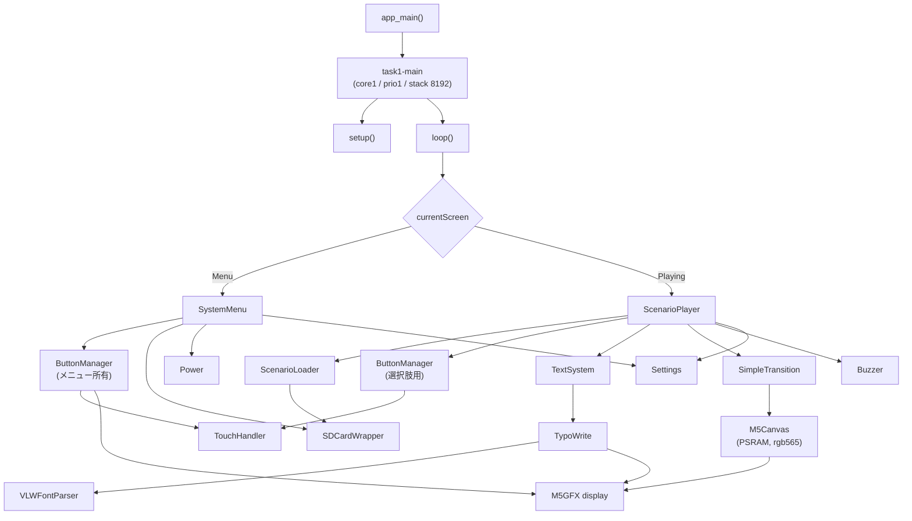

# ayame_sys プログラム仕様書

M5Paper S3（ESP32-S3 + 電子ペーパー）向け、**日本語縦書き表示を備えたアドベンチャーゲーム基盤**。

- 対象: `main/` コンポーネント
- 最終更新: 2026-08-04

**この文書の位置づけ**

| 文書 | 内容 |
|---|---|
| **`PROGRAM_SPEC.md`（本書）** | **プログラムの構成。実装する人が読む** |
| `SCENARIO_SPEC.md` | シナリオデータの書き方。作品を作る人が読む |
| `REFACTORING_LOG.md` | 改修の作業記録。過去の不具合とその経緯 |

---

## 目次

1. [システム概要](#1-システム概要)
2. [ビルドと実行](#2-ビルドと実行)
3. [アーキテクチャ](#3-アーキテクチャ)
4. [モジュール仕様](#4-モジュール仕様)
5. [主要な設計概念](#5-主要な設計概念)
6. [既知の制限・未実装](#6-既知の制限未実装)
7. [開発時のハマりどころ](#7-開発時のハマりどころ)

---

## 1. システム概要

### 1.1 これは何か

**SD カードに置いた JSON のシナリオを読んで再生する、電子ペーパー用のアドベンチャーゲーム基盤。**

起動するとシステムメニューが出て、`scenarios/` にあるシナリオを選ぶと再生が始まる。
シナリオの書き方は [`SCENARIO_SPEC.md`](SCENARIO_SPEC.md) にある。

動くもの:

- シナリオの読み込み・検証・実行（20 コマンド）
- 分岐、変数、条件式、シーンの呼び出し
- 縦書き / 横書き、ルビ、ページ送り、文字送り、名前付きテキストボックス
- 背景・立ち絵（**レイヤー合成**）・一枚絵、画面遷移 10 種
- セーブ / ロード、中断と再開（電源を切って栞を残す）
- シナリオごとのフォント切り替え（`meta.font`）
- ブザー、電池残量、電源 OFF、USB MSC での SD 公開

> `main/hello_world_main.cpp` は各機能の動作確認を1ファイルに詰めた旧デモで、
> **ビルド対象から外してある**（`main/CMakeLists.txt` でコメントアウト）。
> 現在の入口は `main/main.cpp`。

### 1.2 ハードウェア構成

| 項目 | 値 | 備考 |
|---|---|---|
| SoC | ESP32-S3（rev v0.2） | 240MHz / デュアルコア |
| PSRAM | 8MB / Octal / 80MHz | `CONFIG_SPIRAM_MODE_OCT=y`（M5PaperS3 の必須条件） |
| Flash | 16MB / QIO / 80MHz | アプリ領域 10.5MB |
| ディスプレイ | 電子ペーパー 540 × 960 | パネル native は 960×540、`offset_rotation=3` |
| 階調 | **16 階調（4bpp）** | 後述（1.4） |
| タッチ | GT911（I2C, SDA=41 / SCL=42 / INT=48） | ボード自動検出に使われる |
| SDカード | SPI（SPI2_HOST） | MISO=40 / MOSI=38 / SCK=39 / CS=47、マウント先 `/sdcard` |
| ブザー | GPIO21 | LEDC PWM |
| 電源制御 | GPIO44 → PMS150G | パルス列で電源を切る |
| 電池電圧 | ADC1 ch2（GPIO3） | 分圧比 2.0 |
| USB | TinyUSB（MSCデバイス） | SDカードをPCへ公開 |

ボードは `display.begin()` 内の自動検出で判定される。起動ログに次が出れば成功。

```
I (xxx) M5GFX: [Autodetect] board_M5PaperS3
```

### 1.3 モジュール一覧

| 層 | ファイル | 責務 |
|---|---|---|
| 入口・統括 | `main.cpp` | 初期化、画面の切り替え、メインループ |
| 画面 | `SystemMenu.*` | シナリオ一覧、USB / サウンド / 情報 / 電源、「続きから」 |
| シナリオ | `ScenarioLoader.*` | JSON の読み込み・検証・アセットのパス解決 |
| | `ScenarioPlayer.*` | シーンとコマンドの実行、変数、セーブ |
| テキスト | `TextSystem.*` | フォントと描画器の生成・保持、名前付きボックス |
| | `TypoWrite.*` | 日本語組版（縦書き・横書き・ルビ・ページ送り） |
| | `VLWFontParser.*` | VLW フォントのメトリクス解析 |
| 入出力 | `SDcard.*` | FATFS マウント、ファイル I/O、USB MSC |
| | `TouchHandler.*` | 生タッチ座標のイベント化 |
| | `Button.*` | ボタン描画と入力ディスパッチ |
| 演出・周辺 | `SimpleTransition.*` | 画面遷移、フルリフレッシュ、残像消去 |
| | `Buzzer.*` | ブザー（LEDC PWM、非同期の音列） |
| | `Power.*` | 電源を切る、電池残量 |
| | `Settings.*` | 本体設定（`system/settings.json`） |

### 1.4 階調についての重要な注意

**この機種は白黒2値ではない。常に 16 階調（4bpp）である。**

`Panel_EPD::setColorDepth()` は**引数を無視して**内部を常に `grayscale_8bit` に固定する。

```cpp
color_depth_t Panel_EPD::setColorDepth(color_depth_t depth)
{
    _write_depth = color_depth_t::grayscale_8bit;   // 要求値は無視される
    _read_depth  = color_depth_t::grayscale_8bit;
    return depth;
}
```

パネルのバッファも `(幅 × 高さ) / 2` の 4bpp で確保される。
そのため `setColorDepth()` を呼ぶ意味は無く、`main.cpp` では呼んでいない
（以前は `setColorDepth(1)` と書いてあったが、効果が無いうえに
「白黒2値の機種」という誤解を生むので削除した）。

階調が実際に見えるかは **EPD モード**で決まる。

| モード | 階調 |
|---|---|
| `epd_quality` / `epd_text` | 16 階調そのまま |
| `epd_fast` / `epd_fastest` | ベイヤーディザで2階調 |

一方 **`M5Canvas` は親の色深度を継承しない**。`LGFX_Sprite` のコンストラクタが
自身の既定値を使うため、`rgb565_2Byte`（16bpp）で作られる。

```cpp
LGFX_Sprite(LovyanGFX* parent) { _panel = &_panel_sprite; setColorDepth(_write_conv.depth); }
```

したがって 540×960 の Canvas 1枚あたり **約1MB** を消費する。
またコード中の `TFT_BLUE` などのカラー指定はグレースケールに変換されるため、
意図した色にはならない。

---

## 2. ビルドと実行

### 2.1 ESP-IDF は v5.3.2 を使うこと（重要）

**v5.4.3 でビルドすると画面が1ラインおきの白黒縞模様になり、正常に表示できない。**

- v5.3.2: 正常
- v5.4.3: 起動・ログとも正常だが表示だけが崩れる（ハードウェアは正常）

原因は特定できていない。EPD は IDF の `esp_lcd` i80 ドライバ（LCD_CAM + GDMA）で
駆動されており、その版差が疑われる。調査の経緯と否定された仮説は
[REFACTORING_LOG.md](REFACTORING_LOG.md) の §0.4 に記録してある。

VSCode の ESP-IDF 拡張を使う場合、`.vscode/settings.json` の
`idf.espIdfPathWin` と `idf.currentSetup` が**実在する v5.3.2 のパス**を
指していることを必ず確認する。存在しないパスを指していると拡張が有効化に失敗し、
Visual Studio 同梱の CMake/Ninja にフォールバックしてビルドが壊れる。

### 2.2 ビルド

VSCode の `ESP-IDF: Build your project`、または IDF ターミナルで:

```
idf.py build
idf.py -p COM5 flash monitor
```

生の `ninja` タスクを直接叩かないこと（前項のフォールバックを踏む）。

### 2.3 コンポーネント構成

`main/CMakeLists.txt` の `SRCS`（`hello_world_main.cpp` はコメントアウト）:

```
main.cpp  SystemMenu.cpp  ScenarioLoader.cpp  ScenarioPlayer.cpp
TextSystem.cpp  TypoWrite.cpp  VLWFontParser.cpp
SDcard.cpp  TouchHandler.cpp  Button.cpp
SimpleTransition.cpp  Buzzer.cpp  Power.cpp  Settings.cpp
```

| 区分 | 内容 |
|---|---|
| PRIV_REQUIRES | `M5GFX` |
| REQUIRES | `fatfs`, `esp_lcd`, `driver`, `esp_timer`, `tinyusb`, `esp_tinyusb`, `esp_psram`, `json`, `esp_adc`, `app_update` |
| INCLUDE_DIRS | `.`, `fonts` |

後から足した `REQUIRES` の理由:

| 名前 | 用途 |
|---|---|
| `json` | cJSON（ESP-IDF 同梱）。シナリオと設定の解析 |
| `esp_adc` | 電池電圧の測定 |
| `app_update` | `esp_app_get_description()`。メニューの情報画面 |

外部コンポーネント:

| 名前 | 取得元 | 注意 |
|---|---|---|
| M5GFX | `components/M5GFX`（手動配置） | **git管理外**。誤って削除すると復元できない。版情報も不整合（`library.json`=0.2.6 / `idf_component.yml`=0.1.15、ファイル日付 2025-04-29） |
| espressif/tinyusb | `managed_components/`（コンポーネントマネージャ） | 0.18.0~2 |
| espressif/esp_tinyusb | `managed_components/` | 1.7.2 |

### 2.4 sdkconfig.defaults

長いファイル名（LFN）の有効化が**必須**。

```
CONFIG_FATFS_LFN_HEAP=y
CONFIG_FATFS_MAX_LFN=255
```

ESP-IDF の FATFS は既定で 8.3 形式しか扱えない（`CONFIG_FATFS_LFN_NONE`）。
`scenarios`（9文字）・`scenario.json`（拡張子4文字）はどちらも 8.3 に収まらず、
LFN が無いと `stat()` も `fopen()` も失敗する。

`STACK` ではなく `HEAP` を選ぶのは、LFN の作業バッファ（最大 255×2 バイト）が
タスクスタックに載るとスタック不足を招きやすいため。

> **`sdkconfig.defaults` は ASCII のみで書くこと。**
> `kconfgen` がこのファイルをシステムのコードページ（日本語 Windows なら cp932）で
> 読むため、日本語コメントを入れると `UnicodeDecodeError` でビルドが落ちる。

### 2.5 フォントリソース

**使うフォントはビルド時に1つ選ぶ。** 切り替えは
`main/fonts/active_font.h` の `AYAME_FONT` の数字を変えるだけ。

```c
#define AYAME_FONT 10      // IPAex ゴシック 18px
```

`#include` した1つだけがバイナリに載る。選ばなかったものは
`main/fonts/` に置いてあるだけで容量に影響しない。
一覧と各書体の癖は同ファイルのコメントと
[`tools/font/README.md`](tools/font/README.md)。

**現在の設定（`AYAME_FONT 10`）**

| 項目 | 値 |
|---|---|
| シンボル | `const uint8_t font_ipaexg_18[]`（`.rodata.font` セクション） |
| 生成元 | `append/font/ipaexg.ttf`（IPAex ゴシック） |
| フォントサイズ | 18px（**全角の送りもちょうど 18px**） |
| グリフ数 | 4415（unicode昇順・重複なし） |
| ascent / descent | 16 / −3（行の高さ 19） |
| 実効 maxAscent | 17（`getMaxAscent()`。[7.11](#711-空白を正しく収録すると壊れる箇所があった)） |
| 最大グリフ | 18 × 19 |
| ファイルサイズ | 約 1.25 MB |
| 小文字（捨て仮名） | 22 件すべて収録 |
| 縦書き字形 U+FE10〜FE48 | 28 件すべて収録 |

**フォントを作る**

```
python tools/make_font.py append/font/ipaexg.ttf --size 18     -o tools/font/ipaexg_18.vlw --header main/fonts/ipaexg_18.h     --symbol font_ipaexg_18
```

生成後に「全角の送りが宣言サイズと一致するか」「グリフが昇順か」
「空白が収録されているか」を自動で検証する。
使い方は [`tools/README.md`](tools/README.md#make_fontpy)。

**サイズを増やすときの目安。** VLW のサイズは pt の約 1.56 乗で増える
（pt² ではない。グリフの多くが小さく、ビットマップが正方形にならないため）。

| サイズ | ファイル |
|---|---|
| 16pt | 1.00 MB |
| 18pt | 1.25 MB |
| 20pt | 1.46 MB |
| 24pt | 2.05 MB |

アプリ領域は 10.5MB あり現在の使用は約 2.1MB なので、数種類は追加できる。

**シナリオ独自のフォント**

シナリオは `meta.font` で自分の書体を持てる。
SD の VLW を PSRAM へ丸ごと読み、`TextSystem::loadScenarioFont()` が
パーサと全描画器を向け直す（[4.5](#45-textsystem--フォントと描画器の保持)）。

**旧フォントは比較用に残してある**（`AYAME_FONT 9`）。
生成に使った `append/font/ttf2vlw.py` が送り幅を
「レイアウト矩形の幅 + サイズ×0.1」で出していたため、
16pt と名乗りながら全角の送りが 17px ある。
半角・全角スペースが欠落し、縦書き字形のうち 3 つは豆腐が入っている。
経緯は [`append/font/README.md`](append/font/README.md)。

> **注意**: フォントヘッダはファイル名にサイズが入るが**シンボル名には入らない**。
> 同じシンボルを定義するヘッダを2つ `#include` すると重複定義になる。
> `active_font.h` が1つだけ選ぶ形にしてあるのはこのため。
>
> `append/font/` の生成物は**ファイル名・宣言サイズ・実際の送り幅が
> ばらばら**なので、名前を当てにしないこと
> （`mplus2_16.h` は名前が 16、宣言が 32、送りが 17px）。

素材の TTF と過去の生成物は `append/font/` にある。
中身の棚卸しは [`append/font/README.md`](append/font/README.md)。

### 2.6 SD カードの中身

`microsd_sample/` の**中身**（`scenarios/` と `system/`）を
SD のルート直下へコピーする。21 本のサンプルが入っている。
詳細は `microsd_sample/README.md`。

---

## 3. アーキテクチャ

### 3.1 レイヤ構成



**依存の向きは一方向。** `ScenarioPlayer` は UI を持たず、
`SystemMenu` はシナリオの中身を知らない。両者をつなぐのは `main.cpp` だけ。

### 3.2 起動シーケンス

```
app_main()                     ← core0（IDF既定）
  └ xTaskCreatePinnedToCore("task1-main", stack 8192, prio 1, core 1)
      └ runMainLoop()
          ├ setup()            ← 1回だけ
          └ for(;;) { loop(); vTaskDelay(1); }
```

`setup()` の処理順。**順序に意味があるものには理由を書いてある。**

| # | 処理 | 順序の理由 |
|---|---|---|
| 1 | `display.begin()` | |
| 2 | `setRotation(MENU_ROTATION)` | **描画より前**。以後の座標がこの向きで決まる |
| 3 | `setEpdMode(epd_quality)` | |
| 4 | `SimpleTransition::clearGhosting()` | 起動時の残像対策（[4.8](#48-simpletransition--画面遷移)） |
| 5 | `buzzer.begin()` / `power.begin()` | 失敗しても起動は続ける |
| 6 | `ScenarioLoader::initAllocator()` | **最初の解析より前**。cJSON の確保先を PSRAM へ向ける |
| 7 | `textSystem.begin()` | VLW 解析（約138KB）+ 描画器2つの生成 |
| 8 | `SD.init()` | |
| 9 | `settings.load()` → `buzzer.setMuted()` | **SD の後**。設定を使う前 |
| 10 | `simpleTransition->init()` | 画面の大きさからキャンバスを確保（約1MB） |
| 11 | `touchHandler.init()` | |
| 12 | `choiceButtonManager` 生成 | |
| 13 | `systemMenu.begin()` → `enterMenu()` | |

**どれが失敗しても `setup()` は最後まで進む。** SD が無い、タッチが壊れている、
といった状態でも起動して原因がログと画面に出る方が、無言で止まるより扱いやすい。

### 3.3 メインループ

`loop()` は約10ms周期（`vTaskDelay(1)` × `CONFIG_FREERTOS_HZ=100`）で回る。

```
1. トランジション実行中なら update() だけして return
2. touchHandler.update()          ← ここで1回だけ（7.1）
3. currentScreen で分岐
     Menu    : systemMenu.update() → 選択があれば enterPlaying()
     Playing : 下の優先順で1つだけ処理
```

`Playing` の分岐順は次のとおり。**順序に意味がある。**

| 順 | 条件 | 処理 |
|---|---|---|
| 1 | `isWaitingTransition()` | ここへ来た時点で遷移は終わっている（上で return 済み） |
| 2 | `isWaitingChoice()` | 未表示なら選択肢を並べ、`choiceButtonManager->update()` |
| 3 | タッチあり | `onTap()`。文字送り中なら全文表示へ飛ぶ |
| 4 | `isWaiting()` | `tickWait()`。`skippable` は 3 で先に飛ばされる |
| 5 | `isTyping()` | `tickTyping()` |

**タップの判定を文字送りより前に置く**のは、送っている最中のタップを
取りこぼさないため。

最後に `isFinished()` なら `leavePlaying()` でメニューへ戻る。

### 3.4 画面の切り替え

```cpp
enum class AppScreen { Menu, Playing };
```

| 関数 | 処理 |
|---|---|
| `enterMenu()` | 向きを `MENU_ROTATION` へ戻す → `systemMenu.enter()` |
| `enterPlaying(id, resume)` | メニューを片付ける → JSON 読み込み → **向きを適用** → 再生開始 |
| `leavePlaying()` | 選択肢とテキストボックスを捨て、JSON を解放 → `enterMenu()` |
| `applyRotation(r)` | `setRotation()` + キャンバス作り直し + 既定ボックス配置 + 残像消去 |

**ボタンの集合は画面ごとに別。** `SystemMenu` は自分の `ButtonManager` を
`enter()` で作って `leave()` で捨てる。1つを共有すると画面を移るたびに
隠す・戻すの操作が要り、隠し忘れが事故になる
（再生中にメニューのボタンが押せる、など）。

**`applyRotation()` は `setRotation()` だけでは足りない。**
回転すると 540×960 と 960×540 が入れ替わるので、
トランジションのキャンバスと既定のテキストボックスも追従させる必要がある（[5.2](#52-画面の向き)）。

### 3.5 グローバルオブジェクト

| 名前 | 型 | 定義場所 |
|---|---|---|
| `display` | `M5GFX` | `main.cpp` |
| `touchHandler` | `TouchHandler` | `main.cpp` |
| `systemMenu` / `scenarioLoader` / `scenarioPlayer` | 各クラス | `main.cpp` |
| `simpleTransition` / `choiceButtonManager` | ポインタ | `setup()` 内で `new`（解放されない） |
| `SD` | `SDCardWrapper` | `SDcard.cpp` |
| `textSystem` | `TextSystem` | `TextSystem.cpp` |
| `buzzer` | `Buzzer` | `Buzzer.cpp` |
| `power` | `Power` | `Power.cpp` |
| `settings` | `Settings` | `Settings.cpp` |

各モジュールが1つずつグローバル実体を持つのは `SD` に合わせた流儀。
複数持つ意味が無く、引き回しのコストだけが増えるため。

---

## 4. モジュール仕様

### 4.1 `main.cpp` — 入口と画面の統括

3章のとおり。ここが持つのは次の3つだけ。

- 初期化の順序（[3.2](#32-起動シーケンス)）
- 画面の切り替え（[3.4](#34-画面の切り替え)）
- **選択肢の UI**

**選択肢の描画と入力は `ScenarioPlayer` の外にある。**
プレイヤーは `choiceLabels()` / `choiceEnabled()` / `choicePrompt()` を公開するだけで、
ボタンを持たない。プレイヤーが `ButtonManager` を握ると、
メニュー側とレイアウトの持ち方が二重になるため。

`choiceEnabled()` が false の選択肢は灰色で描かれ、押しても何も起きない
（`hide_if_false: false` を指定した選択肢がこれになる）。

**置き場所は画面の下端から上へ、横は中央寄せ。**
`showChoicePrompt()` が `choicePrompt()` をその上に黒帯で描く。
帯は `TextSystem::choicePrompt()` の描画器を使い、
**幅を入れてから高さを測り、測った高さぶんだけ上へ伸ばす**
（折り返しの位置は幅で決まるので、幅を先に確定させないと行数が合わない）。
上端を越える場合は 0 で止め、入らない行は描画側が打ち切る。

問いかけとボタンは `startWrite()` / `endWrite()` で挟んで**1回で出す**。
別々に出すと、電子ペーパーでは順に現れる様子が見えてしまう。

**押されたあとの後始末はここでやらない。**
以前は `display.fillScreen(TFT_BLACK)` で消していたが、
それでは背景も立ち絵も消える。飛び先のシーンが `bg` を書き直していないと
真っ黒な画面に本文だけが乗った。ボタンの下に何があったかを知っているのは
プレイヤー側だけなので、`selectChoice()` が
`restoreStageAndText()` で戻す。

**置き場所は画面の下端から上へ、横は中央寄せ。**
`showChoicePrompt()` が `choicePrompt()` をその上に黒帯で描く。
帯は `TextSystem::choicePrompt()` の描画器を使い、
**幅を入れてから高さを測り、測った高さぶんだけ上へ伸ばす**
（折り返しの位置は幅で決まるので、幅を先に確定させないと行数が合わない）。
上端を越える場合は 0 で止め、入らない行は描画側が打ち切る。

### 4.2 `SystemMenu` — システムメニュー

`SD` の `scenarios/` を列挙してシナリオを選ばせる。

| 表示 | 内容 |
|---|---|
| 一覧 | 1ページ8件。上下スワイプでページ送り |
| 「続きから」 | 栞があるときだけ最上段に出る |
| 下段のボタン5個 | USB / 再読込 / サウンド / 情報 / 電源（各 108×80 の画像アイコン） |

**タイトルは JSON を全部読まずに取る。**
`ScenarioLoader::peekTitle()` が**先頭 4KB だけ**を読み、文字列走査で
`meta.title` を拾う。全フォルダの JSON を解析すると、
シナリオが増えるほどメニューの表示が待たされるため。
4KB より後ろに `meta` があるとフォルダ名が出る（動作は壊れない）。

**アイコンは firmware に埋め込んである。** SD から読むと、
USB MSC が有効な間（＝ファイル操作が全て失敗する間）にメニューが描けなくなる。
生成は `tools/make_icons.py`。

| 操作 | 挙動 |
|---|---|
| USB | MSC の有効／無効を切り替える。無効化時に一覧を読み直す |
| 電源 | **2回タップで実行**。5秒で自動キャンセル |

電源を切る前に `clearGhosting()` → ロゴ描画 → `waitDisplay()` →
**3秒待つ**（`SHUTDOWN_SETTLE_MS`）。
待ちが短いと走査が終わりきる前に電源が落ち、画面上部に横線が残る。

### 4.3 `ScenarioLoader` — シナリオ JSON

`scenarios/<id>/scenario.json` を読んで cJSON のツリーにし、保持する。

| メソッド | 説明 |
|---|---|
| `initAllocator()` | **static。最初の解析より前に1回だけ**。cJSON の確保先を PSRAM へ向ける |
| `load(id)` / `unload()` | 読み込みと解放 |
| `peekTitle(id)` | 先頭 4KB だけ読んでタイトルを推定（一覧用） |
| `rotation()` / `defaultTextDirection()` / `version()` / `title()` | `meta` の値 |
| `variablesNode()` / `textBoxesNode()` / `findScene(id)` | ツリーの部分木 |
| `resolveBackgroundPath()` / `resolveCharaPath()` / `resolveTextBoxBackground()` | 論理名 → フルパス |

**`initAllocator()` を忘れると内部 RAM が枯れる。**
`CONFIG_SPIRAM_MALLOC_ALWAYSINTERNAL=16384` により 16KB 以下の確保は
内部 RAM から行われる。cJSON のノードは1個 40 バイトなので、
既定のままでは数万ノードが全て内部 RAM に載ってしまう。

```cpp
cJSON_InitHooks(&hooks);   // malloc -> heap_caps_malloc(MALLOC_CAP_SPIRAM)
```

効いているかは読み込みログで分かる。

```
I (xxx) SCENARIO: Parsed 1520 bytes. Tree: 2432 bytes in PSRAM (x1.60 of source), internal delta: 0 bytes
```

`internal delta` が大きければ呼び忘れ。

**読み込み時に検証する。** 未定義シーンへの `jump`、`assets` に無い画像名、
`start` の妥当性などを調べ、**問題があっても読み込みは続ける**。
SD 上の手書き JSON は必ず壊れるので、1箇所の誤りで全体が動かない方が困る。

```
W (xxx) SCENARIO:   scene 'main': jump to undefined scene 'no_such_scene'
W (xxx) SCENARIO: Validation found 3 issue(s). Loading anyway
```

### 4.4 `ScenarioPlayer` — コマンドの実行

**20 コマンドを1つずつ実行する。** 仕様は [`SCENARIO_SPEC.md`](SCENARIO_SPEC.md) の4章。

**実行位置はフレームのスタック**

```cpp
struct Frame { const cJSON* commands; int index; };
std::vector<Frame> _frames;
```

`if` の `then` / `else` は入れ子の配列なので、
「今どの配列のどこを見ているか」を積み重ねて持つ必要がある。
添字1個では入れ子から戻れない。

`call` は**シーンごと**移るので、シーン ID とフレーム一式を別のスタック
（`_callStack`、深さ上限 16）へ退避する。

**待ちの種類はコマンドの戻り値が持つ**

```cpp
enum class CmdResult {
    Next, StayAndWaitTap, NextAndWaitTap, NextAndWaitTransition,
    NextAndWaitChoice, StayAndType, NextAndWaitTime,
    Pushed, Jumped, Finished,
};
```

`_state` を設定するのは `run()` の1箇所だけ。
各コマンドが直接触ると、状態と実行位置の整合を保つ場所が散らばる。

`run()` は「コマンドを実行 → 添字を進める」の順で回る。
**この順序が `suspend` の落とし穴になっていた**（4.4 の末尾を参照）。

無限ループ対策として、待ちが入らないまま 1000 コマンド進んだら打ち切る
（手書きの JSON は `jump` が輪になっていることがある）。

**立ち絵はレイヤーに分けられる**

`assets.characters.<id>.layers` があれば、体・目・口を別画像として
配列順に重ねる。`CharaState::layers`（レイヤー名 → 差分名）が状態を持ち、
`chara` で書かれなかったレイヤーは今の差分のまま残る。

- レイヤーの `x`/`y` は**キャラの左上からの相対**。`scale` も掛ける
- `layers` が無ければ従来の単一画像方式。**混在してよい**
- セーブの `stage.charas[].layers` に載る。**無ければ空**なので古いセーブも読める

**透過はここでの直描きが背景と正しく混ぜている**（`png_draw_alpha_callback`）。
スプライトへ展開して重ねると透過が色キー1色に落ちるため、
反転や回転は実行時に行わず素材側で用意する
（`tools/make_image.py --flip`）。

**画面は `renderStage()` に集約**

背景・立ち絵・前面絵は重なるので、片方だけ描くと破綻する。

- 立ち絵だけ描く → 前の立ち絵が消えずに重なる
- 背景だけ描く → 立ち絵が消える

`bg` も `chara` も `image` も、必ずこの1つを通して**背景から描き直す**。

**画面へ出すのは待ちに入るときの1回だけ**

電子ペーパーは1回の書き換えに 117〜351ms かかる。
1つの場面はふつう複数のコマンドで組み立てるので、コマンドごとに出すと
**組み立ての途中が全部見えてしまう**（立ち絵→名前→本文と順に現れる）。

`run()` が `startWrite()` を開いたままコマンドを進める。
`Panel_EPD` は `_auto_display` が立っているので、
`endWrite()` で `_start_count` が 0 に戻ったときにだけ、
それまでの更新範囲をまとめて1つの矩形として積む。
描画そのものはパネルのバッファへ直接行われるため、溜めても内容は消えない。

| メソッド | 役割 |
|---|---|
| `beginBatch()` / `endBatch()` | `startWrite()` / `endWrite()`。二重に開かない |
| `markRefresh(mode)` | 「出す必要がある」印。**描いたコマンドは必ず呼ぶ** |
| `flushScreen()` | 印があれば全画面を走査して出し、バッチを閉じる |

**走査するときはバッチを開けたまま `refreshScreen()` へ渡す。**
先に閉じると「描いた範囲の部分更新」と「全画面の走査」で2回書き換わる。
`refreshScreen()` は `_range_mod` を全画面へ広げてから積むので、
開けたまま呼べば1回で済む（その後の `endWrite()` は空振りする）。

途中で出し切る例外が4つある。いずれも**自分でパネルを動かす処理の前**。

| 場所 | 理由 |
|---|---|
| `suspend` | 電源を切るまでに出し切らないと前の画面が残る |
| `refresh` の `clear_ghost` | 「今出ている絵」を反転させる処理なので |
| 演出つきの `bg` | `SimpleTransition` が自分で動かす |
| `tickTyping()` | `run()` の外。1文字ごとに自分で出す |

**セーブは1箇所で組む**

| メソッド | 役割 |
|---|---|
| `buildStateObject()` | 状態を cJSON にまとめる（`slot` は含めない） |
| `writeStateObject(root, slot)` | `slot` を足して書き、`root` を解放 |
| `saveToSlot(slot)` | 控えがあれば複製、無ければ組む → 書き出す |
| `loadFromSlot(slot)` | 読んで状態を差し替え、`renderStage()` で描き直す |

`checkpoint` が控えた状態（`_checkpoint`）も `buildStateObject()` で作る。
別々に組むと、保存項目を足したときに片方だけ直す事故が起きる。

**`suspend` の再開位置**

`run()` は「実行 → 添字を進める」の順なので、
`suspend` の中で保存した位置は **`suspend` コマンド自身**を指す。
そのまま保存すると、再開のたびに `suspend` を踏んで電源が落ち、操作できなくなる。

対策は2つ。

1. `checkpoint` があればそれを書く（作者が戻り先を決める）
2. 無ければ**保存の直前に添字を1つ進める**

電源を切る直前なので、実行位置を書き換えて構わない。

### 4.5 `TextSystem` — フォントと描画器の保持

フォント解析と描画器の生成は重いので、**起動時に1回だけ**行って使い回す。

- `VLWFontParser::init()` … 約138KB の確保 + 4400 前後のグリフの解析
- `TypoWrite` の構築 … マッピングテーブル構築 + スプライト確保

| 種類 | 生存期間 |
|---|---|
| 既定の2つ（`vertical()` / `horizontal()`） | 起動から終了まで |
| 名前付きボックス（`textboxes`） | シナリオを開いている間だけ |

`defineBox()` は同じ名前が来たら**作り直さず設定だけ入れ替える**。

**フォントは差し替えられる**（`loadScenarioFont()` / `useBuiltinFont()`）。

| メソッド | 役割 |
|---|---|
| `loadScenarioFont(path)` | SD の VLW を PSRAM へ読み、`applyFont()` で切り替える |
| `useBuiltinFont()` | 内蔵へ戻して PSRAM を解放する |
| `applyFont(data, size, name)` | パーサと**全描画器**（既定2つ + 名前付きボックス）を向け直す |

- **丸ごとメモリへ読む。** SD から流し読みにすると1文字描くたびに
  SD を占有し、画像が描けなくなる（同時に開けるファイルは1つ）
- **解放より先に参照を戻す。** 順番を逆にすると、解放済みの領域を
  指したまま1回でも描画が走った時点で落ちる
- VLW かどうかはヘッダの version（11）で先に見る。
  別形式のまま解析へ進むと、でたらめなグリフ数で巨大な確保を試みる
- 読めなくても**内蔵フォントで再生を続ける**

`main.cpp` は `enterPlaying()` で読み、`leavePlaying()` で戻す。
**テキストボックスを組む前に済ませること**（ボックスは作られた時点の
フォントでメトリクスを持つ）。

**本文の色はボックスごと**（`defineBox()` の `textColor`）。
既定は下地の反対（黒地→白文字 / 白地→黒文字）で、
`textboxes` の `text_color` で上書きできる。
以前は白固定で、下地を白にすると必ず読めなくなっていた。

**既定ボックスの位置は画面の向きで変わる**（`layoutDefaultBoxes()`）。

| 描画器 | 縦長 540×960 | 横長 960×540 |
|---|---|---|
| `vertical()` | (400, 0) 130 × 700 | (820, 20) 130 × 500 |
| `horizontal()` | (10, 420) 380 × 180 | (20, 360) 780 × 160 |

縦長前提の座標（縦書きの帯は高さ 700）は横長では画面に収まらない。
**`setRotation()` の直後に必ず呼ぶこと。**
`textboxes` で定義したボックスは対象外（座標は作者が向きを決めて書くもの）。

### 4.6 `TypoWrite` — 日本語組版

VLWフォントを使って横書き・縦書きのテキストを描画する。

**設定API**

| 分類 | メソッド |
|---|---|
| 描画先 | `setDrawTarget(sprite)` / `setVLWParser(parser)` |
| レイアウト | `setDirection()` / `setAlignment()` / `setPosition()` / `setArea()` / `setPadding()` / `setWrap()` |
| 色 | `setColor()` / `setBackgroundColor()` / `setTransparentBackground()` |
| フォント | `setFont()` / `loadFontFromArray()` / `setFontSize()` |
| 間隔 | `setLineSpacing()` / `setCharSpacing()` |
| 描画 | `drawText()` / `drawTextPaged()` / `drawTextCentered()` / `clearArea()` |
| ルビ | `setRubyEnabled()` |
| 寸法 | `getTextWidth()` / `getTextHeight()` |

**外枠と本文領域（`setPadding()`）**

`setPosition()` / `setArea()` が受け取るのは**外枠**で、
本文はそこから余白のぶん内側に置かれる。

| members | 意味 | 使う場所 |
|---|---|---|
| `_boxX/_boxY/_boxWidth/_boxHeight` | 外枠 | 下地の塗り、クリップ、枠線、`clearArea()` |
| `_x/_y/_width/_height` | **本文領域** | 描画・折り返し・揃えの計算すべて |

内部の計算は後者しか見ない。
そのため**余白を足してもレイアウトのコードは変わらない**。
外枠を見るのは下地・クリップ・枠線の3箇所だけ。

下地とクリップを外枠にするのは、本文領域だけを塗ると
**余白の帯に前のページが残る**ため。

余白が大きすぎて本文の置き場が無くなった場合は警告を出し、1px で止める
（無言で「何も出ない」になると原因が分からないため）。

**ページ送り（`drawTextPaged()`）**

```cpp
struct DrawResult { size_t nextOffset; bool hasMore; size_t pageChars; };
DrawResult drawTextPaged(const std::string& text,
                         size_t startOffset = 0, size_t maxChars = 0);
```

領域に入りきらなかった位置（`nextOffset`）を返すので、
呼び出し側はそこを次の `startOffset` にして続きを描く。
`ScenarioPlayer` はこれで **1つの `text` コマンドを複数ページに分ける**。

`maxChars` は**描く文字数だけ**を絞る。
測定・折り返し・揃えは常に全文で行うため、
文字送りの途中でも文字の位置が動かない。

**縦書きの列幅は em ボックス**

列幅は送り幅ではなく `getEmBoxSize()` の `emW`。
送り幅より字面が広いグリフが右端で欠けるため。
回した半角文字の横位置は `rotatedBandOffset()` が補正する（[7.12](#712-縦書きで回した半角文字は-em-ボックスの縦位置に引きずられる)）。

**ルビ**

`|漢字<かんじ>`（半角）と `｜漢字《かんじ》`（全角）の両方を解釈する。
ルビ付きの範囲（`RubyRun`）は**改行・改ページで分断しない**。
ルビだけが次の行へ取り残されるのを防ぐため、範囲ごと次へ送る。

有効にすると、ルビの有無にかかわらず**全行にルビ帯を確保する**。
行ごとに高さが変わると行間が不揃いになるため。

**背景の透過**

`TFT_TRANSPARENT` は `0x0120` という**実在の色値**であって透明フラグではない。
そのため `setBackgroundColor(TFT_TRANSPARENT)` を受けたときは
自動的に透明モード（`_transparentBg`）を有効にする。`setTransparentBackground(bool)` でも明示できる。

透明モードでは、
描画領域の塗りつぶし（`fillRect`）を行わず、
文字描画に1引数版 `setTextColor(_color)` を使う
（LovyanGFX は前景色と背景色が同一のとき背景を塗らない）。

**描画の流れ**

```
drawText()
  ├ setClipRect(領域)
  ├ 透明でなければ fillRect で領域をクリア
  ├ 枠線表示が有効なら drawAreaBorder()
  ├ applyTextStyle(target)        ← フォント/サイズ/色を1回だけ設定
  ├ drawHorizontalTextEnhanced() または drawVerticalTextEnhanced()
  ├ releaseTextStyle(target)      ← loadFont したフォントを解放
  └ clearClipRect()
```

`loadFont()` は VLW ヘッダの解析を伴うため、文字ごとではなく**文字列ごとに1回**だけ行う。

**横書き・縦書きとも「測ってから描く」2パス構造**をとる。
`TextAlignment` を反映するには行（列）の総寸法が先に必要なため。

| 方向 | 揃えの単位 | LEFT | CENTER | RIGHT |
|---|---|---|---|---|
| 横書き | 折り返し後の**視覚行** | 左揃え | 中央 | 右揃え |
| 縦書き | **列** | 上揃え | 中央 | 下揃え |

**送り量**

| 方向 | 送り |
|---|---|
| 横書き | `setWidth × widthScale` + 字間 |
| 縦書き | `setWidth`（em固定、縮小率を掛けない） + 字間 |

> **`setCharSpacing()` の目安（縦書き）**
>
> 縦書きの送りは em 固定なので、**0 でベタ組み**になる。
> 負値を入れすぎると文字が重なる。
>
> `ipaexg_18`（maxAscent=17 / あ は h=16, topExtent=15）での実測:
>
> | `charSpacing` | 送り | 隣接するインクの関係 |
> |---|---|---|
> | 0 | 18px | **間隔 0px（字が接して詰まって見える）** |
> | 2 | 20px | 間隔 2px（既定。`DEFAULT_VERTICAL_CHAR_SPACING`） |
> | −4 | 14px | 4px 重なる |
>
> 送りがちょうど 1em のフォントでは 0 だと隙間ができない。
> **既定を 2 にしてあるのはこのため**（`TextSystem.hpp`）。
>
> インクの位置は `y + ascent − topExtent` から `+ h` の範囲になる
> （`drawString()` はアセント線を y に置く）。
> 詰めたい場合でも −4 程度までにとどめること。

`calculateTextSize()` は描画側と**同じ式**で計算する。ここが食い違うと
`getTextWidth()` と実際の描画がずれ、`drawTextCentered()` の中央位置も外れる。

**文字種別の微調整**

`CharCategory`（NORMAL / BRACKET / HORIZONTAL_BAR / PUNCTUATION / SMALL_CHAR / OTHER_SPECIAL）
ごとに `CharTypeAdjustment`（幅倍率・高さ倍率・字間・縦横オフセット）を持つ。
**既定は全カテゴリ 1.0 倍・オフセット0（＝調整なし）**。
個別に調整したい場合は `TypoWrite.cpp` 冒頭の `TypoWriteConstants` を変更する。

倍率が 1.0 のとき描画は**直接描画（最速パス）**を通る。
1.0 以外や回転が必要な場合のみ、文字単位のスプライトを経由する。

| 文字種 | 倍率 | 経路 |
|---|---|---|
| 横書き 通常 | 1.0 | 直接描画 |
| 縦書き 通常・非回転 | 1.0 | 直接描画 |
| 縦書き 小文字 | 0.75 | スプライト（縮小） |
| 縦書き 回転文字 | 1.0 | スプライト（90°回転） |

**配置基準は2経路で一致させる（em ボックス方式）**

2つの経路は配置の仕組みが異なるため、基準を揃えないと同じ列の中で位置が跳ねる。

| 経路 | 配置の仕組み |
|---|---|
| 直接描画 | `drawString(x, y)` — **左上基準**（フォントのアセント基準） |
| スプライト | `pushRotateZoom(cx, cy, ...)` — **中心基準** |

スプライトは**全文字共通の em ボックスサイズ**で確保する（`getEmBoxSize()`）。
グリフはスプライトの原点 `(0, 0)` に描き、拡大後の em ボックス左上が
`(_x + x, _y + y)` に来るよう中心を計算する。

```cpp
center_x = _x + x + emW * widthScale  / 2;
center_y = _y + y + emH * heightScale / 2;
```

これで直接描画と同じ左上基準になり、回転時も em ボックスの中心を軸に回るため
縦書き中の半角英数が列の中央に収まる。

em ボックスのサイズは代表文字のメトリクスに加え、
VLWパーサの実測最大グリフサイズでも押し広げる
（`ipaexg_18` は代表幅 18 に対し最大グリフ高が 19 ある）。

> **経緯**: 以前はスプライトを
> `(metrics.width * scale + 20) × (metrics.height * scale + 20)` と
> **グリフごとに変えていた**ため、中心位置がグリフのビットマップ高に依存し、
> あ(h=15) は `y+17`、ー(h=7) は `y+13` と**同じ列で4pxずれていた**。
> 送り（`setWidth`=17）は揃っているのに配置だけが跳ねる状態だった。
> em ボックス固定にしたことで解消し、あわせてスプライトの作り直しも
> フォント・フォントサイズ変更時のみになった。

**メトリクスキャッシュ**

`getCharMetrics()` の結果を `unordered_map` にキャッシュする（上限 `METRICS_CACHE_LIMIT` = 256）。
上限に達したら全消去して入れ直す（世代的な追い出し）。
フォントやサイズを変更したときもクリアされる。

### 4.7 `VLWFontParser` — VLWフォント解析

VLW（Processing の Vector Letterform Workshop 形式）バイナリを解析し、
メトリクスを提供する。**ビットマップの描画は行わない**（描画は M5GFX が担当）。

**フォーマット**

| 領域 | サイズ | 内容 |
|---|---|---|
| ファイルヘッダ | 24B（6 × uint32 BE） | glyphCount, version(=11), fontSize, padding, ascent, descent |
| グリフヘッダ × N | 28B（7 × uint32 BE） | unicode, height, width, setWidth, topExtent, leftExtent, padding |
| ビットマップ | width × height B | 8bitグレースケール、グリフ順に連続 |

すべてビッグエンディアン。

**主なAPI**

| メソッド | 説明 |
|---|---|
| `init(data, size)` | ヘッダ解析 → グリフテーブル構築 → 全体メトリクス算出 |
| `getCharMetrics(unicode)` | width / height / setWidth / topExtent / leftExtent / exists をまとめて取得 |
| `getCharWidth/Height/SetWidth(unicode)` | 個別取得（内部では都度グリフ検索） |
| `hasChar(unicode)` | 収録有無 |
| `getFontHeight/Width/Size()`, `getAscent/Descent()` | フォント全体の値 |
| `debugPrintFontInfo()` | ログ出力（**呼び出し側が明示的に呼ぶ**） |

**グリフ検索**

`buildGlyphTable()` の末尾で unicode 昇順かどうかを判定し、`_glyphTableSorted` に保持する。

- 昇順なら **二分探索**（O(log N)、4400グリフなら最大13回）
- 昇順でなければ線形探索へフォールバックし、初期化時に `ESP_LOGW` を出す

どちらを使うかは初期化ログに出る。

```
I (xxx) VLWParser: Glyph table built successfully with 4415 entries (lookup: binary search)
```

**「高さ」の定義**

`getCharHeight()` と `getCharMetrics().height` はどちらも**ビットマップ高**（`glyph->height`）を返す。
収録がない場合はどちらも `fontHeight` にフォールバックする。

**代表文字**

`calculateFontMetrics()` は U+3000（全角スペース）→ U+0020（半角）の順に代表幅を探すが、
**旧フォントはどちらも収録していなかった**。その結果 `fontWidth` は初期値の
`fontSize`（= 16）がそのまま使われる。em幅と一致するため結果的に妥当な値になっている。

### 4.8 `SimpleTransition` — 画面遷移

PSRAM上の `M5Canvas` に完成画面を描いておき、
段階的に電子ペーパーへ転送して遷移を演出する。

**キャンバスの大きさは `init()` で `display->width()/height()` から取る。**
以前は `SIMPLE_TRANSITION_WIDTH/HEIGHT`（540/960）の決め打ちだったが、
画面を横向きにすると 960×540 になり縦横が入れ替わるため実行時に決めるようにした。
向きが変わったら `resizeToDisplay()` でスプライトを作り直す
（大きさが同じなら何もしない）。1MB 級のスプライトを2つ同時に抱えないよう、
先に `deleteSprite()` してから確保する。

**使い方**

```cpp
M5Canvas* canvas = transition->getMainCanvas();
// canvas に最終的な画面を描く
transition->startTransition(SimpleTransitionType::FADE_IN, 6);
// loop() で毎回 update() を呼ぶ。false が返れば完了
```

**効果の種類**

| 種別 | 動作 |
|---|---|
| `NONE` | 即時表示 |
| `FADE_IN` | 上端から下へ段階表示（階調フェードではない） |
| `SLIDE_LEFT/RIGHT/UP/DOWN` | **キャンバスが画面外から滑り込む** |
| `WIPE_HORIZONTAL/VERTICAL` | 画像は固定のまま端から現れる |
| `REVEAL_CENTER` | 中央から矩形が拡大 |
| `REVEAL_CORNER` | 左上から矩形が拡大 |

SLIDE は描画位置そのものをオフセットする（画像が動く）。
WIPE は表示領域だけを広げる（画像は動かない）。両者は別の効果である。

**ステップ管理**

- ステップ数は `[1, 8]` にクランプされる（それ以上の自動最適化はしない）
- 進捗は `calcStepProgress()` = `(_currentStep + 1) / _totalSteps`。
  step 0 で 1/N、最終ステップでちょうど 1.0 になり、全ステップが表示を進める
- `getProgress()` も同じ値を返す

**画面更新の考え方（重要）**

電子ペーパーの所要時間を決めるのは**リフレッシュ回数**であって、更新範囲の広さではない。
`Panel_EPD` の更新タスクは、更新領域に関係なく**常にパネル全行を走査する**。

```cpp
for (uint_fast16_t y = 0; y < mh; y++) {   // mh = 全行
    bus->writeScanLine(...);
}
```

しかも1回の更新につき、EPDモードのLUTステップ数だけこの走査を繰り返す。

| EPDモード | LUTステップ（＝走査回数） |
|---|---|
| `epd_quality` | 21 |
| `epd_text` | 18 |
| `epd_fast` | 11 |
| `epd_fastest` | 7 |

さらに `Panel::endWrite()` が `display()` を呼ぶため、
**転送処理1回ごとにリフレッシュが1回走る**。

```cpp
void endWrite(void) { if (0 == --_start_count) { if (_auto_display) { display(0,0,0,0); } ... } }
```

したがって高速化の指針は次のとおり。

| 施策 | 効果 |
|---|---|
| 転送**回数**を減らす | **大**（走査回数が直接減る） |
| EPDモードを軽くする | **大**（LUTステップ数が減る） |
| ステップ数を減らす | **大**（1ステップ＝1リフレッシュ） |
| 転送**面積**を減らす | **ほぼ無し**（全行走査は変わらない） |

この性質にもとづき、本クラスは次の設計をとる。

1. **クリアは `startTransition()` での1回のみ**。
   各効果は「表示済み領域が単調に広がる」累積展開なので毎ステップのクリアは不要。
2. **1ステップあたりの転送は1回**にする。差分をリング状・L字に分割すると
   転送回数が増えて逆に遅くなるため行わない。
3. **中間フレームは高速モードで描く**（既定 `epd_fast`）。
   完了時に元のモードへ戻し、そのモードで最終画面を描き直す。
   中間フレームは一瞬しか表示されないため画質を落としてよい。

```
8ステップの目安（パネル走査回数）
  全部 epd_quality        : 8 x 21      = 168
  epd_fast + 最終品質描画 : 8 x 11 + 21 = 109   （約1.5倍速）
  epd_fastest + 同上      : 8 x  7 + 21 =  77   （約2.2倍速）
```

モードは `setTransitionEpdMode()` で変更できる。
中断（`stop()`）や未知の種別で終了した場合も必ず元のモードへ戻す
（戻し忘れるとアプリ全体の描画が低画質のままになる）。

**残像（ghosting）の扱い**

更新タスクは次の判定で「全画素を駆動するか、変化した画素だけ駆動するか」を切り替える。

```cpp
bool refresh = (remain == 0);                        // タスクがアイドルのときだけ true
if (refresh && mode != epd_mode_t::epd_fastest) {
    d[0] = s0 + lut_offset;                          // 全画素を駆動（残像が消える）
} else {
    if (d0 != s0) { d[0] = s0 + lut_offset; }        // 変化した画素のみ（残像が残る）
}
```

ここから次が言える。

| 条件 | 挙動 |
|---|---|
| アイドル時の単発更新（`epd_fastest` 以外） | フルリフレッシュ。残像が消える |
| 更新が連続（`remain > 0`） | 部分更新に落ちる |
| `epd_fastest` | **常に部分更新**。フルリフレッシュを一切行わない |

トランジション中は更新が連続するため、ほとんどのステップが部分更新になり残像が溜まる。
そのため完了時は **`waitDisplay()` でタスクがアイドルになるのを待ってから**
最終画面を描き、確実にフルリフレッシュさせる。

`epd_fastest` は速いが残像を一切解消しないので、常用する場合は
後述の `refreshDisplay()` を併用すること。

**起動直後の残像（リセット時に特にひどくなる理由）**

`Panel_EPD::init()` はパネルの内容を**全白と仮定**して内部バッファを埋める。

```cpp
memset(_buf, 0xFF, panel_width * panel_height / 2);        // パネル内容モデル = 全白
for (int i = 0; i < memory_w * memory_h >> 1; ++i) {
    _step_framebuf[i] = 0xFFFFu;                           // リフレッシュ状態 = 全白
}
```

しかし E-Paper は電源を切っても像を保持するため、実際のパネルは前の画像を表示したままである。

| | ドライバの認識 | 実際のパネル | ズレ |
|---|---|---|---|
| コールド起動 | 全白 | 長時間放置で退色・中間状態 | 小 |
| **リセット直後** | 全白 | **直前の画像がくっきり残る** | **大** |

E-Paper の波形は「どの状態から どの状態へ」で決まるため、
実際は黒だった画素に「白から」の波形をかけても駆動しきれず、前の像が残る。
これが「リセットすると残像がひどい」の原因。

対策は**起動直後に `clearGhosting()` を呼んで物理状態をドライバの仮定（全白）へ合わせる**こと。

**描画していない領域が薄くなる理由**

更新は `_range_mod`（描画範囲のバウンディングボックス）に対してのみ行われる。

```cpp
_range_mod.left = std::min(xs, _range_mod.left);   // 描画した範囲だけが累積される
upd.x = xs; upd.w = xe - xs + 2;                   // その矩形だけをキューへ
```

パネル走査は全行を回るが、**電圧がかかるのは更新範囲内の画素だけ**である。
範囲外の画素は駆動されないまま放置され、時間とともにドリフトして薄くなる。

一部だけを描き続ける画面（テキストの書き換え、タッチ座標の表示など）では、
**その部分だけがくっきり保たれ周囲が淡くなる**という見え方になる。

**リフレッシュ手段の使い分け**

| メソッド | 種別 | 動作 | フラッシュ | コスト目安 | 用途 |
|---|---|---|---|---|---|
| `SimpleTransition::refreshScreen(display, mode)` | static | 更新範囲を全画面にして再駆動。内容は変えない | **なし** | 走査21回 | 描画していない領域の**退色を戻す** |
| `SimpleTransition::clearGhosting(display, mode)` | static | 白→黒→白の反転で全画素を強制駆動。画面は白で終わる | あり | 走査63回 | 蓄積した**残像を消す**、起動時の状態同期 |
| `refreshDisplay(mode)` | インスタンス | `clearGhosting()` + メインキャンバスを描き直す | あり | 走査63回＋1回 | 表示を保ったまま残像を消す |

前2つは **static** なので `SimpleTransition` のインスタンスが無くても呼べる。
起動直後（インスタンス生成前）に使うためである。

```cpp
display.begin();
display.setRotation(MENU_ROTATION);
display.setEpdMode(lgfx::v1::epd_mode::epd_mode_t::epd_quality);

SimpleTransition::clearGhosting(&display);   // 起動時の状態同期
```

テキストやタッチ結果を描くたびにリフレッシュする必要はない。
数回に一度、あるいは操作待ちに入る直前などで十分である。

各段階の前後で `waitDisplay()` を挟み、部分更新に落ちないようにしている。
片方向の塗りつぶし1回では粒子が完全にリセットされないため反転を挟む。
最後を白で終えるのは、`Panel_EPD` が初期化時に仮定する状態と一致させるため。

フルリフレッシュ数回分の時間がかかるため、
起動時・場面の区切り・アイドル時など遅延が許容できる場面で呼ぶ。

**部分転送の方法**

中間バッファは使わず、クリップ矩形で行う。

```cpp
_display->setClipRect(x, y, w, h);
_mainCanvas->pushSprite(_display, 0, 0);
_display->clearClipRect();
```

`LGFXBase::pushImage()` がクリップ矩形で転送範囲を切り詰めてから
`writeImage()` を呼ぶため、実際に転送されるのは指定領域だけになる。
ただし前述のとおり、これはCPU側の転送量を減らすだけでパネル走査時間は変わらない。

### 4.9 `SDCardWrapper` — SDカード / USB MSC

`lgfx::v1::DataWrapper` を継承しているため、
`display.drawPngFile(&SD, path, x, y)` のように M5GFX の画像デコーダへ直接渡せる。
グローバルインスタンス `SD` が1つ存在する。

**主なAPI**

| メソッド | 説明 |
|---|---|
| `init()` / `init(miso,mosi,sck,cs,...)` | SPIバス初期化 + FATFSマウント。**失敗時はSPIバスを解放**するので挿抜リトライが可能 |
| `open/close/read/seek/skip/tell` | `DataWrapper` の実装。M5GFX から呼ばれる |
| `exists/mkdir/remove/size` | ファイル操作 |
| `listDir(path)` / `freeDirInfo()` | ディレクトリ一覧。`DirInfo` は `malloc` で確保されるので**呼び出し側が `freeDirInfo()` する** |
| `enableUSBMSC()` / `disableUSBMSC()` | USB MSC の有効／無効 |
| `isUSBMSCEnabled()` / `isUSBMSCConnected()` | 状態取得 |

**内部の仕組み**

- パス構築は private の `buildFullPath()` に集約。`/sdcard` プレフィックスが無ければ付加し、
  切り詰めが起きたら失敗を返す（`snprintf` なので出力は常にNUL終端）。
- USB MSC 有効中はファイルアクセスAPIがすべてエラーを返す。
  SDカードの所有権が USBホスト側へ移るため。
- USB MSC の有効化／無効化はセットアップの逆順で対称に行う。

```
enableUSBMSC : tinyusb_driver_install → tinyusb_msc_storage_init_sdmmc → storage_unmount
disableUSBMSC: storage_mount → tinyusb_msc_storage_deinit → tinyusb_driver_uninstall
```

`tinyusb_msc_storage_deinit()` はハンドルを解放するだけで FATFS をアンマウントしないため、
先に `storage_mount()` しておけば無効化後もアプリから `/sdcard` を読める。

### 4.10 `TouchHandler` — タッチ入力

**型**

| 型 | 値 |
|---|---|
| `ExtendedTouchPoint` | `x`, `y`, `timestamp`（ms） |
| `SwipeDirection` | `None` / `Up` / `Down` / `Left` / `Right` |
| `TouchEvent` | `None` / `Touch` / `Release` |

**イベントモデル**

`update()` を呼ぶたびにハードウェアを読み、状態遷移からイベントを1回だけ生成する。
**破壊的メソッドなので、1ループにつき1回だけ呼ぶこと**（後述 7章）。

- タッチ開始 → `TouchEvent::Touch` + `onTouchStart` コールバック
- タッチ終了 → `TouchEvent::Release` + `onTouchEnd` コールバック
- 終了時に移動量が閾値（`setMinSwipeDistance()`、既定30・`main` は50）を超えていれば
  `_lastSwipe` に方向を設定し `onSwipe` コールバック

**スワイプは Release と排他ではない。** `isReleaseEvent()` と `isSwipeEvent()` は
同時に true になりうる。スワイプは「方向を伴うタッチ終了」として扱う。

`_lastEvent` と `_lastSwipe` は `update()` の先頭で毎回クリアされるため、
`getLastSwipe()` などは**同じ更新サイクル内で参照する**必要がある。

スワイプ方向は移動量の大きい軸で決まる。採用される軸は必ず `max(|dx|, |dy|)` なので、
閾値判定は「主軸の移動量が閾値以上か」と等価。

### 4.11 `Button` / `ButtonManager` — ボタンUI

**`Button`**

| 項目 | 内容 |
|---|---|
| 状態 | `Normal` / `Pressed` / `Disabled` |
| スタイル | `ButtonStyle`（状態別の背景・文字・枠線色、枠線幅、角丸半径） |
| 描画先 | `setDrawTarget(canvas)` で Canvas、`nullptr` なら Display |
| コールバック | 押下 / 離上 / スワイプ4方向 |

描画は `drawTo(lgfx::LovyanGFX*)` の1本で行う。
`LGFX_Sprite` と `M5GFX` はどちらも `lgfx::LovyanGFX` 派生なので、
Canvas と Display を同じコードで扱える。

**`ButtonManager`**

最大32個の `Button*` を保持し、`update()` で入力を配送する。

> **所有権**: `ButtonManager` はボタンを**所有しない**。
> 生成と破棄は呼び出し側の責任で、デストラクタ・`clearButtons()`・`removeButton()`
> のいずれも `delete` しない。所有させたい場合は `unique_ptr` を受け取るAPIに変更すること。

`update()` の処理:

| イベント | 動作 |
|---|---|
| Touch | 座標を含むボタンを `Pressed` にして再描画、`onPressed` を発火 |
| Release | 押下中のボタンを `Normal` に戻して再描画。**スワイプが成立していなければ**、離した位置がボタン内のとき `onReleased` を発火。スワイプ成立時はタッチ開始位置のボタンへスワイプを配送 |

### 4.12 `Settings` — 本体設定

`system/settings.json` の読み書き。中身は
[`SCENARIO_SPEC.md` の7章](SCENARIO_SPEC.md#7-システム設定)。

| キー | 用途 |
|---|---|
| `sound_enabled` | ブザーの消音。メニューのサウンドボタンが切り替える |
| `last_scenario` | 最後に `suspend` したシナリオ ID |
| `resume_slot` | 栞のスロット。**`-1` なら続きが無い** |

`hasResume()` は `resume_slot >= 0` **かつ** `last_scenario` が空でないこと。
片方だけでは「どのシナリオの続きか」が決まらない。

読み込みに失敗しても既定値で動く。初回起動時はファイルが無いのが正常。

### 4.13 `Buzzer` — ブザー

GPIO21 を LEDC PWM（10bit、デューティ 50%）で鳴らす。

**音列は `esp_timer` で非同期に進める。** `vTaskDelay()` で待つと
その間タッチを拾えず、本文も進まない。

```cpp
buzzer.playTone(880, 120);
buzzer.playMelody(notes, count);   // 鳴らし始めてすぐ返る
```

**消音は `playMelody()` の中で判定する。** 呼び出し側で
`if (soundEnabled)` を書くと、**書き忘れた経路だけ鳴る**。
入口を1つに絞ってそこで止める。

### 4.14 `Power` — 電源と電池

**電源を切る**（`powerOff()`）

GPIO44 につながった PMS150G へパルス列を送る。

```
LOW 50ms → HIGH 50ms   を5回
```

M5Unified の実装に合わせてある。USB 給電中は電源が落ちないので、
呼び出し側は「戻ってきた場合」の処理を書いておくこと。

**電池残量**（`batteryVoltage()` / `batteryLevel()`）

ADC1 チャンネル2（GPIO3）、分圧比 2.0、曲線近似のキャリブレーション。

```
level = (mv - 3300) * 100 / (4150 - 3350)
```

M5Unified と同じ式にしてある。
初期化に失敗しても電源を切る機能自体は使えるので、起動は止めない。

---

## 5. 主要な設計概念

### 5.1 日本語縦組みの実装ルール

| ルール | 実装 |
|---|---|
| 1文字 = 1em | 列方向の送りは `setWidth` 固定（18px フォントなら全角18px） |
| 小文字（ぁゃゅ等）も1emを占める | 縮小率0.75は**描画サイズにのみ**適用し、送りには掛けない |
| 小文字は**まずフォントの専用グリフを使う** | 収録が無いフォントでのみ大文字を縮小して代用（下記） |
| 句読点・括弧は縦書き字形へ差し替え | `_verticalGlyphMap`（28件）で U+FE10〜FE48 へ変換 |
| 半角英数・半角カナは90°回転 | `shouldRotateInVertical()` が判定 |
| 列は右から左へ進む | 開始位置 `_width - columnWidth`、列送り `columnWidth + _lineSpacing` |

縦組みでは「行」＝「列」なので、**列の間隔は `setLineSpacing()` で指定する**
（列間専用の設定は持たない）。

**小文字（捨て仮名）の扱い**

`needsSmallCharSubstitution()` が、フォントに専用グリフがあるかで自動的に切り替える。

| 条件 | 動作 |
|---|---|
| フォントが小文字グリフを収録している | **そのまま描く**（直接描画・最速パス） |
| 収録していない | `_smallToLargeMap`（22件）で大文字に変換し 0.75倍に縮小、`SmallCharSettings` でオフセット |

専用グリフはサイズも em ボックス内の位置も適切に設計されているため、
代用品より確実に良い結果になる。`ipaexg_18` の実測（maxAscent=17）:

| 文字 | h | topExtent | インク範囲 | 次の文字までの空き |
|---|---|---|---|---|
| あ U+3042 | 15 | 13 | y+6〜y+21 | 2px |
| **ぁ U+3041** | 13 | 11 | **y+8〜y+21** | **2px** |
| ゃ U+3083 | 11 | 10 | y+9〜y+20 | 3px |
| っ U+3063 | 7 | 7 | y+12〜y+19 | 4px |

専用グリフは**インク下端が大文字と揃うよう設計**されているため、
そのまま描けば間隔が通常文字と揃う。

ただしこれは**横書き用の設計（ベースライン揃え＝下寄せ）**である。
縦組みでは小文字を **em の右上**へ寄せるのが正しいので、
`SmallCharSettings` の `offsetX` / `offsetY` で変位を与える。
この変位は**専用グリフ・代用のどちらにも適用**される。

| 設定 | 意味 | 既定値 | `ipaexg_18` での実効値 |
|---|---|---|---|
| `scale` | **代用時のみ**使う縮小率 | 0.75 | （専用グリフがあるため未使用） |
| `offsetX` | emボックス幅に対する比率（正で右） | 0.15 | 18 × 0.15 = **+2px** |
| `offsetY` | emボックス高に対する比率（負で上） | −0.10 | 24 × −0.10 = **−2px** |

変位の基準は**em ボックス**であってグリフのビットマップ寸法ではない。
グリフ基準にすると ぁ(h=13) と っ(h=7) で変位量が変わり、
同じ列の中で寄せ具合が揃わなくなる。

寄せ具合はフォントの字形設計に依存するため、実機で見て調整すること。

一方「大文字を0.75倍に縮小」で代用すると、em ボックスの左上基準で縮むため
インク下端が上がり、次の文字との空きが **2px → 8px 程度に広がる**。
`ipaexg_18` は22件すべての小文字を収録しているので代用は発動しない。

`setSmallCharHandling(false)` で代用処理そのものを止められるが、
上記の自動判定があるため通常は変更不要。

縦書き字形への差し替えは、フォントに収録がなければ元の文字に戻す。
`ipaexg_18` は 28 件すべてを収録しているためフォールバックは発動しない。

`tools/make_font.py` は cmap を引いて収録を判定するので、
**フォントに無い文字は入らない**。旧ツールは描いた結果を豆腐の見本と
画像比較して判定しており、旧フォント（`AYAME_FONT 9`）には
U+FE30 / FE32 / FE33 の豆腐が混入している。

### 5.2 画面の向き

`meta.rotation`（0〜3）でシナリオごとに指定でき、メニューへ戻ると既定へ戻る。

| 値 | 画面 |
|---|---|
| 0 / 2 | 540 × 960（縦長）。2 は 0 の 180 度反転 |
| 1 / 3 | 960 × 540（横長） |

パネルの物理的な向きは 960×540 で、M5GFX のパネル定義が
`offset_rotation = 3` を持つため、`setRotation()` の値はこれに加算される。

**`setRotation()` だけでは足りない。** 向きに依存するものが2つある。

| 対象 | 必要な追従 | 理由 |
|---|---|---|
| `SimpleTransition` のキャンバス | `resizeToDisplay()` | 縦横が食い違うと中間フレームが崩れる |
| 既定のテキストボックス | `layoutDefaultBoxes()` | 縦長前提の座標は横長では画面外へ出る |

加えて、回転すると全画素の内容が変わるので `clearGhosting()` で振り切る。
部分更新のままだと前の向きの残像が残る。

この3つをまとめたのが `main.cpp` の `applyRotation()`。
**向きを変えるときは必ずこれを通すこと。**

`textboxes` で定義したボックスは追従させない。
座標は作者が向きを決めたうえで書くものなので、勝手に動かすと意図が壊れる。

### 5.3 メモリ配分（実測）

| 用途 | サイズ | 配置 |
|---|---|---|
| EPDフレームバッファ（`_step_framebuf`） | 518,400 B | PSRAM |
| EPD作業バッファ（`_buf`） | 259,200 B | PSRAM |
| `SimpleTransition` の Canvas × 1 | 約 1.04 MB | PSRAM |
| VLWグリフテーブル | 約 138 KB | PSRAM（16KB超のためPSRAMへ回る） |
| シナリオのツリー | 本文次第 | PSRAM（`initAllocator()` 経由） |

PSRAM プールは 6784KB。上記を引いた**約 4762KB がシナリオの取り分**。
本文の総文字数 C、コマンド数 N として、解析中のピークは

```
ピーク ≒ 222N + 6C バイト
```

**実用上の天井は約 35 万文字**（詳細は
[`SCENARIO_SPEC.md` の 9.7](SCENARIO_SPEC.md#97-メモリ上限)）。

`CONFIG_SPIRAM_MALLOC_ALWAYSINTERNAL=16384` により、**16KBを超える確保は
自動的にPSRAMから行われる**。逆に言えば **16KB 以下は内部 RAM へ行く**ので、
小さな確保を大量に行う cJSON には明示的なフックが要る（[4.3](#43-scenarioloader--シナリオ-json)）。

なお `CONFIG_COMPILER_CXX_EXCEPTIONS` は未設定（例外無効）なので、
`new` は確保失敗時に nullptr を返さず `abort()` する。
`if (ptr == nullptr)` のフォールバックは書いても到達しない。

---

## 6. 既知の制限・未実装

### 6.1 表示

- **ESP-IDF 5.4.3 でビルドすると画面が縞模様になる**（原因未特定、[2.1](#21-esp-idf-は-v532-を使うこと重要)）
- カラー指定はグレースケールに変換されるため意図した色にならない（[1.4](#14-階調についての重要な注意)）
- **フォントはビルド時に1つ。** `font_size` はビットマップの倍率拡大なので、
  2.0 倍は輪郭が粗く、1.0 未満は読めない。
  別サイズが要るなら `tools/make_font.py` で作って `active_font.h` に足す
- 禁則処理は無い（行頭の `、。」`、行末の `「`）
- ルビが本文より長い場合、はみ出して隣に重なる

### 6.2 未実装の機能

**シナリオから書ける機能はすべて実装済み。** 以下はシステム側。

| 機能 | 状況 |
|---|---|
| バックログ・既読スキップ | 既読シーンの記録から必要 |
| 設定画面（文字サイズ・EPD品質） | `system/settings.json` の器はある |
| 本体フォントの切り替え画面 | 今はビルド時に選ぶ（`main/fonts/active_font.h`） |
| 禁則処理 | 行頭の `、。」`、行末の `「`、ぶら下げ |
| エンディング一覧 | `end` の `ending` は記録していない |
| 電池切れ前の自動保存 | 電池残量は取得済み |
| タッチキャリブレーション値の永続化 | `calibrate()` は呼ばれていない |
| 省電力（ディープスリープ、タッチ割り込み起床） | |
| Wi-Fi 配信 | `REQUIRES` にも入っていない |

### 6.3 構造上の課題

| 項目 | 内容 |
|---|---|
| `hello_world_main.cpp` が残っている | ビルド対象外だが 1000 行近くある。消すか `append/` へ退避したい |
| `calculateTextSize()` | 折り返し（`_wrap`）を考慮しない。返すのは改行だけで区切った自然な寸法 |
| `ButtonManager` の所有権 | ボタンを `delete` しない。生成と破棄は呼び出し側の責任 |
| `SimpleTransition` のキャンバス常駐 | 遷移を使わない間も約1MB を占有する。足りなくなったら最初に削る候補 |
| `SDCardWrapper` の `FILE*` が1本 | 同時に2つのファイルを開けない（[9.1](SCENARIO_SPEC.md#91-同時に開けるファイルは-1-つだけ)） |
| `main/fonts/` が重い | 8書体ぶんのヘッダで約 49MB。使わないものは消してよい |
| 立ち絵レイヤーの読み込み回数 | 1体につきレイヤー数ぶん PNG を読む。割りすぎると描画が待たされる |

---

## 7. 開発時のハマりどころ

### 7.1 `TouchHandler::update()` は1ループに1回だけ

`update()` はハードウェアを読んで内部状態を更新し、イベントを1回だけ返す**破壊的メソッド**。
2回呼ぶと2回目は必ず `None` を返し、イベントを取りこぼす。

`ButtonManager::update()` は内部で `TouchHandler::update()` を呼ぶため、
同じループで別途 `touchHandler.update()` を呼んではいけない。

### 7.2 `M5Canvas` の色深度は親を継承しない

1.4 のとおり `rgb565`（16bpp）で作られる。540×960 で約1MB。
メモリ計算をするときは注意。

### 7.3 EPD更新タスクは別コアで動く

`Panel_EPD` は `display.begin()` を呼んだコアと**逆のコア**に更新タスクを張り付ける
（`task_pinned_core` の既定が -1 のため常にそうなる）。
M5GFX 自身が「コアが異なる場合はPSRAMのキャッシュ同期が要る」とコメントしている。

### 7.4 フォントヘッダのシンボル名

2.4 のとおりファイル名にサイズが入ってもシンボル名には入らない。
複数のフォントを切り替える場合はシンボル名の衝突に注意。

### 7.5 `components/M5GFX` は git 管理外

untracked かつ `.gitignore` にも入っていないため、
`git clean` や `git stash -u` で**消えると復元できない**。
退避してから操作すること。

### 7.6 電子ペーパーの描画コスト

`fillScreen()` は最も重い操作。ループ内や毎ステップで呼ばない。
描画はまとめて行い、更新回数を減らす設計にする。

### 7.7 `loadFont()` と `unloadFont()` は必ず対にする

`display.loadFont()` した VLW は、明示的に `unloadFont()` するまで載ったままになる。

`setTextSize()` は「**今読み込まれているフォント**への倍率」なので、
VLW を載せたまま `setTextSize(3)` を呼ぶと 16pt × 3 = 48px になる。
既定フォント（8px）を想定して 24px のつもりで書いていると、
**初回起動時だけ文字が巨大になる**という形で現れる。

実際にこの不具合が出た。`TypoWrite::loadFontFromArray()` が
検証のために `loadFont()` したまま解放していなかったのが原因。

### 7.8 電源を切る前は走査の完了を待つ

`waitDisplay()` の後、**さらに3秒待ってから**電源を落とす
（`SystemMenu::SHUTDOWN_SETTLE_MS` / `ScenarioPlayer::SUSPEND_SETTLE_MS`）。

短いと走査が終わりきる前に電源が落ち、**画面上部に横線が残る**。
300ms では足りなかった。

なお `display.sleep()` を挟むと画面が真っ黒になるので**呼ばないこと**。
`Bus_EPD::powerControl(false)` は sph/ckv/cl/le を触らないまま電源を落とす。

### 7.9 電子ペーパーは電源を切っても像が残る

これは不具合ではなく仕様で、`suspend` の「栞」はこの性質を使っている。
最後に描いた画面が次に電源を入れるまで見え続ける。

裏を返すと、**電源を切る直前に描いたものが残り続ける**。
中途半端な画面のまま落とすとそれが残る。

### 7.10 `LGFXBase::display()` の座標は回転を通らない

`display(x, y, w, h)` は引数を**論理座標でクリップ**してから、
**回転を適用せずに**パネルへ渡す。パネル側はそれを物理座標として扱う。

`offset_rotation = 3` の本機では物理 x ↔ 論理 y なので、
全画面リフレッシュのつもりで論理サイズを渡すと**範囲がずれる**。

全面を更新したいときはパネルへ直接渡すこと。

```cpp
display->panel()->display(0, 0, panel_width, panel_height);
```

`SimpleTransition::refreshScreen()` はこれを使っている。

### 7.11 空白を正しく収録すると壊れる箇所があった

**全角スペース U+3000 を「代表文字」として使っている箇所が2つあり、
どちらも `.width` / `.height`（＝字面の大きさ）を見ていた。**

全角スペースには字面が無いので、**正しく収録されていればこれは 0 になる**。
旧フォントは U+3000 を収録していなかったため
「見つからない → `fontWidth` / `fontHeight` のフォールバック」が効き、
**たまたま**正しく動いていた。`tools/make_font.py` で空白を入れた途端に壊れた。

| 関数 | 誤り | 症状 | 直し方 |
|---|---|---|---|
| `getMaxCharWidth()` | U+3000 の**字面の幅** | 縦書きの列幅が 0 になり、1列目が画面外へ出て欠ける | **送り幅**（`setWidth`）を返す |
| `getLineHeight()` | U+3000 の**字面の高さ** | 横書きの行送りが行間だけになり行が重なる | アセント + \|ディセント\| を返す |

**教訓**: 「代表文字のメトリクス」を使うときは、
**その文字が持っている値かどうか**を確かめること。
空白は字面を持たないので、幅や高さの代表には使えない。

縦書きの列幅は、送り幅ではなく **em ボックス幅**（`getEmBoxSize()`）を使う。
送り幅（18px）より字面が広いグリフ（最大 18px）が右端で欠けるため。

### 7.12 縦書きで回した半角文字は em ボックスの縦位置に引きずられる

縦書きの半角英数は 90 度回して描く。このときスプライトごと回すが、
**em ボックスは正方形ではない**（幅 18px / 高さ 19〜24px）。
回すと**縦の広がりがそのまま横の広がりになる**ので列からはみ出す。

さらに字面がスプライトのどこに乗るかは文字ごとに違う
（M5GFX は `maxAscent - topExtent` の位置に置く）。
ベースラインより下へ伸びる `g` `j` `q` は字面が下寄りになり、
回すと**その分だけ左へ振れて左端が欠ける**。

`rotatedBandOffset()` が、半角の字面帯の中心を em ボックスの中心へ寄せる
補正量を返す。**フォントごとに1つの定数**にしてある
（文字ごとに中央へ寄せるとはみ出しはさらに減るが、
`g` と `T` でベースラインが揃わなくなる）。

> **補正量はスケール済みの画素数で返すこと。**
> パーサが返すのは素の値、`getEmBoxSize()` はスケール済み。
> 混ぜると**倍率 1.0 では合うのに 1.5 倍で左、0.5 倍で右へずれる**。
> 実際にこれを踏んだ。

### 7.13 画像の反転・回転は実行時にできない

`drawPngFile()` は拡大率と原点しか取らず、回転も反転も持たない。
スプライトへ展開して `pushRotateZoom()` を通せばできるが、
**透過がアルファ合成から「色キー1色」に落ちる**。

| 経路 | 透過 |
|---|---|
| `drawPngFile()` の直描き | `png_draw_alpha_callback` が背景と混ぜる。縁がなめらか |
| スプライト経由 | 色キー1色。**16階調のうち1階調を消費**し、縁がギザつく |

立ち絵のパーツは小さいので、**反転済みの素材を用意するほうが確実**。
`tools/make_image.py --flip h|v|hv` で作れる。
