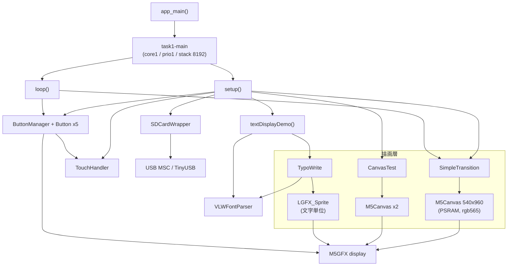

# ayame_sys プログラム仕様書

M5Paper S3（ESP32-S3 + 電子ペーパー）向け、**日本語縦書き表示を備えたアドベンチャーゲーム基盤**。

- 対象: `main/` コンポーネント
- 最終更新: 2026-07-31

> 本書はプログラムの**現在の仕様**を説明する。
> 過去の不具合とその修正経緯は [REFACTORING_LOG.md](REFACTORING_LOG.md) を参照。

---

## 目次

1. [システム概要](#1-システム概要)
2. [ビルドと実行](#2-ビルドと実行)
3. [アーキテクチャ](#3-アーキテクチャ)
4. [モジュール仕様](#4-モジュール仕様)
5. [主要な設計概念](#5-主要な設計概念)
6. [既知の制限・未実装](#6-既知の制限未実装)
7. [開発時のハマりどころ](#7-開発時のハマりどころ)

---

## 1. システム概要

### 1.1 目的と現在地

電子ペーパー端末上で、日本語（縦書き対応）テキストと画面遷移演出を用いた
アドベンチャーゲームを動かすための**基盤**。

現状は**各サブシステムの動作検証段階**であり、次のものはまだ存在しない。

- ゲームシナリオのデータ構造とローダ（テキストはソースにハードコード）
- シーン遷移のステートマシン（タッチで 1→2→3 を循環するだけ）
- セーブ／ロード

`main/hello_world_main.cpp` はアプリ本体というより**各機能のデモ兼テストハーネス**である。

### 1.2 ハードウェア構成

| 項目 | 値 | 備考 |
|---|---|---|
| SoC | ESP32-S3（rev v0.2） | 240MHz / デュアルコア |
| PSRAM | 8MB / Octal / 80MHz | `CONFIG_SPIRAM_MODE_OCT=y`（M5PaperS3 の必須条件） |
| Flash | 16MB / QIO / 80MHz | |
| ディスプレイ | 電子ペーパー 540 × 960 | パネル native は 960×540、`offset_rotation=3` で縦向き |
| 色深度 | **8bit グレースケール** | 後述（1.4）の注意を参照 |
| タッチ | GT911（I2C, SDA=41 / SCL=42 / INT=48） | ボード自動検出に使われる |
| SDカード | SPI（SPI2_HOST） | MISO=40 / MOSI=38 / SCK=39 / CS=47、マウント先 `/sdcard` |
| USB | TinyUSB（MSCデバイス） | SDカードをPCへ公開 |

ボードは `display.begin()` 内の自動検出で判定される。起動ログに次が出れば成功。

```
I (xxx) M5GFX: [Autodetect] board_M5PaperS3
```

### 1.3 主要機能

| 機能 | 担当モジュール |
|---|---|
| SDカードのマウント・ファイル一覧・PNG表示 | `SDCardWrapper` |
| USB MSC によるSDカードのPC公開 | `SDCardWrapper` |
| タッチ／リリース／スワイプ検出 | `TouchHandler` |
| ボタンUI（矩形・角丸、Display/Canvas両対応） | `Button` / `ButtonManager` |
| VLWフォントのメトリクス解析 | `VLWFontParser` |
| 日本語の縦書き・横書き描画 | `TypoWrite` |
| 画面遷移エフェクト（10種） | `SimpleTransition` |
| PSRAMダブルバッファの性能検証 | `CanvasTest` |

### 1.4 色深度についての重要な注意

`main` は `display.setColorDepth(1)` を呼んでいるが、**この呼び出しは効果がない**。

`Panel_EPD::setColorDepth()` が要求値を無視して内部を常に `grayscale_8bit` に固定するためで、
実際の描画は8bitグレースケールで行われる。

```cpp
color_depth_t Panel_EPD::setColorDepth(color_depth_t depth)
{
    _write_depth = color_depth_t::grayscale_8bit;   // 要求値は無視される
    _read_depth  = color_depth_t::grayscale_8bit;
    return depth;
}
```

一方 **`M5Canvas` は親の色深度を継承しない**。`LGFX_Sprite` のコンストラクタが
自身の既定値を使うため、`rgb565_2Byte`（16bpp）で作られる。

```cpp
LGFX_Sprite(LovyanGFX* parent) { _panel = &_panel_sprite; setColorDepth(_write_conv.depth); }
```

したがって 540×960 の Canvas 1枚あたり **約1MB** を消費する。
またコード中の `TFT_BLUE` などのカラー指定はグレースケールに変換されるため、
意図した色にはならない。

---

## 2. ビルドと実行

### 2.1 ESP-IDF は v5.3.2 を使うこと（重要）

**v5.4.3 でビルドすると画面が1ラインおきの白黒縞模様になり、正常に表示できない。**

- v5.3.2: 正常
- v5.4.3: 起動・ログとも正常だが表示だけが崩れる（ハードウェアは正常）

原因は特定できていない。EPD は IDF の `esp_lcd` i80 ドライバ（LCD_CAM + GDMA）で
駆動されており、その版差が疑われる。調査の経緯と否定された仮説は
[REFACTORING_LOG.md](REFACTORING_LOG.md) の §0.4 に記録してある。

VSCode の ESP-IDF 拡張を使う場合、`.vscode/settings.json` の
`idf.espIdfPathWin` と `idf.currentSetup` が**実在する v5.3.2 のパス**を
指していることを必ず確認する。存在しないパスを指していると拡張が有効化に失敗し、
Visual Studio 同梱の CMake/Ninja にフォールバックしてビルドが壊れる。

### 2.2 ビルド

VSCode の `ESP-IDF: Build your project`、または IDF ターミナルで:

```
idf.py build
idf.py -p COM7 flash monitor
```

生の `ninja` タスクを直接叩かないこと（前項のフォールバックを踏む）。

### 2.3 コンポーネント構成

`main/CMakeLists.txt`:

| 区分 | 内容 |
|---|---|
| SRCS | `hello_world_main.cpp`, `SDcard.cpp`, `TouchHandler.cpp`, `Button.cpp`, `TypoWrite.cpp`, `VLWFontParser.cpp`, `SimpleTransition.cpp`, `CanvasTest.cpp` |
| PRIV_REQUIRES | `M5GFX` |
| REQUIRES | `fatfs`, `esp_lcd`, `driver`, `esp_timer`, `tinyusb`, `esp_tinyusb`, `esp_psram` |
| INCLUDE_DIRS | `.`, `fonts` |

外部コンポーネント:

| 名前 | 取得元 | 注意 |
|---|---|---|
| M5GFX | `components/M5GFX`（手動配置） | **git管理外**。誤って削除すると復元できない。版情報も不整合（`library.json`=0.2.6 / `idf_component.yml`=0.1.15、ファイル日付 2025-04-29） |
| espressif/tinyusb | `managed_components/`（コンポーネントマネージャ） | 0.18.0~2 |
| espressif/esp_tinyusb | `managed_components/` | 1.7.2 |

### 2.4 フォントリソース

`main/fonts/` には現在 **`shippori_16.h` のみ**が置かれている。

| 項目 | 値 |
|---|---|
| シンボル | `const uint8_t shippori[]`（`.rodata.font` セクション） |
| 生成元 | `ShipporiMincho-Regular-16.vlw` |
| 形式 | VLW version 11 |
| フォントサイズ | 16pt |
| グリフ数 | 4414（U+0021〜U+FF9F、**unicode昇順・重複なし**） |
| ascent / descent | 19 / −5（fontHeight = 24） |
| 最大グリフ | 18 × 17 |

未使用のフォントは `append/font/` に退避してある（生成スクリプトとTTFも同ディレクトリ）。

> **注意**: フォントヘッダはファイル名にサイズが入るが**シンボル名には入らない**。
> 例えば `shippori.h` と `shippori_16.h` はどちらも `shippori[]` を定義するため、
> 2つ同時に `#include` すると重複定義になる。

---

## 3. アーキテクチャ

### 3.1 レイヤ構成



| レイヤ | クラス | 責務 |
|---|---|---|
| アプリ | `hello_world_main.cpp` | 初期化、シーン描画、イベント配線、メインループ |
| UI | `Button`, `ButtonManager` | ボタン描画と入力ディスパッチ |
| 入力 | `TouchHandler` | 生タッチ座標のイベント化 |
| テキスト | `TypoWrite`, `VLWFontParser` | 日本語組版とフォントメトリクス |
| 演出 | `SimpleTransition` | Canvas → 画面の段階的転送 |
| 検証 | `CanvasTest` | PSRAM・描画性能の測定 |
| ストレージ | `SDCardWrapper` | FATFSマウント、ファイルI/O、USB MSC |

### 3.2 起動シーケンス

```
app_main()                     ← core0（IDF既定）
  └ initializeTask()
      └ xTaskCreatePinnedToCore("task1-main", stack 8192, prio 1, core 1)
          └ runMainLoop()
              ├ setup()        ← 1回だけ
              └ for(;;) { loop(); vTaskDelay(1); }
```

`setup()` の処理順:

1. `display.begin()` → `setEpdMode(epd_quality)` → `setColorDepth(1)` → `fillScreen(TFT_BLACK)`
2. `SD.init()` → `tes.png` があれば表示 → ファイル一覧表示
3. `CanvasTest` 生成 + `init()`（Canvas 2枚 ≒ 2MB）
4. `SimpleTransition` 生成 + `init(true)`（Canvas 1枚 ≒ 1MB）
5. `TouchHandler::init()` → 成功時のみ `ButtonManager` とボタン5個を生成
6. `textDisplayDemo()`（VLW初期化 + 縦書きサンプル描画）

生成されるボタン（すべて y=350）:

| 変数 | x, w | ラベル | 役割 |
|---|---|---|---|
| `btnTest` | 10, 100 | テストボタン | 動作確認・スワイプ検証 |
| `btnUSBMSC` | 120, 100 | USB MSC | USB MSC の有効/無効トグル |
| `btnCanvasTest` | 230, 100 | Canvas Test | Canvas 3種テストの連続実行 |
| `btnTransitionTest` | 340, 100 | Simple Trans | トランジションデモ開始 |
| `btnCanvasStop` | 450, 80 | Stop Test | 中断（初期状態は非表示） |

### 3.3 メインループ

`loop()` は約10ms周期（`vTaskDelay(1)` × `CONFIG_FREERTOS_HZ=100`）で回る。
処理は優先順に次のとおり。

1. **トランジション実行中**なら `simpleTransition->update()` だけ実行して `return`
2. **トランジションデモ中**（`TestMode::SIMPLE_TRANSITION`）ならタッチで次シーンへ進めて `return`
3. 5秒間隔で USB MSC の接続状態を表示
4. `buttonManager->update()`（内部で `TouchHandler::update()` を呼ぶ）

`TestMode` はテスト実行状態を表す列挙で、`NORMAL` 以外のときは
各コールバックが早期 return して通常表示を汚さないようにしている。

### 3.4 グローバルオブジェクト

| 名前 | 型 | 定義場所 |
|---|---|---|
| `display` | `M5GFX` | `hello_world_main.cpp` |
| `SD` | `SDCardWrapper` | `SDcard.cpp`（`extern` は `SDcard.hpp`） |
| `touchHandler` | `TouchHandler` | `hello_world_main.cpp` |
| `vlwParser` | `VLWFontParser` | `hello_world_main.cpp` |
| `buttonManager` / `btn*` / `canvasTest` / `simpleTransition` | ポインタ | `setup()` 内で `new`（解放されない） |

---

## 4. モジュール仕様

### 4.1 `SDCardWrapper` — SDカード / USB MSC

`lgfx::v1::DataWrapper` を継承しているため、
`display.drawPngFile(&SD, path, x, y)` のように M5GFX の画像デコーダへ直接渡せる。
グローバルインスタンス `SD` が1つ存在する。

**主なAPI**

| メソッド | 説明 |
|---|---|
| `init()` / `init(miso,mosi,sck,cs,...)` | SPIバス初期化 + FATFSマウント。**失敗時はSPIバスを解放**するので挿抜リトライが可能 |
| `open/close/read/seek/skip/tell` | `DataWrapper` の実装。M5GFX から呼ばれる |
| `exists/mkdir/remove/size` | ファイル操作 |
| `listDir(path)` / `freeDirInfo()` | ディレクトリ一覧。`DirInfo` は `malloc` で確保されるので**呼び出し側が `freeDirInfo()` する** |
| `enableUSBMSC()` / `disableUSBMSC()` | USB MSC の有効／無効 |
| `isUSBMSCEnabled()` / `isUSBMSCConnected()` | 状態取得 |

**内部の仕組み**

- パス構築は private の `buildFullPath()` に集約。`/sdcard` プレフィックスが無ければ付加し、
  切り詰めが起きたら失敗を返す（`snprintf` なので出力は常にNUL終端）。
- USB MSC 有効中はファイルアクセスAPIがすべてエラーを返す。
  SDカードの所有権が USBホスト側へ移るため。
- USB MSC の有効化／無効化はセットアップの逆順で対称に行う。

```
enableUSBMSC : tinyusb_driver_install → tinyusb_msc_storage_init_sdmmc → storage_unmount
disableUSBMSC: storage_mount → tinyusb_msc_storage_deinit → tinyusb_driver_uninstall
```

`tinyusb_msc_storage_deinit()` はハンドルを解放するだけで FATFS をアンマウントしないため、
先に `storage_mount()` しておけば無効化後もアプリから `/sdcard` を読める。

### 4.2 `TouchHandler` — タッチ入力

**型**

| 型 | 値 |
|---|---|
| `ExtendedTouchPoint` | `x`, `y`, `timestamp`（ms） |
| `SwipeDirection` | `None` / `Up` / `Down` / `Left` / `Right` |
| `TouchEvent` | `None` / `Touch` / `Release` |

**イベントモデル**

`update()` を呼ぶたびにハードウェアを読み、状態遷移からイベントを1回だけ生成する。
**破壊的メソッドなので、1ループにつき1回だけ呼ぶこと**（後述 7章）。

- タッチ開始 → `TouchEvent::Touch` + `onTouchStart` コールバック
- タッチ終了 → `TouchEvent::Release` + `onTouchEnd` コールバック
- 終了時に移動量が閾値（`setMinSwipeDistance()`、既定30・`main` は50）を超えていれば
  `_lastSwipe` に方向を設定し `onSwipe` コールバック

**スワイプは Release と排他ではない。** `isReleaseEvent()` と `isSwipeEvent()` は
同時に true になりうる。スワイプは「方向を伴うタッチ終了」として扱う。

`_lastEvent` と `_lastSwipe` は `update()` の先頭で毎回クリアされるため、
`getLastSwipe()` などは**同じ更新サイクル内で参照する**必要がある。

スワイプ方向は移動量の大きい軸で決まる。採用される軸は必ず `max(|dx|, |dy|)` なので、
閾値判定は「主軸の移動量が閾値以上か」と等価。

### 4.3 `Button` / `ButtonManager` — ボタンUI

**`Button`**

| 項目 | 内容 |
|---|---|
| 状態 | `Normal` / `Pressed` / `Disabled` |
| スタイル | `ButtonStyle`（状態別の背景・文字・枠線色、枠線幅、角丸半径） |
| 描画先 | `setDrawTarget(canvas)` で Canvas、`nullptr` なら Display |
| コールバック | 押下 / 離上 / スワイプ4方向 |

描画は `drawTo(lgfx::LovyanGFX*)` の1本で行う。
`LGFX_Sprite` と `M5GFX` はどちらも `lgfx::LovyanGFX` 派生なので、
Canvas と Display を同じコードで扱える。

**`ButtonManager`**

最大32個の `Button*` を保持し、`update()` で入力を配送する。

> **所有権**: `ButtonManager` はボタンを**所有しない**。
> 生成と破棄は呼び出し側の責任で、デストラクタ・`clearButtons()`・`removeButton()`
> のいずれも `delete` しない。所有させたい場合は `unique_ptr` を受け取るAPIに変更すること。

`update()` の処理:

| イベント | 動作 |
|---|---|
| Touch | 座標を含むボタンを `Pressed` にして再描画、`onPressed` を発火 |
| Release | 押下中のボタンを `Normal` に戻して再描画。**スワイプが成立していなければ**、離した位置がボタン内のとき `onReleased` を発火。スワイプ成立時はタッチ開始位置のボタンへスワイプを配送 |

### 4.4 `VLWFontParser` — VLWフォント解析

VLW（Processing の Vector Letterform Workshop 形式）バイナリを解析し、
メトリクスを提供する。**ビットマップの描画は行わない**（描画は M5GFX が担当）。

**フォーマット**

| 領域 | サイズ | 内容 |
|---|---|---|
| ファイルヘッダ | 24B（6 × uint32 BE） | glyphCount, version(=11), fontSize, padding, ascent, descent |
| グリフヘッダ × N | 28B（7 × uint32 BE） | unicode, height, width, setWidth, topExtent, leftExtent, padding |
| ビットマップ | width × height B | 8bitグレースケール、グリフ順に連続 |

すべてビッグエンディアン。

**主なAPI**

| メソッド | 説明 |
|---|---|
| `init(data, size)` | ヘッダ解析 → グリフテーブル構築 → 全体メトリクス算出 |
| `getCharMetrics(unicode)` | width / height / setWidth / topExtent / leftExtent / exists をまとめて取得 |
| `getCharWidth/Height/SetWidth(unicode)` | 個別取得（内部では都度グリフ検索） |
| `hasChar(unicode)` | 収録有無 |
| `getFontHeight/Width/Size()`, `getAscent/Descent()` | フォント全体の値 |
| `debugPrintFontInfo()` | ログ出力（**呼び出し側が明示的に呼ぶ**） |

**グリフ検索**

`buildGlyphTable()` の末尾で unicode 昇順かどうかを判定し、`_glyphTableSorted` に保持する。

- 昇順なら **二分探索**（O(log N)、4414グリフで最大13回）
- 昇順でなければ線形探索へフォールバックし、初期化時に `ESP_LOGW` を出す

どちらを使うかは初期化ログに出る。

```
I (xxx) VLWParser: Glyph table built successfully with 4414 entries (lookup: binary search)
```

**「高さ」の定義**

`getCharHeight()` と `getCharMetrics().height` はどちらも**ビットマップ高**（`glyph->height`）を返す。
収録がない場合はどちらも `fontHeight` にフォールバックする。

**代表文字**

`calculateFontMetrics()` は U+3000（全角スペース）→ U+0020（半角）の順に代表幅を探すが、
**`shippori_16` はどちらも収録していない**。その結果 `fontWidth` は初期値の
`fontSize`（= 16）がそのまま使われる。em幅と一致するため結果的に妥当な値になっている。

### 4.5 `TypoWrite` — 日本語組版

VLWフォントを使って横書き・縦書きのテキストを描画する。

**設定API**

| 分類 | メソッド |
|---|---|
| 描画先 | `setDrawTarget(sprite)` / `setVLWParser(parser)` |
| レイアウト | `setDirection()` / `setAlignment()` / `setPosition()` / `setArea()` / `setWrap()` |
| 色 | `setColor()` / `setBackgroundColor()` / `setTransparentBackground()` |
| フォント | `setFont()` / `loadFontFromArray()` / `setFontSize()` |
| 間隔 | `setLineSpacing()` / `setCharSpacing()` |
| 描画 | `drawText()` / `drawTextCentered()` / `clearArea()` |
| 寸法 | `getTextWidth()` / `getTextHeight()` |

**背景の透過**

`TFT_TRANSPARENT` は `0x0120` という**実在の色値**であって透明フラグではない。
そのため `setBackgroundColor(TFT_TRANSPARENT)` を受けたときは
自動的に透明モード（`_transparentBg`）を有効にする。`setTransparentBackground(bool)` でも明示できる。

透明モードでは、
描画領域の塗りつぶし（`fillRect`）を行わず、
文字描画に1引数版 `setTextColor(_color)` を使う
（LovyanGFX は前景色と背景色が同一のとき背景を塗らない）。

**描画の流れ**

```
drawText()
  ├ setClipRect(領域)
  ├ 透明でなければ fillRect で領域をクリア
  ├ 枠線表示が有効なら drawAreaBorder()
  ├ applyTextStyle(target)        ← フォント/サイズ/色を1回だけ設定
  ├ drawHorizontalTextEnhanced() または drawVerticalTextEnhanced()
  ├ releaseTextStyle(target)      ← loadFont したフォントを解放
  └ clearClipRect()
```

`loadFont()` は VLW ヘッダの解析を伴うため、文字ごとではなく**文字列ごとに1回**だけ行う。

**横書き・縦書きとも「測ってから描く」2パス構造**をとる。
`TextAlignment` を反映するには行（列）の総寸法が先に必要なため。

| 方向 | 揃えの単位 | LEFT | CENTER | RIGHT |
|---|---|---|---|---|
| 横書き | 折り返し後の**視覚行** | 左揃え | 中央 | 右揃え |
| 縦書き | **列** | 上揃え | 中央 | 下揃え |

**送り量**

| 方向 | 送り |
|---|---|
| 横書き | `setWidth × widthScale` + 字間 |
| 縦書き | `setWidth`（em固定、縮小率を掛けない） + 字間 |

> **`setCharSpacing()` の目安（縦書き）**
>
> 縦書きの送りは em 固定なので、**0 でベタ組み**になる。
> 負値を入れすぎると文字が重なる。
>
> `shippori_16`（ascent=19 / あ は h=15, topExtent=13）での実測:
>
> | `charSpacing` | 送り | 隣接するインクの関係 |
> |---|---|---|
> | 0 | 17px | 間隔 2px（適正） |
> | −4 | 13px | 2px 重なる |
> | −8 | 9px | **6px 重なる** |
>
> インクの位置は `y + ascent − topExtent` から `+ h` の範囲になる
> （`drawString()` はアセント線を y に置く）。
> 詰めたい場合でも −4 程度までにとどめること。

`calculateTextSize()` は描画側と**同じ式**で計算する。ここが食い違うと
`getTextWidth()` と実際の描画がずれ、`drawTextCentered()` の中央位置も外れる。

**文字種別の微調整**

`CharCategory`（NORMAL / BRACKET / HORIZONTAL_BAR / PUNCTUATION / SMALL_CHAR / OTHER_SPECIAL）
ごとに `CharTypeAdjustment`（幅倍率・高さ倍率・字間・縦横オフセット）を持つ。
**既定は全カテゴリ 1.0 倍・オフセット0（＝調整なし）**。
個別に調整したい場合は `TypoWrite.cpp` 冒頭の `TypoWriteConstants` を変更する。

倍率が 1.0 のとき描画は**直接描画（最速パス）**を通る。
1.0 以外や回転が必要な場合のみ、文字単位のスプライトを経由する。

| 文字種 | 倍率 | 経路 |
|---|---|---|
| 横書き 通常 | 1.0 | 直接描画 |
| 縦書き 通常・非回転 | 1.0 | 直接描画 |
| 縦書き 小文字 | 0.75 | スプライト（縮小） |
| 縦書き 回転文字 | 1.0 | スプライト（90°回転） |

**配置基準は2経路で一致させる（em ボックス方式）**

2つの経路は配置の仕組みが異なるため、基準を揃えないと同じ列の中で位置が跳ねる。

| 経路 | 配置の仕組み |
|---|---|
| 直接描画 | `drawString(x, y)` — **左上基準**（フォントのアセント基準） |
| スプライト | `pushRotateZoom(cx, cy, ...)` — **中心基準** |

スプライトは**全文字共通の em ボックスサイズ**で確保する（`getEmBoxSize()`）。
グリフはスプライトの原点 `(0, 0)` に描き、拡大後の em ボックス左上が
`(_x + x, _y + y)` に来るよう中心を計算する。

```cpp
center_x = _x + x + emW * widthScale  / 2;
center_y = _y + y + emH * heightScale / 2;
```

これで直接描画と同じ左上基準になり、回転時も em ボックスの中心を軸に回るため
縦書き中の半角英数が列の中央に収まる。

em ボックスのサイズは代表文字のメトリクスに加え、
VLWパーサの実測最大グリフサイズでも押し広げる
（`shippori_16` は代表幅16に対し最大グリフ幅18）。

> **経緯**: 以前はスプライトを
> `(metrics.width * scale + 20) × (metrics.height * scale + 20)` と
> **グリフごとに変えていた**ため、中心位置がグリフのビットマップ高に依存し、
> あ(h=15) は `y+17`、ー(h=7) は `y+13` と**同じ列で4pxずれていた**。
> 送り（`setWidth`=17）は揃っているのに配置だけが跳ねる状態だった。
> em ボックス固定にしたことで解消し、あわせてスプライトの作り直しも
> フォント・フォントサイズ変更時のみになった。

**メトリクスキャッシュ**

`getCharMetrics()` の結果を `unordered_map` にキャッシュする（上限 `METRICS_CACHE_LIMIT` = 256）。
上限に達したら全消去して入れ直す（世代的な追い出し）。
フォントやサイズを変更したときもクリアされる。

### 4.6 `SimpleTransition` — 画面遷移

PSRAM上の `M5Canvas`（540×960）に完成画面を描いておき、
段階的に電子ペーパーへ転送して遷移を演出する。

**使い方**

```cpp
M5Canvas* canvas = transition->getMainCanvas();
// canvas に最終的な画面を描く
transition->startTransition(SimpleTransitionType::FADE_IN, 6);
// loop() で毎回 update() を呼ぶ。false が返れば完了
```

**効果の種類**

| 種別 | 動作 |
|---|---|
| `NONE` | 即時表示 |
| `FADE_IN` | 上端から下へ段階表示（階調フェードではない） |
| `SLIDE_LEFT/RIGHT/UP/DOWN` | **キャンバスが画面外から滑り込む** |
| `WIPE_HORIZONTAL/VERTICAL` | 画像は固定のまま端から現れる |
| `REVEAL_CENTER` | 中央から矩形が拡大 |
| `REVEAL_CORNER` | 左上から矩形が拡大 |

SLIDE は描画位置そのものをオフセットする（画像が動く）。
WIPE は表示領域だけを広げる（画像は動かない）。両者は別の効果である。

**ステップ管理**

- ステップ数は `[1, 8]` にクランプされる（それ以上の自動最適化はしない）
- 進捗は `calcStepProgress()` = `(_currentStep + 1) / _totalSteps`。
  step 0 で 1/N、最終ステップでちょうど 1.0 になり、全ステップが表示を進める
- `getProgress()` も同じ値を返す

**画面更新の考え方（重要）**

電子ペーパーの所要時間を決めるのは**リフレッシュ回数**であって、更新範囲の広さではない。
`Panel_EPD` の更新タスクは、更新領域に関係なく**常にパネル全行を走査する**。

```cpp
for (uint_fast16_t y = 0; y < mh; y++) {   // mh = 全行
    bus->writeScanLine(...);
}
```

しかも1回の更新につき、EPDモードのLUTステップ数だけこの走査を繰り返す。

| EPDモード | LUTステップ（＝走査回数） |
|---|---|
| `epd_quality` | 21 |
| `epd_text` | 18 |
| `epd_fast` | 11 |
| `epd_fastest` | 7 |

さらに `Panel::endWrite()` が `display()` を呼ぶため、
**転送処理1回ごとにリフレッシュが1回走る**。

```cpp
void endWrite(void) { if (0 == --_start_count) { if (_auto_display) { display(0,0,0,0); } ... } }
```

したがって高速化の指針は次のとおり。

| 施策 | 効果 |
|---|---|
| 転送**回数**を減らす | **大**（走査回数が直接減る） |
| EPDモードを軽くする | **大**（LUTステップ数が減る） |
| ステップ数を減らす | **大**（1ステップ＝1リフレッシュ） |
| 転送**面積**を減らす | **ほぼ無し**（全行走査は変わらない） |

この性質にもとづき、本クラスは次の設計をとる。

1. **クリアは `startTransition()` での1回のみ**。
   各効果は「表示済み領域が単調に広がる」累積展開なので毎ステップのクリアは不要。
2. **1ステップあたりの転送は1回**にする。差分をリング状・L字に分割すると
   転送回数が増えて逆に遅くなるため行わない。
3. **中間フレームは高速モードで描く**（既定 `epd_fast`）。
   完了時に元のモードへ戻し、そのモードで最終画面を描き直す。
   中間フレームは一瞬しか表示されないため画質を落としてよい。

```
8ステップの目安（パネル走査回数）
  全部 epd_quality        : 8 x 21      = 168
  epd_fast + 最終品質描画 : 8 x 11 + 21 = 109   （約1.5倍速）
  epd_fastest + 同上      : 8 x  7 + 21 =  77   （約2.2倍速）
```

モードは `setTransitionEpdMode()` で変更できる。
中断（`stop()`）や未知の種別で終了した場合も必ず元のモードへ戻す
（戻し忘れるとアプリ全体の描画が低画質のままになる）。

**残像（ghosting）の扱い**

更新タスクは次の判定で「全画素を駆動するか、変化した画素だけ駆動するか」を切り替える。

```cpp
bool refresh = (remain == 0);                        // タスクがアイドルのときだけ true
if (refresh && mode != epd_mode_t::epd_fastest) {
    d[0] = s0 + lut_offset;                          // 全画素を駆動（残像が消える）
} else {
    if (d0 != s0) { d[0] = s0 + lut_offset; }        // 変化した画素のみ（残像が残る）
}
```

ここから次が言える。

| 条件 | 挙動 |
|---|---|
| アイドル時の単発更新（`epd_fastest` 以外） | フルリフレッシュ。残像が消える |
| 更新が連続（`remain > 0`） | 部分更新に落ちる |
| `epd_fastest` | **常に部分更新**。フルリフレッシュを一切行わない |

トランジション中は更新が連続するため、ほとんどのステップが部分更新になり残像が溜まる。
そのため完了時は **`waitDisplay()` でタスクがアイドルになるのを待ってから**
最終画面を描き、確実にフルリフレッシュさせる。

`epd_fastest` は速いが残像を一切解消しないので、常用する場合は
後述の `refreshDisplay()` を併用すること。

**起動直後の残像（リセット時に特にひどくなる理由）**

`Panel_EPD::init()` はパネルの内容を**全白と仮定**して内部バッファを埋める。

```cpp
memset(_buf, 0xFF, panel_width * panel_height / 2);        // パネル内容モデル = 全白
for (int i = 0; i < memory_w * memory_h >> 1; ++i) {
    _step_framebuf[i] = 0xFFFFu;                           // リフレッシュ状態 = 全白
}
```

しかし E-Paper は電源を切っても像を保持するため、実際のパネルは前の画像を表示したままである。

| | ドライバの認識 | 実際のパネル | ズレ |
|---|---|---|---|
| コールド起動 | 全白 | 長時間放置で退色・中間状態 | 小 |
| **リセット直後** | 全白 | **直前の画像がくっきり残る** | **大** |

E-Paper の波形は「どの状態から どの状態へ」で決まるため、
実際は黒だった画素に「白から」の波形をかけても駆動しきれず、前の像が残る。
これが「リセットすると残像がひどい」の原因。

対策は**起動直後に `clearGhosting()` を呼んで物理状態をドライバの仮定（全白）へ合わせる**こと。

**描画していない領域が薄くなる理由**

更新は `_range_mod`（描画範囲のバウンディングボックス）に対してのみ行われる。

```cpp
_range_mod.left = std::min(xs, _range_mod.left);   // 描画した範囲だけが累積される
upd.x = xs; upd.w = xe - xs + 2;                   // その矩形だけをキューへ
```

パネル走査は全行を回るが、**電圧がかかるのは更新範囲内の画素だけ**である。
範囲外の画素は駆動されないまま放置され、時間とともにドリフトして薄くなる。

一部だけを描き続ける画面（テキストの書き換え、タッチ座標の表示など）では、
**その部分だけがくっきり保たれ周囲が淡くなる**という見え方になる。

**リフレッシュ手段の使い分け**

| メソッド | 種別 | 動作 | フラッシュ | コスト目安 | 用途 |
|---|---|---|---|---|---|
| `SimpleTransition::refreshScreen(display, mode)` | static | 更新範囲を全画面にして再駆動。内容は変えない | **なし** | 走査21回 | 描画していない領域の**退色を戻す** |
| `SimpleTransition::clearGhosting(display, mode)` | static | 白→黒→白の反転で全画素を強制駆動。画面は白で終わる | あり | 走査63回 | 蓄積した**残像を消す**、起動時の状態同期 |
| `refreshDisplay(mode)` | インスタンス | `clearGhosting()` + メインキャンバスを描き直す | あり | 走査63回＋1回 | 表示を保ったまま残像を消す |

前2つは **static** なので `SimpleTransition` のインスタンスが無くても呼べる。
起動直後（インスタンス生成前）に使うためである。

```cpp
display.begin();
display.setEpdMode(lgfx::v1::epd_mode::epd_mode_t::epd_quality);
display.setColorDepth(1);

SimpleTransition::clearGhosting(&display);   // 起動時の状態同期
```

テキストやタッチ結果を描くたびにリフレッシュする必要はない。
数回に一度、あるいは操作待ちに入る直前などで十分である。

`clearGhosting()` は **static メソッド**なので `SimpleTransition` の
インスタンスが無くても呼べる。起動直後（インスタンス生成前）に使うためである。

```cpp
display.begin();
display.setEpdMode(lgfx::v1::epd_mode::epd_mode_t::epd_quality);
display.setColorDepth(1);

SimpleTransition::clearGhosting(&display);   // インスタンス生成前でも呼べる
```

各段階の前後で `waitDisplay()` を挟み、部分更新に落ちないようにしている。
片方向の塗りつぶし1回では粒子が完全にリセットされないため反転を挟む。
最後を白で終えるのは、`Panel_EPD` が初期化時に仮定する状態と一致させるため。

フルリフレッシュ数回分の時間がかかるため、
起動時・場面の区切り・アイドル時など遅延が許容できる場面で呼ぶ。

**部分転送の方法**

中間バッファは使わず、クリップ矩形で行う。

```cpp
_display->setClipRect(x, y, w, h);
_mainCanvas->pushSprite(_display, 0, 0);
_display->clearClipRect();
```

`LGFXBase::pushImage()` がクリップ矩形で転送範囲を切り詰めてから
`writeImage()` を呼ぶため、実際に転送されるのは指定領域だけになる。
ただし前述のとおり、これはCPU側の転送量を減らすだけでパネル走査時間は変わらない。

### 4.7 `CanvasTest` — PSRAM検証（テスト専用）

PSRAM上に 540×960 の `M5Canvas` を2枚確保し、
メモリ使用量・描画性能・ダブルバッファ切替を測定する**検証用クラス**。

| メソッド | 内容 |
|---|---|
| `testMemoryUsage()` | PSRAM / 内部RAM の使用量をログと画面に表示 |
| `testDrawingPerformance()` | 塗りつぶし・線1000本・円100個・矩形100個の所要時間を測定 |
| `runDoubleBufferTest()` | 100フレームのバッファ切替 |

> 本番機能ではない。現状は `setup()` で常駐生成されており Canvas 2枚（約2MB）を
> 占有し続けるため、不要なら生成を外してよい。

---

## 5. 主要な設計概念

### 5.1 日本語縦組みの実装ルール

| ルール | 実装 |
|---|---|
| 1文字 = 1em | 列方向の送りは `setWidth` 固定（`shippori_16` では全角17px） |
| 小文字（ぁゃゅ等）も1emを占める | 縮小率0.75は**描画サイズにのみ**適用し、送りには掛けない |
| 小文字は**まずフォントの専用グリフを使う** | 収録が無いフォントでのみ大文字を縮小して代用（下記） |
| 句読点・括弧は縦書き字形へ差し替え | `_verticalGlyphMap`（28件）で U+FE10〜FE48 へ変換 |
| 半角英数・半角カナは90°回転 | `shouldRotateInVertical()` が判定 |
| 列は右から左へ進む | 開始位置 `_width - columnWidth`、列送り `columnWidth + _lineSpacing` |

縦組みでは「行」＝「列」なので、**列の間隔は `setLineSpacing()` で指定する**
（列間専用の設定は持たない）。

**小文字（捨て仮名）の扱い**

`needsSmallCharSubstitution()` が、フォントに専用グリフがあるかで自動的に切り替える。

| 条件 | 動作 |
|---|---|
| フォントが小文字グリフを収録している | **そのまま描く**（直接描画・最速パス） |
| 収録していない | `_smallToLargeMap`（22件）で大文字に変換し 0.75倍に縮小、`SmallCharSettings` でオフセット |

専用グリフはサイズも em ボックス内の位置も適切に設計されているため、
代用品より確実に良い結果になる。`shippori_16` の実測（ascent=19）:

| 文字 | h | topExtent | インク範囲 | 次の文字までの空き |
|---|---|---|---|---|
| あ U+3042 | 15 | 13 | y+6〜y+21 | 2px |
| **ぁ U+3041** | 13 | 11 | **y+8〜y+21** | **2px** |
| ゃ U+3083 | 11 | 10 | y+9〜y+20 | 3px |
| っ U+3063 | 7 | 7 | y+12〜y+19 | 4px |

専用グリフは**インク下端が大文字と揃うよう設計**されているため、
そのまま描けば間隔が通常文字と揃う。

ただしこれは**横書き用の設計（ベースライン揃え＝下寄せ）**である。
縦組みでは小文字を **em の右上**へ寄せるのが正しいので、
`SmallCharSettings` の `offsetX` / `offsetY` で変位を与える。
この変位は**専用グリフ・代用のどちらにも適用**される。

| 設定 | 意味 | 既定値 | `shippori_16` での実効値 |
|---|---|---|---|
| `scale` | **代用時のみ**使う縮小率 | 0.75 | （専用グリフがあるため未使用） |
| `offsetX` | emボックス幅に対する比率（正で右） | 0.15 | 18 × 0.15 = **+2px** |
| `offsetY` | emボックス高に対する比率（負で上） | −0.10 | 24 × −0.10 = **−2px** |

変位の基準は**em ボックス**であってグリフのビットマップ寸法ではない。
グリフ基準にすると ぁ(h=13) と っ(h=7) で変位量が変わり、
同じ列の中で寄せ具合が揃わなくなる。

寄せ具合はフォントの字形設計に依存するため、実機で見て調整すること。

一方「大文字を0.75倍に縮小」で代用すると、em ボックスの左上基準で縮むため
インク下端が上がり、次の文字との空きが **2px → 8px 程度に広がる**。
`shippori_16` は22件すべての小文字を収録しているので代用は発動しない。

`setSmallCharHandling(false)` で代用処理そのものを止められるが、
上記の自動判定があるため通常は変更不要。

縦書き字形への差し替えは、フォントに収録がなければ元の文字に戻す。
`shippori_16` は28件すべてを収録しているためフォールバックは発動しない。

### 5.2 描画先の切り替え

`Button` と `TypoWrite` は描画先を切り替えられる。

```cpp
button->setDrawTarget(canvas);    // nullptr で Display 直描画
typo->setDrawTarget(canvas);
```

いずれも内部では `lgfx::LovyanGFX*` に束ねて扱う。
ただし現状 `setup()` ではすべて Display 直描画になっており、
Canvas 経由のちらつき抑制は使われていない。

### 5.3 メモリ配分（実測）

| 用途 | サイズ | 配置 |
|---|---|---|
| EPDフレームバッファ（`_step_framebuf`） | 518,400 B | PSRAM |
| EPD作業バッファ（`_buf`） | 259,200 B | PSRAM |
| `CanvasTest` の Canvas × 2 | 約 2.07 MB | PSRAM |
| `SimpleTransition` の Canvas × 1 | 約 1.04 MB | PSRAM |
| VLWグリフテーブル | 約 138 KB | PSRAM（16KB超のためPSRAMへ回る） |

`CONFIG_SPIRAM_MALLOC_ALWAYSINTERNAL=16384` により、**16KBを超える確保は
自動的にPSRAMから行われる**。明示的な `heap_caps_malloc(MALLOC_CAP_SPIRAM)` は不要。

なお `CONFIG_COMPILER_CXX_EXCEPTIONS` は未設定（例外無効）なので、
`new` は確保失敗時に nullptr を返さず `abort()` する。
`if (ptr == nullptr)` のフォールバックは書いても到達しない。

---

## 6. 既知の制限・未実装

### 6.1 表示

- **ESP-IDF 5.4.3 でビルドすると画面が縞模様になる**（原因未特定、2.1参照）
- カラー指定はグレースケールに変換されるため意図した色にならない（1.4参照）
- ボタンのラベルとシーンのテキストは日本語フォントが設定されておらず豆腐になる
  （`Button::setFont()` / `canvas->setFont()` の指定が必要）

### 6.2 未実装の機能

- ゲームシナリオのデータ構造とローダ
- シーン遷移のステートマシン、セーブ／ロード
- 禁則処理など日本語組版の詳細ルール
- タッチキャリブレーション値の永続化（`calibrate()` は呼ばれていない）
- 省電力（ディープスリープ、タッチ割り込み起床）

### 6.3 構造上の課題

| 項目 | 内容 |
|---|---|
| タッチの多重ポーリング | `loop()` と `ButtonManager::update()` が別々に `TouchHandler::update()` を呼びうる（7.1参照） |
| Canvasテストの同期実行 | ボタンコールバック内で完結するため実行中UIが固まり、Stopボタンを押せない |
| `textDisplayDemo()` の再初期化 | 呼ぶたびにVLW再解析（約138KB再確保）と `TypoWrite` 再構築を行う |
| Canvas常駐 | 検証用の `CanvasTest` が常時2MBを占有 |
| `calculateTextSize()` | 折り返し（`_wrap`）を考慮しない。返すのは改行だけで区切った自然な寸法 |
| 画面サイズマクロの重複 | `SIMPLE_TRANSITION_WIDTH/HEIGHT` と `CANVAS_WIDTH/HEIGHT` が同値で別定義 |
| 描画先指定の分散 | 各モジュールが個別に描画先を持ち、共通の「現在のフレームバッファ」概念がない |

---

## 7. 開発時のハマりどころ

### 7.1 `TouchHandler::update()` は1ループに1回だけ

`update()` はハードウェアを読んで内部状態を更新し、イベントを1回だけ返す**破壊的メソッド**。
2回呼ぶと2回目は必ず `None` を返し、イベントを取りこぼす。

`ButtonManager::update()` は内部で `TouchHandler::update()` を呼ぶため、
同じループで別途 `touchHandler.update()` を呼んではいけない。

### 7.2 `M5Canvas` の色深度は親を継承しない

1.4 のとおり `rgb565`（16bpp）で作られる。540×960 で約1MB。
メモリ計算をするときは注意。

### 7.3 EPD更新タスクは別コアで動く

`Panel_EPD` は `display.begin()` を呼んだコアと**逆のコア**に更新タスクを張り付ける
（`task_pinned_core` の既定が -1 のため常にそうなる）。
M5GFX 自身が「コアが異なる場合はPSRAMのキャッシュ同期が要る」とコメントしている。

### 7.4 フォントヘッダのシンボル名

2.4 のとおりファイル名にサイズが入ってもシンボル名には入らない。
複数のフォントを切り替える場合はシンボル名の衝突に注意。

### 7.5 `components/M5GFX` は git 管理外

untracked かつ `.gitignore` にも入っていないため、
`git clean` や `git stash -u` で**消えると復元できない**。
退避してから操作すること。

### 7.6 電子ペーパーの描画コスト

`fillScreen()` は最も重い操作。ループ内や毎ステップで呼ばない。
描画はまとめて行い、更新回数を減らす設計にする。
