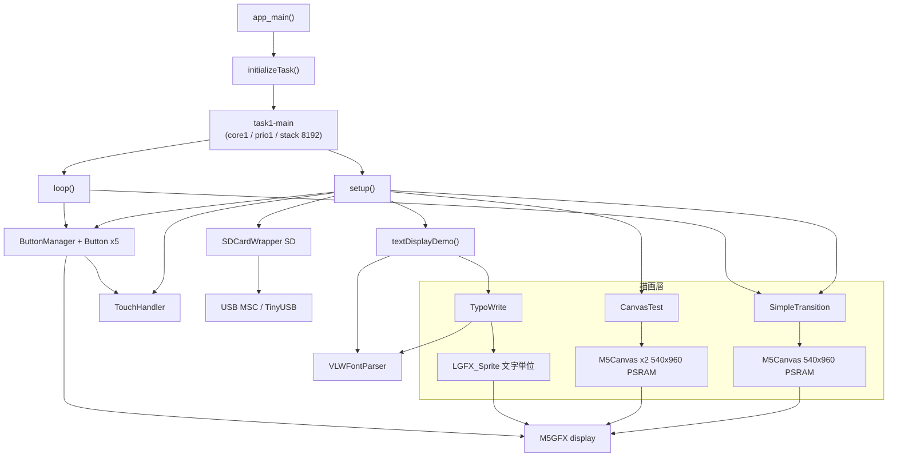

# ayame_sys 改修記録

本書は 2026-07-30 に既存ソースを読み取って作成した**初版の仕様書**と、
そこに記載した Todo を順に修正していった**作業記録**である。

- **プログラムの現在の仕様を知りたい場合は [PROGRAM_SPEC.md](PROGRAM_SPEC.md) を参照すること。**
- 本書は「何がどう壊れていて、なぜそう直したか」「初版の記述のどこが誤っていたか」
  を残すためのものであり、仕様書としては読みにくい。
  記述の多くは修正前の状態を説明しているため、現在のコードとは一致しない。

各項目の凡例:

| 表記 | 意味 |
|---|---|
| ~~取り消し線~~ + `対応済み（日付）` | 修正済み。取り消し線部分は修正前の状態 |
| `一部対応` | 一部のみ修正。残りの理由を併記 |
| `【訂正】` | 初版の記述自体が誤りだったもの |
| `未対応` | 未着手。理由を併記 |

---


M5Paper S3（ESP32-S3 + 電子ペーパー）向け、日本語縦書き表示機能を持つアドベンチャーゲーム系システムの
`main/` コンポーネント仕様書。

- 対象ディレクトリ: `main/`
- 作成日: 2026-07-30（初版）／最終更新: 2026-07-30
- 初版はリバースエンジニアリング（既存ソースの読み取り）によって作成した。
  その後、記載した Todo を順に修正しており、対応済み項目には
  `対応済み（日付）` を、初版の記述自体が誤っていたものには
  `【訂正】` を付記している。
- 各メソッドの章末に、実装上の疑問点・非効率箇所を `Todo:` として記載している。

---

## 0. 対応状況サマリ（2026-07-30 時点）

### 0.1 修正方針

利用者の指示により、以下の範囲で進めている。

| 範囲 | 方針 |
|---|---|
| `main/hello_world_main.cpp` の処理フロー | **調整中のため変更しない**（§4.2 の到達不能コードと未使用includeのみ対応済み） |
| `main/fonts/` のフォントヘッダ | **調整中のため以降は保留**（§2.2 の整理までで停止） |
| `CanvasTest`（§11） | **保留** |
| 設計変更を伴うもの | Todo として残し、個別の実装修正を優先 |

### 0.2 検証方法

各修正ごとに ESP-IDF v5.4.3 でフルビルドし、
exit code・コンパイラ警告・バイナリサイズの変化を確認している。
アルゴリズムを変更した箇所（VLW二分探索）は、実データに対する
網羅テストで従来実装との一致を確認した。

**ただし実機（M5Paper S3）での動作確認は行えていない。**
以下は実機テストが必要:

| 項目 | 確認すべきこと |
|---|---|
| USB MSC（§5.7） | PC からの認識、有効化→無効化→有効化のトグル、無効化後にSDが読めるか |
| タッチ／スワイプ（§6.3, §7.6） | 押下→スワイプ時にボタン表示が戻るか、スワイプが正しく配送されるか |
| 縦書き描画（§9） | 字間・位置・文字サイズ。下記「見た目の変化」を参照 |
| トランジション（§10.9） | クリップ矩形方式での部分転送が正しく描画されるか |

### 0.3 見た目に影響する変更

| 変更 | 内容 | 対応する調整 |
|---|---|---|
| 縦書きの字間 | 可変（−4〜7px、負の値では**逆行していた**）→ em固定送り（一律 `setWidth`＋`charSpacing`） | `main` の `setCharSpacing(-8)` は旧送り前提。要再調整 |
| 縦書きの水平位置 | 1列目が右端から2em内側 → 1em内側（右へ16px移動） | — |
| 文字サイズ | 横1.0倍／縦1.1倍の不一致 → 両方1.0倍（縦書きは約9%小さくなる） | 戻すなら `setFontSize()` |
| 描画領域の背景 | `TFT_TRANSPARENT`(0x0120) で塗りつぶし → 透過（塗らない） | 呼び出し側の意図どおり |

### 0.4 既知の不具合: ESP-IDF 5.4.3 で画面が縞模様になる（未解決）

**症状**: `fillScreen()` を含むあらゆる描画で、1ラインおきに白線が入り白黒の縞模様になる。
起動直後から常時発生する。M5Stack の Factory Test は正常表示されるため**ハードウェアは正常**。

**原因**: ESP-IDF の版差。**5.3.2 では正常、5.4.3 で発生**する。

本書の修正作業に着手した時点で `build/` は v5.3.2 構成だったが、
その v5.3.2 が既にアンインストールされていたため v5.4.3 で再構成せざるを得なかった。
この版差が持ち込まれた。

**切り分け済みの事実**:

| 検証 | 結果 |
|---|---|
| 原本ソース（`git stash` で全修正を退避）+ IDF 5.4.3 | **再現する** → 本書のソース修正は無関係 |
| ボード自動検出 | `[Autodetect] board_M5PaperS3` 正常 |
| PSRAM | 8MB検出・80MHz・メモリテストOK |
| パネル/バス初期化 | エラーなし |

**検証して否定された仮説**:

| 仮説 | 検証方法 | 結果 |
|---|---|---|
| `CONFIG_SPIRAM_RODATA=y` による PSRAM 帯域競合 | 無効化して実機確認（PSRAMプールが 6784K→8192K になったことで有効化を確認） | **無関係**。症状変わらず |
| IDF 5.4 で追加された `esp_lcd_panel_io_tx_color()` のアライメント検査で転送が無言で失敗 | `Bus_EPD::writeScanLine()` に戻り値ログを仕込んで実機確認 | **無関係**。エラーは1件も出ず、転送は成功している |

**関連する構造上の注意点**（今回の原因ではないが記録）:

- `Bus_EPD::writeScanLine()` は `esp_lcd_panel_io_tx_color()` の戻り値を検査していない。
  失敗しても無言で、完了コールバックが来ないため `_bus_busy` が true のまま残り
  `wait()` が無限ループしうる。
- `Panel_EPD` の DMA バッファは `heap_caps_malloc(dma_len, MALLOC_CAP_DMA)` で確保され、
  `dma_len = memory_w/4 + line_padding = 248` バイト（16の倍数ではない）。
  IDF 5.4 で追加された `esp_lcd_i80_alloc_draw_buffer()` は使っていない。
- `Panel_EPD` の EPD 更新タスクは `task_pinned_core = -1` のため
  **常に `display.begin()` を呼んだコアと逆のコア**に張り付く。
  M5GFX 自身が「コアが異なる場合は PSRAM のキャッシュ同期が要る」とコメントしている。

**M5GFX の状態**（別途要対応）:

- `components/M5GFX` は **git 管理外**（untracked かつ `.gitignore` にも無い）。
  誤って削除すると復元できない。
- 版情報が不整合: `library.json` / `library.properties` は 0.2.6、
  `idf_component.yml` は 0.1.15。ファイル日付は 2025-04-29。
- 最新版で IDF 5.4 対応が入っている可能性があるため、更新を試す価値がある。

**現時点の対処**: ESP-IDF 5.3.2 に戻す。

### 0.5 初版の記述で誤っていたもの（訂正済み）

| 箇所 | 初版の記述 | 実際 |
|---|---|---|
| §12.1 #1 / §8.4 | 大きな確保が内部RAMを使い失敗する | `CONFIG_SPIRAM_MALLOC_ALWAYSINTERNAL=16384` により16KB超はPSRAMから確保され成功する |
| §2.1 | TinyUSB が IDF同梱とマネージドの二系統 | IDF v5.4.3 に `components/tinyusb` は存在しない。`EXTRA_COMPONENT_DIRS` が死んだ指定だった |
| §2.2 | `maruminya_mini.h` と `marumiya_mini.h` は同種の重複 | 別サイズ（5pt / 10pt）かつ Adafruit GFX 形式で VLW ではない |
| §4.2 | `freertos/idf_additions.h` が未使用 | `xTaskCreatePinnedToCore` の宣言元で**必須** |
| §12.4 #59 | `detectSwipe()` の AND 条件が不適切 | 採用軸は必ず `max` なので閾値は常に満たされる。現行ロジックは妥当 |
| §9.7 | 回転文字が二重スケーリングされている | 真因は回転**なし**版がスケールを適用していなかったこと |

---

## 目次

0. [対応状況サマリ](#0-対応状況サマリ2026-07-30-時点)
1. [システム概要](#1-システム概要)
2. [ビルド構成](#2-ビルド構成)
3. [全体アーキテクチャ](#3-全体アーキテクチャ)
4. [hello_world_main.cpp — アプリケーション本体](#4-hello_world_maincpp--アプリケーション本体)
5. [SDcard — SDカード / USB MSC 管理](#5-sdcard--sdカード--usb-msc-管理)
6. [TouchHandler — タッチ入力処理](#6-touchhandler--タッチ入力処理)
7. [Button / ButtonManager — ボタンUI](#7-button--buttonmanager--ボタンui)
8. [VLWFontParser — VLWフォント解析](#8-vlwfontparser--vlwフォント解析)
9. [TypoWrite — 縦書き / 横書きテキスト描画](#9-typowrite--縦書き--横書きテキスト描画)
10. [SimpleTransition — 画面遷移エフェクト](#10-simpletransition--画面遷移エフェクト)
11. [CanvasTest — PSRAMダブルバッファ検証](#11-canvastest--psramダブルバッファ検証)
12. [全体課題サマリ](#12-全体課題サマリ)

---

## 1. システム概要

### 1.1 目的

電子ペーパー端末上で、日本語（縦書き対応）テキストと画面遷移演出を用いたアドベンチャーゲーム風の
表示を行うためのシステム基盤。現状は各サブシステムの**動作検証アプリ**の状態であり、
ゲームシナリオ本体やステートマシンは未実装。

### 1.2 ハードウェア構成

| 項目 | 値 | 備考 |
|---|---|---|
| SoC | ESP32-S3 | `CONFIG_IDF_TARGET="esp32s3"` |
| PSRAM | 有効 / Octal / 80MHz | `CONFIG_SPIRAM_MODE_OCT=y` |
| ディスプレイ | 電子ペーパー 540 × 960 | M5GFX 経由 |
| 色深度 | **grayscale_8bit（8bitグレースケール）** | `display.setColorDepth(1)` は呼ばれているが、`Panel_EPD::setColorDepth()` が要求値を無視して `_write_depth`/`_read_depth` を常に `grayscale_8bit` に固定するため**事実上no-op**（§0.5 参照） |
| EPD描画モード | `epd_quality` | 全画面リフレッシュ品質優先 |
| タッチパネル | M5GFX 内蔵ドライバ | `display.getTouch()` |
| SDカード | SPI接続（SPI2_HOST） | MISO=40 / MOSI=38 / SCK=39 / CS=47 |
| USB | TinyUSB（MSCデバイス） | SDカードをPCへ公開 |
| FreeRTOS tick | 100Hz | `vTaskDelay(1)` = 10ms |

### 1.3 主要機能

- SDカードのマウント、ファイル一覧取得、PNG表示
- USB MSC による SDカードのPC公開／解除
- 静電容量タッチのタッチ／リリース／スワイプ検出
- 矩形・角丸ボタンUI（Display直描画 / Canvas描画の両対応）
- VLW（Processing形式）フォントのメトリクス解析
- 日本語縦書き・横書き描画（小文字の縮小配置、縦書き専用グリフ差し替え、半角文字の90°回転）
- 電子ペーパー向け画面遷移エフェクト（フェード／スライド／ワイプ／中央展開／角展開）
- PSRAM上のM5Canvasによるダブルバッファリング性能検証

---

## 2. ビルド構成

### 2.1 `main/CMakeLists.txt`

| 区分 | 内容 |
|---|---|
| SRCS | `hello_world_main.cpp`, `SDcard.cpp`, `TouchHandler.cpp`, `Button.cpp`, `TypoWrite.cpp`, `VLWFontParser.cpp`, `SimpleTransition.cpp`, `CanvasTest.cpp` |
| PRIV_REQUIRES | `M5GFX` |
| REQUIRES | `fatfs`, `esp_lcd`, `driver`, `esp_timer`, `tinyusb`, `esp_tinyusb`, `esp_psram` |
| INCLUDE_DIRS | `.`, `fonts` |

`ScreenTransition.cpp` はビルド対象からコメントアウトされている（`SimpleTransition` に置換済み）。

### 2.1.1 検証環境（実測）

| 項目 | 値 |
|---|---|
| ESP-IDF | v5.4.3（`C:\Users\amiha\esp\v5.4.3\esp-idf`） |
| ビルド結果 | 成功（exit 0） |
| `ayame_sys.bin` | 1,862,368 bytes (0x1c6ae0) / app パーティション 0xa80000 の17% |
| `bootloader.bin` | 22,368 bytes (0x5760) |
| TinyUSB 実体 | `managed_components/espressif__tinyusb` 0.18.0~2 + `espressif__esp_tinyusb` 1.7.2 |
| `main/` の警告 | 6件 = `SDcard.cpp` の未使用MSCコールバック5件（§12.3 #30 を実証）＋ `hello_world_main.cpp:833` の `unused variable 'point'`（§4.11 参照） |

`.vscode/settings.json` の `idf.espIdfPathWin` は削除済みの v5.3.2 を指したままで、
`idf.currentSetup` のみ v5.4.3 になっている（要修正だがビルドには影響しない）。
なお ESP-IDF の `export.sh` は MSys/Git Bash を拒否するため、ビルドは PowerShell から
`export.ps1` を読む必要がある。

**IDF 5.3.2 → 5.4.3 への切り替えに伴う自動再生成（意図的な設定変更ではない）**

元の `build/` は v5.3.2 で構成されていたが v5.3.2 は既に削除済みのため、
v5.4.3 で再構成せざるを得なかった。その結果、以下2ファイルが自動更新された。

| ファイル | 変更内容 |
|---|---|
| `sdkconfig` | ヘッダの版表記が 5.3.2→5.4.3。`CONFIG_SOC_*`（ハード能力フラグ）の追加。5.4で改名/廃止された旧シンボル（`CONFIG_ESP32S3_BROWNOUT_DET`, `CONFIG_ESP32_WIFI_*` 等）の除去 |
| `dependencies.lock` | `idf: version` が 5.3.2→5.4.3 |

プロジェクト固有の設定は変わっていないことを確認済み
（`CONFIG_IDF_TARGET` / `CONFIG_SPIRAM` / `CONFIG_SPIRAM_MODE_OCT` / `CONFIG_SPIRAM_SPEED` /
`CONFIG_FREERTOS_HZ` / `CONFIG_ESP_MAIN_TASK_STACK_SIZE` /
`CONFIG_PARTITION_TABLE_CUSTOM_FILENAME` / `CONFIG_ESPTOOLPY_FLASHSIZE` すべて同値。
`CONFIG_SPIRAM_ALLOW_STACK_EXTERNAL_MEMORY=y` も維持されており、
ファイル内の位置が移動しただけ）。

**メモリ関連の実測値**（§10.9 / §12.1 #1 の判断根拠）

| 設定 | 値 | 意味 |
|---|---|---|
| `CONFIG_SPIRAM_USE_MALLOC` | `y` | 通常の `malloc`/`new` が PSRAM も使う |
| `CONFIG_SPIRAM_MALLOC_ALWAYSINTERNAL` | `16384` | **16KB超の確保はPSRAMへ回る** |
| `CONFIG_SPIRAM_MALLOC_RESERVE_INTERNAL` | `32768` | 内部RAMを32KB確保用に留保 |
| `CONFIG_COMPILER_CXX_EXCEPTIONS` | 未設定 | 例外無効 → `new` 失敗時は nullptr を返さず `abort()` |

> **Todo（ビルド構成）**
> - ~~`ScreenTransition.cpp` / `.hpp` / `.old`、`TypoWrite.old.txt` が死蔵~~
>   → **対応済み（2026-07-30）**: 4ファイル（計約100KB）を削除。Git履歴から復元可能。
>   バイナリサイズはベースラインと完全一致（0x1c6ae0）で、機能変更なしを確認。
> - ~~TinyUSB の実体が二系統~~ → **対応済み（2026-07-30）**: 調査の結果、
>   IDF v5.4.3 には `components/tinyusb` が**そもそも存在せず**、
>   ルート `CMakeLists.txt` の `set(EXTRA_COMPONENT_DIRS $ENV{IDF_PATH}/components/tinyusb/additions)` は
>   **二重に無効**だった —
>   (a) 参照先パスが存在しない、
>   (b) `project()` の**後**に置かれているため IDF の仕様上そもそも評価されない。
>   実体は managed_components 側の1系統のみ。当該行を削除し、経緯をコメントに置換した。
> - **未対応（保留）**: `REQUIRES`（公開依存）に置く必要がないものが多い。
>   `fatfs` / `driver` / `esp_timer` 等は `PRIV_REQUIRES` で足りるため、
>   ビルド依存グラフを不要に広げている。
> - **新規（上記削除に伴う）**: `main/CMakeLists.txt:9` の `#"ScreenTransition.cpp"` は
>   削除済みファイルを指すコメントになった。コメントなのでビルドへの影響はないが、
>   併せて整理するのが望ましい。

### 2.2 フォントリソース

`main/fonts/` に VLW をCヘッダ化した配列が格納されている。
各ヘッダは生成元 `.vlw` のファイル名と元データサイズをコメントに保持しており、
配列は `__attribute__((section(".rodata.font")))` に配置される。

**整理後（2026-07-30）の `main/fonts/`:**

| ファイル | シンボル | 生成元 | VLW実測 |
|---|---|---|---|
| `shippori_16.h` | `shippori` | `ShipporiMincho-Regular-16.vlw` | fontSize=16 / 4414グリフ / ascent=19 / descent=-5 |

`main/fonts/` は 62MB → 7.4MB になった。使用箇所は
`hello_world_main.cpp:19` の `#include "fonts/shippori_16.h"` と、
`textDisplayDemo()` 内の `shippori` 参照3箇所のみ。

**`append/font/` へ移動した未使用6本**（VLWヘッダを実測してデコードした結果）:

| ファイル | シンボル | 生成元 | VLW実測 |
|---|---|---|---|
| `shippori.h` | `shippori` ⚠ | `shippori_18.vlw` | fontSize=18 / 4203グリフ |
| `mplus2_16.h` | `mplus2` ⚠ | `Mplus2-Light-16.vlw` | **fontSize=32**（ファイル名と不一致） / 4414グリフ |
| `mplus2_18.h` | `mplus2` ⚠ | `mplus2_18.vlw` | fontSize=18 / 3909グリフ |
| `mplus2_32.h` | `mplus2` ⚠ | `Mplus2-Light-32.vlw` | **fontSize=38**（ファイル名と不一致） / 4414グリフ |
| `genshin.h` | `genshin` | `genshin.vlw` | fontSize=18 / 4430グリフ |
| `myfont.h` | `myfont` | `myfont.vlw` | **VLWとして解釈不能**（下記） |

`append/font/` 配下には VLW 生成用の Python スクリプト群
（`font_glyph_extractor.py`, `ttf2vlw.py`, `f2d.py`, `bin2header.py` 等）、
生成元TTF/OTF（`ShipporiMincho-Regular.ttf`, `Mplus2-Light.ttf`, `ipaexg.ttf`,
`ipaexm.ttf`, `SourceHanSansJP-Light.otf`, `x12y12pxMaruMinya.ttf`,
`x12y16pxMaruMonica.ttf`）、グリフリスト、および生成済み `.vlw` / `.h` が置かれている
（ビルド対象外の作業用ディレクトリ）。

> **Todo（フォントリソース）**
> - ~~未使用フォントヘッダが6本ある~~ → **対応済み（2026-07-30）**:
>   6本（計約55MB）を `git mv` で `append/font/` へ移動。gitはすべてリネームとして
>   記録したため履歴は保持されている。`main/fonts/` は 62MB → 7.4MB。
> - ~~`maruminya_mini.h` と `marumiya_mini.h`（綴りの異なる同種ファイル）が併存~~
>   → **調査の結果、当初の記述は誤りだったため訂正**。両者は重複ではなく
>   **別サイズかつ Adafruit GFX 形式**（`GFXfont` / `GFXglyph` / `PROGMEM`）であり、
>   VLW ではない:
>   - `maruminya_mini.h` → `x12y12pxMaruMinya**5pt**8b`
>   - `marumiya_mini.h` → `x12y12pxMaruMinya**10pt**8b`
>   GFX 形式は `main/` のどこでも使われておらず（`VLWFontParser` は解釈できない）、
>   両ファイルは未追跡のWIPとして `append/font/` に残置した。
>   ただしファイル名の綴りが `maruminya` / `marumiya` で不統一（TTF名 `x12y12pxMaruMinya`
>   に照らすと後者が誤り）で、かつ名前にサイズが入っていないため、
>   どちらが何ptか判別できない。命名の統一を推奨。
>
> **移動によって副次的に解消した問題（当初は未検出）**
> - **シンボル名の衝突**: `shippori.h` と `shippori_16.h` が**どちらも
>   `const uint8_t shippori[]`** を定義し、`mplus2_16.h` / `mplus2_18.h` /
>   `mplus2_32.h` は**3本すべてが `const uint8_t mplus2[]`** を定義していた。
>   ファイル名にはサイズが入るがシンボル名には入らないため、
>   `vlwParser.init(shippori, sizeof(shippori))` というコードを読んでも
>   どのサイズのフォントを使っているのか判別できなかった。
>   さらに2本を同時に `#include` すれば重複定義でリンクエラーになる。
>   未使用6本を移動した結果、`main/fonts/` に残るのは1本のみとなり衝突は消滅した。
>   （`append/font/mplus2.h` も `mplus2` を定義しているが、ビルド対象外）
>
> **未対応（要判断）**
> - `mplus2_16.h` / `mplus2_32.h` は VLWヘッダの `fontSize` フィールドが
>   それぞれ 32 / 38 で、ファイル名および生成元 `.vlw` 名（16 / 32）と一致しない。
>   他の4本は一致しているため、この2本のみ生成時の指定と実データがずれている疑いがある。
>   再利用する際は実測値を確認すること。
> - `myfont.h` は先頭が `00 5f 0b 41 40 00 00 00 ...` で、VLW v11 として解釈すると
>   glyphCount=6228801 / version=0x40000000 となり破綻する。
>   glyphCount が `VLWFontParser::parseHeader()` の上限 65536 を超えるため、
>   仮に使用しても `init()` は必ず false を返す。
>   また 8バイト間隔で `00 00 00 20` / `00 00 00 21` / `00 00 00 22`（U+0020〜）が
>   並んでおり、28バイト単位の標準VLWグリフヘッダとは構造が異なる。
>   別形式か破損データと考えられるため、削除するか正体を確認すべき。

---

## 3. 全体アーキテクチャ



### 3.1 レイヤ構成

| レイヤ | クラス | 責務 |
|---|---|---|
| アプリ | `hello_world_main.cpp` | 初期化、シーン描画、イベント配線、メインループ |
| UI | `Button`, `ButtonManager` | ボタン描画と入力ディスパッチ |
| 入力 | `TouchHandler` | 生タッチ座標のイベント化（タッチ/リリース/スワイプ） |
| テキスト | `TypoWrite`, `VLWFontParser` | 日本語組版とフォントメトリクス |
| 演出 | `SimpleTransition` | Canvas → 画面の段階的転送 |
| 検証 | `CanvasTest` | PSRAM/描画性能の測定 |
| ストレージ | `SDCardWrapper` | FATFS マウント、ファイルI/O、USB MSC |

### 3.2 グローバルオブジェクト

| 名前 | 型 | 定義場所 |
|---|---|---|
| `display` | `M5GFX` | `hello_world_main.cpp` |
| `SD` | `SDCardWrapper` | `SDcard.cpp`（`extern` 宣言は `SDcard.hpp`） |
| `touchHandler` | `TouchHandler` | `hello_world_main.cpp` |
| `vlwParser` | `VLWFontParser` | `hello_world_main.cpp` |
| `buttonManager`, `btn*` | ポインタ | `setup()` 内で `new` |
| `canvasTest`, `simpleTransition` | ポインタ | `setup()` 内で `new` |

> **Todo（アーキテクチャ全体）**
> - `setup()` で `new` したオブジェクトを解放する経路が存在しない（電源が切れるまで常駐）。
>   組み込みでは許容される設計だが、`CanvasTest`（Canvas 2枚）は検証専用であり常駐させる必要がない。
>   `SimpleTransition` の1枚と合わせて Canvas 3枚を常時確保している。
> - 描画先の指定方法が3系統に分裂している（`Button::setDrawTarget()` / `TypoWrite::setDrawTarget()` /
>   `SimpleTransition::getMainCanvas()`）。全モジュールが同一の「現在のフレームバッファ」を
>   参照する仕組みがないため、`setup()` では全部が `display` 直描画になっており、
>   Canvas によるちらつき抑制の恩恵を受けていない。
> - 電子ペーパーであるにもかかわらず `display.fillScreen()` を各処理が個別に呼んでおり、
>   1操作あたり複数回の全画面リフレッシュが発生する。描画のバッチ化ポリシーが存在しない。

---

## 4. `hello_world_main.cpp` — アプリケーション本体

### 4.1 状態変数

| 変数 | 型 | 説明 |
|---|---|---|
| `currentTestMode` | `TestMode` | `NORMAL` / `CANVAS_MEMORY` / `CANVAS_DOUBLE` / `CANVAS_PERFORMANCE` / `SIMPLE_TRANSITION` |
| `currentSceneId` | `int` | 現在のシーン番号（1〜3を循環） |
| `MAX_SCENES` | `const int` | 3 |
| `IMAGE_FILE` | `const char*` | `"tes.png"` |

### 4.2 `app_main()` / `initializeTask()` / `runMainLoop()`

| 項目 | 内容 |
|---|---|
| 処理 | ログレベル設定 → `xTaskCreatePinnedToCore` でメインタスク生成 |
| タスク | 名前 `task1-main` / スタック 8192B / 優先度 1 / コア1固定 |
| ループ | `setup()` 1回 → `for(;;) { loop(); vTaskDelay(1); }` |

> **Todo**
> - ~~`runMainLoop()` 末尾の `vTaskDelete(g_handle)` は `for(;;)` の後ろにあり**到達不能コード**~~
>   → **対応済み（2026-07-30）**: 当該行を削除し、ループが常駐であることをコメントで明示。
>   バイナリサイズ不変（0x1c6ae0）。
> - ~~`esp_task_wdt.h` / `freertos/idf_additions.h` を include しているが未使用~~
>   → **一部対応済み（2026-07-30）／一部は初版の記述が誤り**:
>   - `esp_task_wdt.h` は実際に未使用だったため削除した。
>   - `freertos/idf_additions.h` は**未使用ではなく必須**だった。
>     `xTaskCreatePinnedToCore()` の宣言はこのヘッダにしかなく、
>     IDF v5.4.3 の `freertos/task.h` は `idf_additions.h` を include していない
>     （確認済み）。そのため削除するとビルドが壊れる。
>     誤って外されないよう、include 行に理由をコメントとして付記した。
> - **未対応（挙動変更を伴うため保留）**: `vTaskDelay(1)` は `CONFIG_FREERTOS_HZ=100` のため
>   実質 **10ms** 周期。`loop()` 内で `esp_timer_get_time()` による5秒間隔ポーリングを
>   しているので実害は小さいが、タッチの取りこぼし（後述のダブルポーリング問題）を
>   悪化させる要因になる。
> - **未対応（計測が必要）**: スタック 8192B のタスク内で `std::function` /
>   `std::unordered_map` / `std::string` を多用するモジュール（`TypoWrite`）を呼んでいる。
>   `textDisplayDemo()` はスタック上に `TypoWrite` を構築するため、
>   スタック消費のワーストケースが読みにくい。
>   `uxTaskGetStackHighWaterMark()` での実測を推奨。
>   なお `CONFIG_SPIRAM_ALLOW_STACK_EXTERNAL_MEMORY=y` なので、
>   必要ならタスクスタックをPSRAMに置く選択肢もある（§2.1.1参照）。

### 4.3 `setup()`

初期化順序:

1. `display.begin()` → `setEpdMode(epd_quality)` → `setColorDepth(1)` → `fillScreen(TFT_BLACK)`
2. `SD.init()` → `tes.png` が存在すれば `display.drawPngFile()` → `fillScreen()` → `listAndDisplayFiles()` → `SD.close()`
3. `CanvasTest` 生成 + `init()`（失敗時は `delete` して nullptr）
4. `SimpleTransition` 生成 + `init(true)` + 完了/ステップコールバック登録
5. `TouchHandler::init()` → 成功時のみ `ButtonManager` とボタン5個を生成
6. `textDisplayDemo()`

生成されるボタン:

| 変数 | 位置 (x,y,w,h) | ラベル | 役割 |
|---|---|---|---|
| `btnTest` | 10,350,100,40 | `テストボタン` | 動作確認・スワイプ検証 |
| `btnUSBMSC` | 120,350,100,40 | `USB MSC` | USB MSC の有効/無効トグル |
| `btnCanvasTest` | 230,350,100,40 | `Canvas Test` | Canvas 3種テストの連続実行 |
| `btnTransitionTest` | 340,350,100,40 | `Simple Trans` | トランジションデモ開始 |
| `btnCanvasStop` | 450,350,80,40 | `Stop Test` | テスト中断（初期状態は非表示） |

> **Todo**
> - **PNG表示が無意味になっている**: `display.drawPngFile()` の直後に無条件で
>   `display.fillScreen(TFT_BLACK)` を実行しているため、画像は表示された瞬間に消える。
>   電子ペーパーの全画面リフレッシュ2回分を無駄に消費している。
> - **色指定が全て無効**: `setColorDepth(1)`（1bpp モノクロ）の後に `TFT_BLUE` / `TFT_RED` /
>   `TFT_PURPLE` / `TFT_DARKGREEN` などのカラー値をボタンスタイルやシーン描画で指定している。
>   1bpp では黒/白に丸められるため、意図した見た目にならない。
> - **日本語ラベルが表示できない**: `btnTest` のラベルが `"テストボタン"` だが、`Button` は
>   `setFont()` が呼ばれない限り M5GFX のデフォルトフォント（ASCIIのみ）で描画するため豆腐になる。
>   `fonts::lgfxJapanGothic_16` 等の設定が必要。
> - `TouchHandler::init()` が失敗すると `buttonManager` が `nullptr` のまま残り、ボタンも生成されない。
>   その状態でも `textDisplayDemo()` は実行されるが、ユーザーは以後一切操作できない。
>   復旧手段やエラー表示の設計がない。
> - `SD.init()` 失敗時も `CanvasTest` 以降の初期化は続行するが、`listAndDisplayFiles()` を
>   後から呼ぶ各コールバックが毎回失敗ログを出す。SDの有無を保持するフラグがない。

### 4.4 `drawScene1()` / `drawScene2()` / `drawScene3()`

指定 `M5Canvas` に対して背景色・タイトル・図形・シナリオテキストを描画する。
シーン1=青、シーン2=深緑（森）、シーン3=紫（神秘空間）。

> **Todo**
> - 3関数の構造がほぼ同一（`fillSprite` → タイトル3行 → 図形 → 本文2行）。
>   シーン定義を「背景色・タイトル・本文・図形リスト」のデータ構造にして
>   1つの汎用描画関数に統合すべき。シーン追加のたびに関数が増える現状はスケールしない。
> - 座標が `SIMPLE_TRANSITION_WIDTH` / `SIMPLE_TRANSITION_HEIGHT` マクロ（540/960固定）で
>   ハードコードされている。引数の `canvas->width()` / `canvas->height()` を使うべき。
>   マクロは `SimpleTransition.hpp` のものであり、シーン描画が遷移モジュールの定数に依存している
>   のはレイヤ違反。
> - `canvas->setTextSize(1.5)` / `(3)` の混在。`setTextSize` は float を取るが、
>   ビットマップフォントの非整数倍拡大は品質が落ちる。
> - 日本語文字列（`"青い世界の始まり"` 等）を描画しているが、`TypoWrite` を経由せず
>   `canvas->drawString()` を直接呼んでいるため、こちらも日本語フォント未設定で豆腐になる。
> - シーン3の `TFT_CYAN + (i * 0x0820)` はRGB565の値を整数加算しており、
>   グラデーションとしての意味を持たない（キャリー越えで色が飛ぶ）。1bppでは無意味。

### 4.5 `drawSceneToMainCanvas(int sceneId)`

`simpleTransition->getMainCanvas()` を取得し、`switch` で該当シーン描画関数へ振り分ける。
未知のIDは警告ログを出してシーン1にフォールバック。

> **Todo**
> - `switch` によるID→関数のディスパッチは、シーン数に比例して分岐が増える。
>   `void (*)(M5Canvas*)` の配列または `std::array` にすれば `MAX_SCENES` との整合も取れる。
> - `MAX_SCENES = 3` と `switch` の `case 1..3` が二重管理になっている。

### 4.6 `advanceToNextScene(SimpleTransitionType)`

`currentSceneId` をインクリメント（`MAX_SCENES` 超で1に戻す）→ メインCanvasへ描画 →
`startTransition(type, 16)` で遷移開始。以降の進行は `loop()` に委譲。

> **Todo**
> - ステップ数に **16** を渡しているが、`SimpleTransition::startTransition()` 内部で
>   `std::min(steps, 8)` にクランプされるため、実際は常に8ステップ。
>   呼び出し側の意図（16段階）が silently 無視されている。
> - シーンの「描画」と「遷移開始」が密結合。シナリオ進行のためには
>   「次のシーンID決定」「描画」「遷移」を分離しておく必要がある。

### 4.7 `textDisplayDemo()`

`vlwParser.init(shippori, sizeof(shippori))` → デバッグ情報出力 → ローカルに `TypoWrite` を構築し、
縦書き設定（位置 400,0 / 領域 130×700 / 行間6 / 字間-8）で日本語サンプル文を描画。

> **Todo（本関数は最も無駄が大きい）**
> - **呼ばれるたびにフォントを再解析している**: 本関数は `setup()` と3つのボタンコールバックから
>   合計4箇所で呼ばれる。そのたびに `vlwParser.init()` が走り、`cleanup()` → `malloc()` →
>   全グリフヘッダの再パースが発生する。フォントデータは不変なので初期化は1回で十分。
>   ヒープの断片化要因にもなる。
> - **`TypoWrite` をローカル変数として毎回構築している**: コンストラクタで
>   `_smallToLargeMap`（22件）、`_verticalGlyphMap`（26件）、`_charAdjustments`（5件）の
>   `unordered_map` を毎回構築し、`LGFX_Sprite` を `new` し、デストラクタで破棄している。
>   さらにメトリクスキャッシュも毎回破棄されるため、キャッシュがほぼ機能しない。
>   グローバル or 静的インスタンスとして保持すべき。
> - `verticalWriter.setBackgroundColor(TFT_TRANSPARENT)` を呼んでいるが、`TypoWrite` には
>   `_transparentBg` を立てるAPIが存在しない（後述 9.4）。よって `TFT_TRANSPARENT` の値が
>   そのまま塗り色として使われ、意図した透過にならない。
> - フォント読み込みが二重: `vlwParser.init(shippori,...)` と
>   `verticalWriter.loadFontFromArray(shippori)` で同じデータを別経路（自作パーサとM5GFX）に
>   読ませている。メトリクス計算と実描画で別実装を使うため、両者の食い違いが
>   位置ずれの原因になりうる。
> - サンプル文がソースにハードコード。シナリオはSDカードから読む設計にすべき。
> - `setCharSpacing(-8)` のようなマジックナンバーが根拠不明のまま埋め込まれている。

### 4.8 `listAndDisplayFiles()`

`SD.listDir("/")` の結果を `display.printf()` で列挙表示し、`SD.freeDirInfo()` で解放。

> **Todo**
> - ローカル変数 `y` を加算して画面下端の判定に使っているが、実際の描画は
>   `display.println()` / `printf()` のカーソル自動送りに任せている。`y` は判定専用の
>   独立カウンタになっており、実際の描画位置とずれる。1行20px固定という仮定も
>   フォントサイズと連動していない。
> - ヘッダ行だけ `setCursor(10,10)` を指定し、以降はカーソル依存。
>   ファイル数が多いと `display.height()-20` の判定より先に画面外へ出る可能性がある。
> - `SD.listDir()` は `.` と `..` を除外しないため、それらも一覧に表示される。
> - エラー時のみ `fillScreen()` を呼び、成功時は呼ばない非対称な作り。
>   呼び出し側で既に `fillScreen()` している箇所と重複している。

### 4.9 タッチ／スワイプコールバック

`onTouchStart()` / `onTouchEnd()` / `onSwipe()` / `onButtonSwipeUp/Down/Left/Right()`。
いずれも `ESP_LOGI` 出力と、`currentTestMode == NORMAL` の場合のみ
画面下部への座標／方向テキスト描画を行う。

> **Todo**
> - 7つの関数がほぼ同一構造（ログ → モード判定 → 色設定 → `setCursor` → `printf`）。
>   色と表示行だけが違うため、共通ヘルパー
>   `showStatus(int lineFromBottom, uint32_t color, const char* fmt, ...)` に統合できる。
> - スワイプ4種は全て `display.height() - 160` の**同じ行**に描画するため、
>   前の表示を上書きする。末尾の空白パディングで消しているが、文字幅が変わると残留する。
> - 電子ペーパーでタッチごとに文字を描画すると、そのたびに部分リフレッシュが発生する。
>   デバッグ表示なのでビルドフラグで無効化できるようにすべき。
> - `onSwipe()` の `start` / `end` 引数が未使用。

### 4.10 ボタンコールバック

| 関数 | 処理 |
|---|---|
| `onTestButtonPressed/Released` | ログと画面へのメッセージ表示のみ |
| `onUSBMSCButtonPressed/Released` | `SD.enableUSBMSC()` / `disableUSBMSC()` のトグル、ラベル更新 |
| `onCanvasTestButtonPressed/Released` | メモリ→性能→ダブルバッファの3テストを**同期実行** |
| `onTransitionTestButtonPressed/Released` | `SIMPLE_TRANSITION` モードへ移行、シーン1を即時表示 |
| `onCanvasStopButtonPressed/Released` | モードに応じてトランジション停止 or Canvasテスト停止 |

> **Todo**
> - **`onCanvasTestButtonReleased()` の Stop ボタンが機能しない**: 本関数は
>   `ButtonManager::update()` → `loop()` と同じタスクで**同期的に**
>   `testMemoryUsage()` → `vTaskDelay(3000)` → `testDrawingPerformance()`（内部で計8秒待機）→
>   `runDoubleBufferTest()`（100フレーム × 33ms ≒ 3.3秒）を実行する。
>   この間 `loop()` は戻ってこないので `btnCanvasStop` のタッチは検出されず、
>   `canvasTest->stopTest()` を呼ぶ手段がない。`_testRunning` フラグによる中断機構が
>   構造的に無効化されている。テストは別タスク化するか、`loop()` から1ステップずつ
>   進めるステートマシンにすべき。
> - 全コールバックの先頭にある `if (currentTestMode != TestMode::NORMAL) return;` が
>   7回以上コピーされている。`ButtonManager` の入力受付自体を止める（`setEnabled(false)`）
>   ほうが素直。
> - `onCanvasTestButtonReleased()` は `btnCanvasStop` / `buttonManager` を null チェックなしで
>   参照している。生成タイミングは同一なので現状は安全だが、前提が暗黙。
> - Pressed 系コールバック4つはログ出力のみで実質空。登録の必要性を再検討。
> - `onCanvasStopButtonReleased()` の後段（テスト停止処理）は、上記の通り
>   `canvasTest->isTestRunning()` が true の状態でタッチを受け付けられないため**到達不能**。
> - 復帰処理 `fillScreen()` → `listAndDisplayFiles()` → `textDisplayDemo()` →
>   `drawButtons()` の4行が3箇所に重複。`redrawNormalScreen()` として括り出すべき。

### 4.11 `loop()`

処理優先順:

1. トランジション実行中なら `simpleTransition->update()` のみ実行して `return`
2. `SIMPLE_TRANSITION` モードならタッチで次シーンへ（遷移種別を9種順番に巡回）して `return`
3. 5秒間隔で USB MSC 接続状態をポーリング表示
4. `buttonManager->update()`
5. `NORMAL` かつ `!buttonManager` のときタッチ座標を表示

> **Todo**
> - **手順5は永久に実行されない**: 条件に `!buttonManager` が含まれるが、`buttonManager` が
>   nullptr になるのは `TouchHandler::init()` 失敗時のみで、その場合そもそも
>   タッチが取得できない。完全なデッドコード。
> - **タッチのダブルポーリング**: 手順4の `ButtonManager::update()` が内部で
>   `_touchHandler->update()` を呼び、手順5でも `touchHandler.update()` を呼んでいる。
>   `TouchHandler::update()` は呼ぶたびにハードウェアを読んで内部状態を更新し
>   イベントを1回だけ返す破壊的メソッドなので、2回呼ぶとイベントを取りこぼす。
>   手順2の `SIMPLE_TRANSITION` 分岐でも同様に独自に `update()` を呼んでおり、
>   タッチの所有者が定まっていない。`loop()` 先頭で1回だけ更新し、
>   結果を各所に配る設計にすべき。
> - 遷移種別の配列 `transitions[]` が `loop()` 内のローカル配列として毎回スタックに構築される
>   （9要素なので影響は小さいが `static constexpr` にすべき）。`transitionTypeIndex` は
>   `static` なので単調増加し、`int` オーバーフロー時に `%` が負を返す可能性がある。
> - USB MSC のポーリング表示は `currentTestMode == NORMAL && SD.isUSBMSCEnabled()` で
>   ガードされているが、`last_check` の更新は条件の外にあるため、
>   条件不成立でもタイマだけが進む。意図的かどうか不明。
> - 電子ペーパー向けとしては、`loop()` が10ms周期で回る必要性がない。
>   イベント駆動（タッチ割り込み待ち）にすれば消費電力が大幅に下がる。

---

## 5. `SDcard` — SDカード / USB MSC 管理

### 5.1 クラス構成

```
lgfx::v1::DataWrapper (M5GFX)
        └── SDCardWrapper      // グローバルインスタンス SD
```

`DataWrapper` を継承しているため、`display.drawPngFile(&SD, path, x, y)` のように
M5GFX の画像デコーダへ直接渡せる。

### 5.2 構造体

| 構造体 | メンバ | 説明 |
|---|---|---|
| `FileInfo` | `name[256]`, `isDirectory`, `size`, `lastModified` | 1エントリの情報 |
| `DirInfo` | `files*`, `count`, `path[256]` | ディレクトリ一覧（`malloc` 確保） |
| `SDConfig`（private） | ピン4本, `max_files`, `format_if_failed`, `mount_point` | 初期化設定 |

### 5.3 `init()` / `init(miso, mosi, sck, cs, max_files, format_if_failed)`

`spi_bus_initialize(SPI2_HOST)` → `SDSPI_HOST_DEFAULT()` → `esp_vfs_fat_sdspi_mount()`。
成功時はカード名・容量・セクタサイズをログ出力。既に初期化済みなら即 `true`。

> **Todo**
> - ~~**失敗時に SPI バスを解放していない**~~ → **対応済み（2026-07-30）**:
>   マウント失敗時に `_card = nullptr` としたうえで `spi_bus_free(SPI2_HOST)` を呼び、
>   初期化前の状態へ戻すようにした。解放結果も `ESP_LOGW` で記録する。
>   これによりカード未挿入で失敗した後の挿抜リトライが可能になる
>   （従来は2回目以降の `spi_bus_initialize()` が `ESP_ERR_INVALID_STATE` で
>   永久に失敗していた）。バイナリ +96バイト。
> - **未対応**: `max_transfer_sz = 4000` がマジックナンバー。
>   `allocation_unit_size = 16*1024` と整合しておらず、根拠がコメントされていない。
> - **未対応**: `_config` に設定を保存する処理が、成功/失敗を判定する前に行われる。
>   失敗しても壊れた設定が残る。
> - **未対応**: `SDSPI_HOST_DEFAULT()` のクロック設定を変更していないため、
>   カード相性で失敗した場合に低速リトライする手段がない。

### 5.4 `open(path)` / `close()` / `read()` / `skip()` / `seek()` / `tell()`

`DataWrapper` の抽象メソッド実装。`open()` はパスに `/sdcard` プレフィックスが無ければ付加する。
`read()` は `parent` と `fp_pre_read` / `fp_post_read` が設定されていればフックを呼ぶ
（M5GFX がバス排他制御に使用）。

> **Todo**
> - `read(buf, maximum_len, required_len)` は `required_len` を `(void)` で捨てている。
>   M5GFX 側が「最低 required_len バイト読めること」を期待するインタフェースなので、
>   短い読み込みが返った場合の挙動が仕様と食い違う可能性がある。
> - `seek(uint32_t position)` は `fseek` に渡す際に `long` へ暗黙変換される。
>   2GB超のオフセットで破綻する（実用上は問題になりにくい）。
> - `open()` は失敗時に `_file` が nullptr のままだが、`close()` を先に呼ぶため
>   直前に開いていたファイルが失われる。失敗時に元の状態へ戻す保証がない。
> - ~~パス正規化ロジックが6箇所に重複~~ → **対応済み（2026-07-30）**:
>   private メソッド
>   `bool buildFullPath(const char* path, char* out, size_t outSize) const`
>   を新設し、`open` / `exists` / `mkdir` / `remove` / `size` / `listDir` の
>   6箇所すべてを置き換えた。切り詰めを検出したら `ESP_LOGE` を出して false を返す。

### 5.5 `exists()` / `mkdir()` / `remove()` / `size()`

いずれも「USB MSC 有効ならエラー返却」→「未初期化なら失敗」→「フルパス構築」→
「`stat`/`mkdir`/`remove` 実行」→「ログ出力」の同一パターン。

> **Todo**
> - ~~`strncpy` が切り詰め時に NUL 終端を保証しない~~ → **対応済み（2026-07-30）**:
>   `buildFullPath()` への統一により `SDcard.cpp` から `strncpy` を全廃した
>   （`grep` で残存0件を確認）。`snprintf` は常にNUL終端し、
>   戻り値がバッファサイズ以上なら切り詰めと判定して失敗を返すため、
>   256文字超のパスでバッファ外を読む経路が閉じた。
> - **未対応**: `size()` の戻り値が `uint32_t` で、`st.st_size`（`off_t`）を切り詰めている。
>   4GB超のファイルで誤った値を返す。
> - **未対応**: `exists()` は毎回 `ESP_LOGI` で結果を出力する。
>   ファイル探索ループから呼ばれるとログが溢れる。`ESP_LOGD` が適切。
> - **未対応**: `mkdir()` は中間ディレクトリを作らない（`mkdir -p` 相当がない）。

### 5.6 `listDir(path)` / `freeDirInfo(dirInfo)`

`opendir` → 全エントリを数える → `closedir` → **再度 `opendir`** → `malloc` →
`readdir` + `stat` でメタ情報取得。`freeDirInfo()` で `files` と本体を `free`。

> **Todo**
> - ~~**2回の走査間の不整合で未初期化メモリを返す**~~ → **対応済み（2026-07-30）**:
>   `dirInfo->count` を最初 0 に置き、読み取りループ終了後に
>   **実際に読めた件数 `index`** で確定するようにした。
>   1パス目と2パス目で件数が食い違った場合は `ESP_LOGW` で警告する。
>   これで末尾要素が未初期化のまま呼び出し側に渡る経路が閉じた。
> - ~~2回目の `opendir()` の戻り値を**チェックしていない**~~ → **対応済み（2026-07-30）**:
>   戻り値を検査し、失敗時は `ESP_LOGE` を出して `nullptr` を返すようにした
>   （従来は `readdir(nullptr)` を呼ぶ可能性があった）。
> - ~~`strncpy` による NUL 終端非保証（`dirInfo->path` と `files[i].name`）~~
>   → **対応済み（2026-07-30）**: 双方 `snprintf` に置換。
> - **新規対応**: 空ディレクトリで `malloc(0)` を呼ばないよう、
>   `file_count == 0` のときは `files = nullptr` とした
>   （`freeDirInfo()` は `files` の null を既に許容している）。
> - **未対応**: **ディレクトリを2回走査している**。件数カウント目的で全体を読み、
>   閉じてから開き直している。FATFS + SPI では走査コストが高い。
>   `realloc` による動的拡張、または固定上限（例: 64件）の1パス走査に変更すべき。
>   なお上記の `count = index` 修正により、2回走査でも安全性は確保されている
>   （過剰に確保される可能性が残るだけ）。
> - **未対応**: `.` / `..` を除外しないため、呼び出し側が毎回フィルタする必要がある。
>   除外すると表示内容が変わるため、方針決定が必要（今回は挙動を変えないよう保留）。
> - **未対応**: `malloc`/`free` を直接使っており、`DirInfo` の解放を呼び出し側の規律に
>   依存している。`std::vector<FileInfo>` を返すか、RAIIラッパにすれば
>   `freeDirInfo()` は不要になる。
> - ~~`ESP_LOGI(..., "%d files found", ...)` の書式指定子~~ → **対応済み（2026-07-30）**:
>   `unsigned` へ明示キャストして `%u` で出力するようにした。

### 5.7 `initMSC()` / `enableUSBMSC()` / `disableUSBMSC()` / `isUSBMSCConnected()`

`tinyusb_driver_install()` → `tinyusb_msc_storage_init_sdmmc()` → `tud_init()` →
`tinyusb_msc_storage_unmount()` の順で、SDカードをUSBホストに明け渡す。
無効化時は `tinyusb_msc_storage_mount()` → `tud_disconnect()`。

> **Todo**
> - ~~**TinyUSB の二重初期化**~~ → **対応済み（2026-07-30）**:
>   `enableUSBMSC()` の `tud_init(TUD_OPT_RHPORT)` を削除した。
>   `managed_components/espressif__esp_tinyusb/tinyusb.c` を読んで確認したところ、
>   `tinyusb_driver_install()` は内部で `tusb_init()` と `tusb_run_task()` を呼ぶ。
>   本プロジェクトの `sdkconfig` は
>   `CONFIG_TINYUSB_INIT_IN_DEFAULT_TASK` / `CONFIG_TINYUSB_NO_DEFAULT_TASK`
>   がいずれも未設定なので両方が実際に実行され、`tud_init()` は明確に二重初期化だった。
> - ~~**無効化が対称でない**~~ → **対応済み（2026-07-30）**:
>   `disableUSBMSC()` を「再マウント → `tinyusb_msc_storage_deinit()` →
>   `tinyusb_driver_uninstall()`」というセットアップの逆順に変更した。
>   `enableUSBMSC()` の失敗パスにも同じ巻き戻しを追加した。
>   これで有効化→無効化→有効化のトグルが2周目以降も成立するはず。
>   順序の根拠: `tinyusb_msc_storage_deinit()` は実装を確認した結果
>   `s_storage_handle` を `free` するだけで **FATFS をアンマウントしない**ため、
>   先に `tinyusb_msc_storage_mount()` を済ませておけば
>   以降もアプリから `/sdcard` を読める。
>   使用API（`tinyusb_driver_uninstall` / `tinyusb_msc_storage_deinit`）は
>   esp_tinyusb 1.7.2 のヘッダに存在することを確認済み。
>   バイナリ +1088バイト（`tusb_teardown` / `usb_del_phy` / `tusb_stop_task` が
>   新たにリンクされたため）。
>
>   > ⚠ **未検証**: 本修正はコンパイル成功までしか確認できていない。
>   > USB MSC の実挙動（PCからの認識、トグルの2周目、マウント状態の維持）は
>   > 実機（M5Paper S3 + USBホスト + SDカード）でのテストが必要。
> - ~~**MSCコールバック5関数が完全な死蔵コード**~~ → **対応済み（2026-07-30）**:
>   `onMscRead()` / `onMscWrite()` / `onMscIsReady()` / `onMscGetBlockCount()` /
>   `onMscGetBlockSize()` のプロトタイプ5行と実装約57行を削除し、経緯をコメントで残した。
>   削除前に全ツリーを grep して参照0件を再確認済み
>   （`onMscMountChanged` は `tinyusb_msc_sdmmc_config_t.callback_mount_changed` に
>   登録されているため保持）。
>   **`SDcard.cpp` の警告は5件 → 0件**になった。
>   なおバイナリは縮まなかった（未参照の static 関数はリンカが既に破棄していたため）。
> - ~~`onMscGetBlockCount()` の `offset` 引数無視~~ → 上記削除により消滅。
> - `disableUSBMSC()` は `tinyusb_msc_storage_mount()` の失敗を「続行する」とコメントして
>   無視するが、その結果 `_usbMscEnabled = false` になり、アプリは
>   マウントされていないSDへアクセスしようとする。
> - グローバルインスタンス `SD` のデストラクタで `disableUSBMSC()` と
>   `esp_vfs_fat_sdcard_unmount()` を呼んでいるが、静的オブジェクトのデストラクタは
>   ESP-IDF の通常動作では実行されない（`app_main` から戻らない）。実質デッドコード。

---

## 6. `TouchHandler` — タッチ入力処理

### 6.1 型定義

| 型 | 値 |
|---|---|
| `ExtendedTouchPoint` | `x`, `y`, `timestamp`（ms） |
| `SwipeDirection` | `None` / `Up` / `Down` / `Left` / `Right` |
| `TouchEvent` | `None` / `Touch` / `Release` / `Swipe` |

### 6.2 `init(display)`

`display->touch() != nullptr` でタッチパネルの存在を確認するだけ。

> **Todo**
> - キャリブレーションを行わないため `_calibrated` は常に `false`。
>   `isCalibrated()` は常に false を返すゲッターとして残っている。
> - `_touchCalibration[8]` は `calibrate()` 以外から参照されず、`calibrate()` 自体が
>   どこからも呼ばれない。キャリブレーション値の永続化（NVS保存/復元）も未実装なので、
>   `calibrate()` を呼んでも再起動で失われる。

### 6.3 `update()`

1. `_wasTouched = _touched`
2. `_touched = _display->getTouch(&_rawPoint) > 0`
3. タッチ中かつ前回未タッチ → `TouchEvent::Touch` + `_onTouchStart` 呼び出し
4. 非タッチかつ前回タッチ → `TouchEvent::Release`、`detectSwipe()` でスワイプ判定。
   スワイプなら `_lastEvent` を `Swipe` に**上書き**して `_onSwipe` を呼び、
   その後 `_onTouchEnd` も呼ぶ
5. 戻り値 = `_lastEvent != None`

> **Todo**
> - ~~**Release と Swipe が排他になっている**~~ → **対応済み（2026-07-30）**:
>   スワイプの有無を `_lastEvent` ではなく `_lastSwipe` で表現するように変更した。
>   - `TouchEvent` から `Swipe` を削除し、`_lastEvent` は `Touch` / `Release` のみを取る
>     （スワイプ成立時も `Release`）。
>   - `isSwipeEvent()` は `_lastSwipe != SwipeDirection::None` を返すようにした。
>     よって `isReleaseEvent()` と `isSwipeEvent()` は同時に true になりうる。
>   - **併せて発見した別の不具合も修正**: `_lastSwipe` はリリース時にしか
>     代入されておらず、一度スワイプすると次のリリースまで
>     `getLastSwipe()` / `isSwipeUp()` 等が古い方向を返し続けていた。
>     `update()` 冒頭で `_lastEvent` と同様にクリアするようにした。
>   - 消費側（`ButtonManager::update()`）も同時に修正が必要だった（§7.6 参照）。
>   これによりボタンが押下表示のまま固まる症状が解消されるはず（実機未検証）。
> - **破壊的メソッドである点が呼び出し側に伝わっていない**: 1ループで2回呼ぶと
>   2回目は必ず `None` を返し、`_wasTouched` も潰れる（4.11 のダブルポーリング問題）。
>   `poll()` と `getEvent()` に分離するのが望ましい。
> - `ESP_LOGI` でタッチ開始・終了・スワイプを毎回出力している。
>   高頻度イベントなので `ESP_LOGD` が適切。
> - `_touchEndPoint = _lastPoint` は「離した瞬間」ではなく「最後にタッチが取れた座標」。
>   命名と実体がずれている。
> - `timestamp` を記録しているが、タップ/ロングプレスの判別など時間を使う処理は未実装。
>   スワイプ判定も距離のみで、速度を見ていない。
> - デバウンス処理がない。電子ペーパー端末のタッチではノイズによる
>   単発イベントが起こりうる。

### 6.4 `detectSwipe(start, end)`

dx, dy の絶対値がともに `_minSwipeDistance`（既定30、main で50に設定）未満なら `None`。
それ以外は絶対値の大きい軸の符号で4方向に判定。

> **Todo**
> - ~~判定条件の AND が原因で斜め入力の扱いが直感に反する~~
>   → **【訂正】本書初版の指摘は誤りだったため取り下げる**。
>   `if (absDx < min && absDy < min) return None;` を通過する条件は
>   `absDx >= min || absDy >= min`。その後に採用されるのは
>   `max(absDx, absDy)` の軸であり、`max` は両者以上なので
>   **採用軸の距離は必ず閾値以上**になる。
>   初版で挙げた例（min=50, dx=45, dy=55 → `Down`）も、
>   Y方向の移動が55pxで閾値を超えかつY優勢なので `Down` が正しい判定であり、
>   不具合ではなかった。現行ロジックは
>   「主軸の移動量が閾値以上か」と等価で妥当。
> - **未対応（堅牢性の改善余地。不具合ではない）**: 斜め45度付近では
>   `absDx > absDy` の僅差で方向が決まるため判定が揺れやすい。
>   アスペクト比（例: 主軸が副軸の1.5倍以上のときのみ確定）による
>   判定にすると安定するが、操作感が変わるため要判断。
> - ~~`abs()` が `<cstdlib>` の明示 include に依存していない~~
>   → **対応済み（2026-07-30）**: `#include <cstdlib>` を追加し、
>   M5GFX 経由の推移的 include への依存を解消した。

### 6.5 `calibrate()` / `drawCircleAtTouch()`

`calibrate()` は `display->calibrateTouch()` を呼び、結果8個をログ出力。
`drawCircleAtTouch()` はデバッグ用に現在座標へ円を描画。

> **Todo**
> - 両メソッドともプロダクションコードから呼ばれていない（`drawCircleAtTouch` の
>   呼び出し箇所は 4.11 のデッドコード内のみ）。
> - `calibrate()` はキャリブレーション値を返さず、ログにしか出さないため
>   呼び出し側が保存できない。ゲッターが必要。

---

## 7. `Button` / `ButtonManager` — ボタンUI

### 7.1 `ButtonStyle`

背景／テキスト／枠線それぞれに Normal / Pressed / Disabled の3色、
`borderWidth`、`cornerRadius` を持つ。`defaultStyle()` が既定値を返す。

> **Todo**
> - 9個の色メンバが `uint32_t` で並んでおり、構造体初期化が位置依存のため
>   代入ミスを検出できない（`defaultStyle()` のコメントで補っているだけ）。
>   状態ごとにネストした構造体にするか、指定初期化子を使うべき。
> - 1bpp ディスプレイでは9色のうち区別できるのは実質2色。
>   モノクロ向けには「反転」「網掛け」などのパターン指定が必要。

### 7.2 `Button` メンバ

`_x/_y/_width/_height`、`_label[64]`、`_state`、`_style`、`_display`、`_drawTarget`、
`_font`、`_textSize`、`_visible`、押下/離上コールバック、スワイプ4方向コールバック。

> **Todo**
> - `_label` が `char[64]` 固定。1インスタンスあたり64バイトを常時消費し、
>   最大32ボタンで2KB。`std::string` か `const char*` 参照でよい。
> - `_font` が `lgfx::IFont*`（非const）。M5GFX の `setFont()` は
>   `const IFont*` を取るため、const 性が不必要に緩い。
> - スワイプコールバックを4本個別に持つため、`std::function` 4個 ＋ タッチ2個 =
>   1ボタンあたり6個の `std::function`（各16〜32バイト）を保持する。
>   `SwipeDirection` を引数に取る1本に統合できる（`handleSwipe()` が既に
>   方向を受け取っているので、そのまま渡せば済む）。

### 7.3 `Button::draw()` / `drawToCanvas()` / `drawToDisplay()`

`_state` に応じて3色を選択 → `_drawTarget != nullptr` なら Canvas、
それ以外は `_display` に描画。角丸/矩形の分岐、枠線の多重描画、
`middle_center` でのラベル中央寄せを行う。

> **Todo**
> - ~~**`drawToCanvas()` と `drawToDisplay()` が完全な重複**（約50行 × 2）~~
>   → **対応済み（2026-07-30）**: `void drawTo(lgfx::LovyanGFX* target, ...)` の
>   1本に統合した。`LGFX_Sprite : public LovyanGFX` と
>   `M5GFX : public lgfx::LGFX_Device`（`LovyanGFX` 派生）を確認し、
>   使用する9メソッド（`fillRoundRect` / `drawRoundRect` / `fillRect` / `drawRect` /
>   `setFont` / `setTextColor` / `setTextSize` / `setTextDatum` / `drawString`）が
>   すべて `LGFXBase` にあることも確認済み。
>   `draw()` 側は描画先を基底ポインタに束ねてから1回呼ぶ形にした。
>   **`Button.cpp` は 551行 → 510行、バイナリは −448バイト**。
> - 枠線を `borderWidth` 回のループで1pxずつ描いている。
>   `drawRect` を N 回呼ぶより、外形塗り→内側塗りの2回で済む。
>   角丸の場合、内側の `cornerRadius` を一定にしているため
>   線幅が太いと角の形が崩れる。
> - `setTextDatum(top_left)` で「元に戻す」としているが、これは
>   呼び出し前の値ではなく決め打ちの復帰。描画対象の状態を破壊している。
> - `draw()` が状態変化のたびに即座に呼ばれる（`update()` 内、`ButtonManager::update()` 内）。
>   電子ペーパーでは1回ごとに部分リフレッシュが走るため、押下→離上で2回点滅する。
>   ダーティフラグを立てて `loop()` 末尾で一括描画すべき。

### 7.4 `Button::update(touchPoint, isTouched)`

領域内タッチで `Pressed` へ遷移＋`_onPressed` 発火、離上で `Normal` へ戻し `_onReleased` 発火。
戻り値は状態変化の有無。

> **Todo**
> - **このメソッドは実質使われていない**: 呼び出し元は
>   `ButtonManager::handleTouch()` のみで、`handleTouch()` は「非推奨」と
>   ヘッダに明記され、どこからも呼ばれていない。
>   一方 `ButtonManager::update()` が同等のロジックを**インラインで再実装**している。
>   同じ状態遷移が2箇所にあり、`update()` 側だけが
>   「離上位置がボタン内かどうか」を判定するという差異まで生じている
>   （`Button::update()` は領域外で離しても `_onReleased` を発火する）。
>   `Button::update()` に一本化すべき。
> - 領域外へドラッグして離した場合の扱いが2実装で異なるため、
>   仕様として「どちらが正しいか」が定義されていない。

### 7.5 `Button::containsPoint()` / `handleSwipe()` / インラインゲッタ・セッタ

`containsPoint()` は `_visible` も条件に含む。`handleSwipe()` は方向別に
コールバックを呼び、処理したら true。

> **Todo**
> - `containsPoint()` が `_visible` を判定に含めるのは名前と実体の乖離。
>   「点が矩形内か」と「可視か」は別の関心事。呼び出し側は既に
>   `isVisible()` を別途チェックしており、判定が二重になっている。
> - `handleSwipe()` の `switch` 4分岐は、コールバックを配列
>   （`SwipeCallback _onSwipe[4]`）にすればインデックス参照1行で済む。
> - ~~`getOnPressed()` / `getOnReleased()` が `std::function` を**値で返す**~~
>   → **対応済み（2026-07-30）**: `const TouchCallback&` を返すよう変更した。
>   `ButtonManager::update()` の
>   `if (getOnPressed()) getOnPressed()(btn);` というパターンで
>   毎イベント2回発生していた `std::function` のコピーが消えた。
>   `getOnSwipeUp/Down/Left/Right()` も同様に `const SwipeCallback&` へ統一
>   （こちらは現状呼び出し元なし）。
> - `setState()` が状態を変えても再描画しないため、呼び出し側が `draw()` を
>   忘れると表示と実体がずれる。

### 7.6 `ButtonManager`

`Button*` を最大32個保持。`addButton()` / `removeButton()` / `clearButtons()` /
`drawButtons()` / `drawButtonsToTarget()` / `update()` / `handleTouch()` /
`getButton()` / `findButtonByLabel()`。

> **Todo**
> - **所有権が不明**: `clearButtons()` と デストラクタは配列を nullptr で埋めるだけで
>   `delete` しない。一方 `main` も `delete` しないため、ボタンは解放されない。
>   「非所有」と決めるならコメントで明記し、`main` 側に解放責任を持たせるべき。
> - `MAX_BUTTONS = 32` の固定配列（ポインタ128バイト）。`std::vector` でよい。
> - `drawButtonsToTarget()` は全ボタンの描画先を一時変更 → 描画 → 復元する。
>   各 `setDrawTarget()` が `ESP_LOGI` を出すため、5ボタンで**10行のログ**が出る。
>   さらに `_drawTarget` メンバ自体は変更しないので、`drawButtons()` 末尾の
>   ログは「display に描いた」と誤表示する。呼び出し元は存在しない（死蔵）。
> - `update()` の押下ループに `break` がない。座標が重なるボタンがあれば
>   複数が同時に押下扱いになる。
> - `update()` は `TouchHandler::update()` を内部で呼ぶため、
>   「ボタン管理」と「入力ポーリング」の責務が混ざっている。
>   イベントを引数で受け取る形（`update(const TouchEvent&, const ExtendedTouchPoint&)`）に
>   すべき。これが 4.11 のダブルポーリング問題の根本原因。
> - `findButtonByLabel()` は `strcmp` の線形探索。ラベルは表示用文字列であり
>   識別子ではないため、ID による検索にすべき（ラベルは実行中に
>   `setLabel("Testing...")` などで書き換えられ、検索が破綻する）。
> - `handleTouch()` は非推奨のまま残置。削除候補。

---

## 8. `VLWFontParser` — VLWフォント解析

### 8.1 VLW フォーマット

| 領域 | サイズ | 内容 |
|---|---|---|
| ファイルヘッダ | 24B（6 × uint32 BE） | glyphCount, version(=11), fontSize, padding, ascent, descent |
| グリフヘッダ × N | 28B（7 × uint32 BE） | unicode, height, width, setWidth, topExtent, leftExtent, padding |
| ビットマップ | width × height B | 8bit グレースケール（グリフ順に連続） |

すべてビッグエンディアン。

### 8.2 `init(fontData, dataSize)`

`cleanup()` → `parseHeader()` → `buildGlyphTable()` → `calculateFontMetrics()` の順。
成功時 `_initialized = true` とし `debugPrintFontInfo()` を出力。

> **Todo**
> - 末尾で無条件に `debugPrintFontInfo()` を呼ぶため、初期化のたびに
>   20行以上のログが出る。呼び出し側（`textDisplayDemo()`）も別途
>   `debugPrintFontInfo()` を呼んでいるので**2重出力**になっている。
> - `fontData` のポインタを保持するだけで所有権を持たない。
>   呼び出し側が寿命を保証する必要があるが、その旨のドキュメントがない
>   （現状は `.rodata` の配列なので問題なし）。

### 8.3 `parseHeader()`

24バイトを読み、glyphCount（1〜65536）と必要ファイルサイズの妥当性を検証。
version が11以外は警告のみ、fontSize が0なら16で代替。

> **Todo**
> - `readUint32BE()` は範囲外アクセス時に**エラーログを出して 0 を返す**。
>   `parseHeader()` は戻り値が0か否かを区別できないため、
>   壊れたファイルでも「ascent=0」として通過しうる。
>   例外的な値を返すのではなく成功/失敗を別に返すべき。
> - `offset` を4ずつ手動で加算する記述が6回続く。構造体への
>   一括読み込み＋バイトスワップにすればずれの混入を防げる。

### 8.4 `buildGlyphTable()`

`glyphCount × sizeof(GlyphInfo)` を `malloc` し、全グリフヘッダを解析。
ビットマップオフセットを累積計算し、ファイル境界を超えないか検証。

> **Todo**
> - **`malloc` の失敗以外にも早期 return があるがメモリを解放していない**:
>   境界チェックで `return false` する際 `_glyphTable` を `free` しない。
>   呼び出し元 `init()` が `cleanup()` を呼ぶので実害はないが、
>   このメソッド単体では leak する構造。
> - **【訂正】** 本書初版では「グリフテーブルを内部RAMに `malloc` している。
>   PSRAM を使うべき」と記述したが、これは誤り。
>   `CONFIG_SPIRAM_USE_MALLOC=y` かつ `CONFIG_SPIRAM_MALLOC_ALWAYSINTERNAL=16384`
>   のため（§2.1.1）、16KBを超える確保は既に **PSRAM から行われている**。
>   `shippori_16` は 4414グリフ ×（アライメント込み32バイト）≈ 138KB で
>   閾値を大きく上回るため、現行の `malloc()` で自動的にPSRAMに載る。
>   明示的に `heap_caps_malloc(MALLOC_CAP_SPIRAM)` にすると
>   PSRAM枯渇時に内部RAMへフォールバックしなくなるため、
>   現状のままのほうが望ましい。**コード変更不要**。
> - **未対応（実害あり）**: `textDisplayDemo()` が呼ばれるたびに
>   `init()` → `cleanup()` → `malloc()` で約138KBを再確保し、
>   全グリフヘッダを再パースしている（§4.7参照）。
>   フォントデータは不変なので初期化は1回で十分。
> - `malloc` + 手動 `free` の管理。`std::unique_ptr` か `std::vector` が適切。
> - `glyph.unicode` を `uint16_t` へキャストしているため、BMP外（U+10000以降）の
>   グリフを含むフォントでは値が壊れる。検出も警告もしていない。
> - `ESP_LOGD` を全グリフに対して出力する。デバッグレベル有効時は
>   数千行のログで起動が実質停止する。

### 8.5 `calculateFontMetrics()`

全グリフを走査して `maxCharWidth` / `maxCharHeight` を求め、
U+3000（全角スペース）の `setWidth` を代表幅とする（無ければ U+0020 の2倍）。
`fontHeight = ascent + |descent|`。

> **Todo**
> - **【重要な実測結果】`shippori_16` には U+3000（全角スペース）も
>   U+0020（半角スペース）も存在しない**（グリフ範囲は U+0021〜U+FF9F）。
>   そのため `representativeWidth` は2つの `if` のどちらも成立せず、
>   **初期値の `_fontMetrics.fontSize`（= 16）がそのまま `fontWidth` になる**。
>   結果として:
>   - `fontWidth` = 16（em幅と一致するため結果的に妥当な値になっている）
>   - `TypoWrite::getMaxCharWidth()` = `getCharMetrics(0x3000).width` → 16（フォールバック）
>   - `TypoWrite::getLineHeight()` = `getCharMetrics(0x3000).height` → 24（フォールバック）
>
>   つまり初版で指摘した「グリフの並び順に依存して脆い」問題は、
>   **このフォントではそもそも両分岐が実行されない**ため現れない。
>   ただし代表文字が存在するフォントに差し替えた瞬間に挙動が変わるため、
>   脆さ自体は残っている（走査後に優先順で決定すべき）。
> - **未対応**: `representativeWidth` の初期値が `fontSize`（ポイント値）で、
>   ピクセル幅と単位が混ざっている。上記のとおり
>   **現在はこの初期値がそのまま使われている**唯一の経路なので、
>   意図を明示するコメントか、`fontSize` ではない明示的な既定値が必要。
> - **未対応**: `maxCharWidth` / `maxCharHeight` を計算しているが、`TypoWrite` は
>   これらを使わず自前で U+3000 のメトリクスを引いている（9.9参照）。
>   計算した値の利用者がいない。

### 8.6 `findGlyph(unicode)`

グリフテーブルを**線形検索**する。コメントに「大きなフォントではバイナリサーチを検討」とある。

> **Todo**
> - ~~**最も重大な性能問題**: 線形検索~~ → **対応済み（2026-07-30）**:
>   **二分探索（O(log N)）を実装**した。
>   - 実データ検証: `shippori_16.h` のグリフ表は
>     **厳密昇順かつ重複なし**（4414件、U+0021〜U+FF9F）であることを確認。
>   - ただし昇順はVLW仕様上の保証ではないため、`buildGlyphTable()` の末尾で
>     昇順かどうかを判定して `_glyphTableSorted` に保持し、
>     崩れている場合は `ESP_LOGW` を出して**線形検索へフォールバック**する。
>     どちらを使うかは初期化時のログに出る。
>   - `low`/`high` が `uint32_t` のため、`high = mid - 1` のアンダーフローを
>     `mid == 0` で打ち切ってガードしている。
>   - **網羅検証済み**: 実フォント4414グリフに対し全65536コードで
>     線形検索と結果が完全一致（不一致0件）。
>     空・1件・2件・3件・5件の境界ケースも一致。無限ループなし。
>   - 比較回数は最悪 4414回 → **13回**。
> - **未対応**: `getCharWidth()` / `getCharHeight()` / `getCharSetWidth()` /
>   `hasChar()` / `getCharMetrics()` がそれぞれ独立に `findGlyph()` を呼ぶ構造は
>   そのまま。`TypoWrite::getCharMetrics()` は1文字につき3回呼ぶため、
>   二分探索でも 3 × 13 = 39回の比較になる。
>   `getCharMetrics()` 1回で済ませれば 13回に減る（§9.10 参照）。
> - **未対応**: `TypoWrite` 側のメトリクスキャッシュ（256件）は
>   `TypoWrite` インスタンスごとに破棄されるため（4.7参照）実効性が低い。

### 8.7 `getCharMetrics()` / `getCharWidth()` / `getCharHeight()` / `getCharSetWidth()` / `hasChar()`

グリフが見つかればその値、見つからなければフォント全体の既定値を返す。

> **Todo**
> - ~~**`getCharHeight()` の定義が他と不整合**~~ → **対応済み（2026-07-30）**:
>   `glyph->height + glyph->topExtent` → **`glyph->height`** に統一し、
>   `getCharMetrics().height` と同じ定義（ビットマップ高）にした。
>   グリフ欠落時のフォールバックも `getCharMetrics()` と同じ
>   `_fontMetrics.fontHeight` に揃えてある。
>
>   実測での影響（`shippori_16`, fontSize=16 / ascent=19 / descent=-5 / fontHeight=24）:
>
>   | 文字 | h | setW | top | 旧 `h+top` | 新 `h` |
>   |---|---|---|---|---|---|
>   | あ U+3042 | 15 | 17 | 13 | 28 | 15 |
>   | ぁ U+3041 | 13 | 17 | 11 | 24 | 13 |
>   | ー U+30FC | 7 | 17 | 7 | 14 | 7 |
>   | 、U+3001 | 4 | 17 | 3 | 7 | 4 |
>   | 「U+300C | 14 | 17 | 14 | 28 | 14 |
>
>   旧実装の `h+top` は **7〜28** とばらつき、行の高さ24を超えるものもあった。
>   縦書きの送りがこの値だったため字間が文字ごとに激しく変動していた。
>   **ただし新しい `h` も文字ごとに変動する**（15/13/7/4…）ため、
>   縦書きの字間ばらつき自体は解消していない。
>   全角の `setWidth` は全文字 **17 で一定**なので、
>   縦書きの送りを固定値（`setWidth` か `fontHeight`）にする対応が別途必要
>   → §9.9 の未対応Todoとして切り出した。
> - `getCharMetrics()` のフォールバック時のみ `ESP_LOGD` を出す。
>   欠落文字が多いテキストでログが溢れる。
> - 5つのアクセサが個別に `findGlyph()` を呼ぶ。`getCharMetrics()` を1回呼んで
>   構造体から取り出す使い方に統一すれば検索回数が1/3〜1/5になる。

### 8.8 `calculateTextWidth()` / `utf8ToUnicode()`

UTF-8 を1〜3バイトまでデコードして幅を集計 / Unicode配列へ変換。

> **Todo**
> - UTF-8 デコードロジックが `calculateTextWidth()` と `utf8ToUnicode()` で
>   **重複**しており、さらに `TypoWrite::utf8ToUnicode()` にも
>   **3つ目の実装**がある（境界チェックの有無が三者で異なる）。
>   共通ユーティリティに切り出すべき。
> - 4バイト文字（サロゲートペア対象）は `i += 4` でスキップするだけ。
>   絵文字などが無言で消える。
> - `calculateTextWidth()` は改行を考慮せず全文字を横方向に合算する。
>   複数行テキストでは意味のない値を返す。
> - `TypoWrite` はこの2メソッドを使っておらず、独自実装を持つ。未使用API。

### 8.9 `debugPrintFontInfo()`

フォント全体情報と代表6文字（U+0020, U+0041, U+3042, U+3000, U+3001, U+3002）の
メトリクスを出力。

> **Todo**
> - 8.2 の通り `init()` から自動で呼ばれるため、意図しない大量ログの原因。
> - `hasChar()` → `getCharMetrics()` の2回検索を6文字分行う（線形検索12回）。

---

## 9. `TypoWrite` — 縦書き / 横書きテキスト描画

### 9.1 責務

VLWフォントを用いた日本語組版。横書き／縦書きの切替、
小文字（ぁぃぅ等）の縮小オフセット配置、縦書き専用グリフへの差し替え（`、`→`︑`）、
半角文字の90°回転、文字種別ごとのスケール／位置微調整を行う。

### 9.2 型定義

| 型 | 内容 |
|---|---|
| `TextDirection` | `HORIZONTAL` / `VERTICAL` |
| `TextAlignment` | `LEFT` / `CENTER` / `RIGHT` |
| `CharCategory` | `NORMAL` / `BRACKET` / `HORIZONTAL_BAR` / `PUNCTUATION` / `SMALL_CHAR` / `OTHER_SPECIAL` |
| `SmallCharSettings` | `scale`(0.75), `offsetX`(0.35), `offsetY`(-0.1) |
| `CharMetrics` | `width`, `height`, `setWidth`, `baseline` |
| `CharTypeAdjustment` | `widthScale`, `heightScale`, `spacingOffset`, `verticalOffset`, `horizontalOffset` |

### 9.3 マッピングテーブル（`initializeAllTables()`）

| テーブル | 件数 | 内容 |
|---|---|---|
| `_smallToLargeMap` | 22 | ぁ→あ、ャ→ヤ、ヵ→カ 等 |
| `_verticalGlyphMap` | 26 | 、→︑ 、「→﹁ 、ー→︱ 等（U+FE1x / U+FE3x / U+FE4x） |
| `_charAdjustments` | 5 | カテゴリ別の微調整値 |

> **Todo**
> - ~~**`_charAdjustments` の5カテゴリの値が全て同一（1.1）**~~
>   → **対応済み（2026-07-30）**: 5カテゴリすべての
>   `WIDTH_SCALE` / `HEIGHT_SCALE` を **1.1 → 1.0**（＝調整なし）に変更した。
>   名前空間の構造は「個別に調整したくなったときの拡張点」として残し、
>   経緯を `TypoWriteConstants` 冒頭のコメントに記録した。
> - ~~**副作用として全文字が低速パスを通る**~~ → **上記変更で解消（2026-07-30）**。
>   倍率が 1.0 になったため `drawEnhancedCharacter()` /
>   `drawEnhancedCharacterWithRotation()` の「スケール不要なら直接描画」判定が
>   成立するようになった。変更後の経路:
>
>   | 文字種 | 倍率 | 経路 |
>   |---|---|---|
>   | 横書き 通常 | 1.0 | **直接描画（最速）** |
>   | 縦書き 通常・非回転 | 1.0 | **直接描画（最速）** |
>   | 縦書き 小文字 | 0.75 | スプライト（正しく縮小される） |
>   | 縦書き 回転文字 | 1.0 | スプライト（従来の1.1倍膨張が解消） |
>
>   縦書き日本語の大半が最速パスに乗るようになった。
>
>   **見た目に出る変化**: 変更前は横書きが 1.0倍、縦書きが 1.1倍
>   （小文字 0.825倍）という不一致があった。変更後は両方 1.0倍
>   （小文字 0.75倍）に揃うため、**縦書きは従来より約9%小さくなる**。
>   元の大きさに戻したい場合は `setFontSize()` で調整する。
> - テーブルは3つとも定数データだが、`unordered_map` としてコンストラクタで
>   毎回ヒープ上に構築される。53エントリ分のノード確保が
>   インスタンス生成ごとに発生する。`static const` なテーブル
>   （ソート済み配列＋二分探索、または `constexpr` テーブル）にすべき。
> - `_verticalGlyphMap` は縦書き専用グリフ（U+FE10〜FE4F）へ変換するが、
>   使用中の `shippori_16` にこれらのグリフが含まれている保証がない。
>   欠落時は `VLWFontParser` の既定値にフォールバックし、豆腐や空白になる。
>   フォント側にグリフがあるかを `hasChar()` で確認してから変換すべき。
> - `CharCategory::OTHER_SPECIAL` は列挙型に存在するが、
>   `getCharCategory()` が返すことはなく `_charAdjustments` にも登録がない。デッドな列挙子。
> - `ESP_LOGI` の `%d` に `size_t`（`.size()`）を渡している（3箇所）。`%zu` が正しい。

### 9.4 コンストラクタ / デストラクタ

`_font = &fonts::lgfxJapanGothic_16`、`_fontSize = 1.0`、`_lineSpacing = 2` 等で初期化し、
`initializeAllTables()` を実行、`_charSprite = new lgfx::LGFX_Sprite(_display)`。
デストラクタで `deleteSprite()` + `delete`。

> **Todo**
> - ~~**`_transparentBg` を設定するAPIが存在しない**~~ → **対応済み（2026-07-30）**:
>   `TFT_TRANSPARENT` は M5GFX 内で `static constexpr int TFT_TRANSPARENT = 0x0120`
>   と定義された**実在の色値**であり、透明を表すフラグではないことを確認した。
>   そのため従来は 0x0120 という色で領域と文字背景が塗られていた。
>   - `setBackgroundColor()` が `TFT_TRANSPARENT` を受けたとき
>     `_transparentBg = true` を自動的に立てるようにした
>     （`main` 側の既存呼び出し `setBackgroundColor(TFT_TRANSPARENT)` が
>     そのまま意図どおり動くようにするため。`main` は変更していない）。
>   - 明示用に `setTransparentBackground(bool)` と
>     `isTransparentBackground()` を追加した。
>   - `drawDirectCharacter()` が透明モードで1引数版 `setTextColor(_color)` を
>     使うようにした。LovyanGFX は前景色と背景色が同一のとき背景を塗らない
>     （`LGFXBase.hpp` の実装で確認）。
>   - スプライト経路（`drawScaledCharacter` /
>     `drawScaledCharacterWithRotation`）は、`fillSprite` の色と
>     `pushSprite` / `pushRotateZoom` の透過キーを同一のローカル変数
>     `fillColor` から取るようにして整合させた
>     （従来は前者が `TFT_TRANSPARENT`、後者が `_bgColor` と別経路だった）。
>
>   **見た目に出る変化**: `drawText()` の
>   `if (!_transparentBg) fillRect(...)` が実際にスキップされるようになったため、
>   描画領域が 0x0120 で塗りつぶされなくなる。これは呼び出し側の意図どおりの挙動。
> - `_charSprite` は `new` するが `createSprite()` は呼ばない（サイズ0のまま）。
>   最初の描画時に遅延生成される設計だが、生成失敗時の扱いがない。
> - コンストラクタで `_display` の null チェックをしていない。
>   `new lgfx::LGFX_Sprite(nullptr)` になりうる。
> - `_alignment` を初期化しているが、描画処理で参照されない（9.13参照）。

### 9.5 `setDrawTarget()` / `setVLWParser()` / `setDirection()` / `setAlignment()` / `setPosition()` / `setArea()` / `setColor()` / `setBackgroundColor()` / `setWrap()`

いずれも単純な代入＋ログ出力。

> **Todo**
> - **`setColumnSpacing(int)` はヘッダに宣言があるが `TypoWrite.cpp` に定義がない**。
>   現在どこからも呼ばれていないためリンクエラーになっていないが、
>   呼んだ瞬間に undefined reference になる。
>   結果として `_columnSpacing` は**常に0**で、縦書きの列間隔を制御できない
>   （`drawVerticalTextEnhanced()` は `_columnSpacing` を加算しているが常に0）。
> - `setVLWParser()` はパーサを差し替えても `_metricsCache` をクリアしない。
>   別フォントのメトリクスが残る。`setFontSize()` / `setFont()` /
>   `loadFontFromArray()` はクリアしているので、扱いが不統一。
> - 全セッターが `ESP_LOGD` / `ESP_LOGI` を出す。`textDisplayDemo()` は
>   9個のセッターを呼ぶため、1回の描画準備で9行のログが出る。
> - `setArea()` / `setPosition()` に負値・0のバリデーションがない。

### 9.6 `drawEnhancedCharacter()` / `drawDirectCharacter()` / `drawScaledCharacter()`

- `drawEnhancedCharacter()`: スケールが 1.0/1.0 なら `drawDirectCharacter()`、
  そうでなければ `drawScaledCharacter()`。
- `drawDirectCharacter()`: 描画先へフォント設定 → `drawString()`（最速パス）。
- `drawScaledCharacter()`: `_charSprite` に1文字描いて `pushSprite()`。

> **Todo**
> - ~~**`drawScaledCharacter()` は名前に反してスケーリングしていない**~~
>   → **対応済み（2026-07-30）**: 最後の転送が `pushSprite()` による等倍転送
>   だったため `widthScale` / `heightScale` がスプライトの確保サイズにしか
>   効いていなかった。拡大縮小は `pushRotateZoom()` を使う
>   `drawScaledCharacterWithRotation()` 側で正しく行われているので、
>   **回転角0度として同メソッドへ委譲**する形に一本化した。
>   これで名前と挙動が一致し、約55行の重複も解消した（バイナリ −480バイト）。
>   なお倍率を1.0に統一した（§9.3）結果、既定の描画では
>   このメソッド自体が呼ばれなくなっている（カテゴリ別に1.0以外を
>   設定したときのみ通る潜在経路）。
> - **スプライトの再生成コストが高い**: 現在のスプライトより大きい文字が来ると
>   `deleteSprite()` → `createSprite()` を実行する。異なる文字幅が混在する
>   日本語テキストでは、1文字ごとに数回のヒープ確保/解放が起こりうる。
>   最大文字サイズ（`VLWFontParser::getMaxCharWidth/Height()` が既に計算済み）で
>   一度だけ確保し、以後は `fillSprite()` で再利用すべき。
> - スプライトを縮小する経路がないため、一度大きくなったら解放まで大きいまま。
> - `drawDirectCharacter()` が**1文字ごとに** `loadFont()` / `setFont()` /
>   `setTextSize()` / `setTextColor()` を呼び、`_isCustomFont` なら
>   `unloadFont()` まで実行する。`loadFont()` は VLW ヘッダの再解析を伴う
>   可能性があり、文字列描画のループで呼ぶべき処理ではない。
>   描画開始前に1回設定すれば足りる。
> - `unicodeToUtf8()` が1文字ごとに `std::string` を構築（ヒープ確保の可能性）。
>   `char buf[4]` で済む。
> - `_x + x` の加算が `drawDirectCharacter()` 内で行われる一方、
>   呼び出し側（`drawHorizontalTextEnhanced()`）は領域相対座標を渡している。
>   絶対座標／相対座標の境界が関数ごとに異なり、追いにくい。

### 9.7 `drawEnhancedCharacterWithRotation()` / `drawScaledCharacterWithRotation()`

回転もスケールも不要なら直接描画。そうでなければスプライトに描いて
`pushRotateZoom(target, cx, cy, rotation, avgScale, avgScale, transp)`。

> **Todo**
> - ~~**回転する文字と回転しない文字でサイズが揃わない**~~
>   → **対応済み（2026-07-30）**: 原因は「二重スケーリング」ではなく、
>   `drawScaledCharacter()`（回転なし版）が**スケールを適用していなかった**
>   ことだった（§9.6）。回転あり版は `pushRotateZoom()` で正しく
>   `_fontSize × スケール` 倍にしていたため、
>   結果として回転文字 1.1倍 / 非回転文字 1.0倍という不一致が出ていた。
>   回転なし版を委譲に一本化し、かつ倍率を1.0に統一したことで両者が揃った。
>   コミットメッセージ `aaee1c6`（微調整うまくいかない）の一因と推定される。
> - ~~`avgScale = (widthScale + heightScale) / 2` による平均化~~
>   → **対応済み（2026-07-30）**: `pushRotateZoom()` に
>   `widthScale` / `heightScale` を個別に渡すようにした。
>   現在の呼び出し元は常に縦横同値なので見た目は変わらないが、
>   縦横で異なる倍率を指定できるようになった。
> - スプライトサイズに `+20` のマージンを、`drawScaledCharacter()` では `+4` を
>   加えている。根拠不明のマジックナンバーで、値が不一致。
> - 文字を `(10, 10)` に描画しつつ、中心を `sprite_width / 2` で計算している。
>   `+20` マージンの半分（10）とは一致するが、スプライトサイズが
>   `metrics.width * avgScale + 20` なので中心は文字の中心とずれる。
>   回転の中心がずれるため、90°回転した半角文字の位置が不正確になる。
> - メソッド冒頭でスケール1.0/回転0の早期 return をしているが、
>   呼び出し元 `drawEnhancedCharacterWithRotation()` でも同じ判定をしている（重複）。
> - 回転角は `90.0f` 固定（`shouldRotateInVertical()` の戻り値で0/90を選ぶだけ）。
>   `float rotation` を引数に取る汎用性は使われていない。

### 9.8 `drawHorizontalTextEnhanced()`

`utf8ToUnicode()` → 1文字ずつ、改行処理／メトリクス取得／調整値適用／
折り返し判定／範囲チェック／描画／カーソル送り。

> **Todo**
> - 送り幅に `metrics.setWidth`（＝送り幅）ではなく
>   `adjusted_width`（＝`metrics.width × 1.1`、字形の実幅）を使っている。
>   プロポーショナルフォントでは字間が詰まりすぎる／空きすぎる。
>   一方 `calculateTextSize()` は `setWidth` を使っており、
>   **描画実装とサイズ計算で送り幅の定義が違う**。
>   `getTextWidth()` の値で中央揃えすると位置がずれる。
> - 折り返し判定 `_currentX + adjusted_width > _width` の後に、
>   改行後の位置で範囲チェック（`_currentY + adjusted_height > _height`）をして
>   `break` する。行の途中で高さを超えた場合、その行が中途半端に描かれる。
> - 縦書き版にはある小文字処理（`isSmallChar` による縮小）が横書きには無い。
>   コメントに「横書きでは小文字フォントをそのまま使用」とあるが、
>   `_enableSmallCharHandling` フラグは方向に関係なく共有されており、
>   フラグの意味が方向依存になっている。
> - 単語単位の折り返し（禁則処理・行頭の句読点回避）が未実装。
>   日本語組版としては最低限「行頭に `、` `。` `」` を置かない」処理が必要。

### 9.9 `drawVerticalTextEnhanced()`

右上を起点に下方向へ描画。改行で左の列へ移動。
小文字は対応する大文字へ変換して縮小＋オフセット、縦書き専用グリフへ差し替え、
半角文字は90°回転。

> **Todo**
> - ~~**座標計算で `getMaxCharWidth()` が2回減算される**~~
>   → **対応済み（2026-07-30）**: `draw_x` 側の `- getMaxCharWidth()` を除去した。
>   開始位置が `_currentX = _width - columnWidth` なので、
>   `draw_x` でさらに引くと列幅が二重に減算され、
>   1列目が領域右端から **2em（このフォントでは32px）内側**に描かれていた。
>   列の左端は `_currentX` と一致すべきなので減算を削除した。
>   130px幅の領域では `draw_x` が 98 → **114** になる（右へ16px移動）。
> - ~~`getMaxCharWidth()` / `getLineHeight()` を**ループ内で毎文字呼ぶ**~~
>   → **対応済み（2026-07-30）**: `drawVerticalTextEnhanced()` の冒頭で
>   `columnWidth`（= `getMaxCharWidth()`）と
>   `columnStep`（= `columnWidth + _columnSpacing + _lineSpacing`）を
>   const ローカルとして1回だけ求め、改行時・折り返し時・座標計算時で共用するようにした。
>   `getMaxCharWidth()` の呼び出しは**ループ内3回 → ループ外1回**になった
>   （中身は `getCharMetrics(0x3000)` で、キャッシュヒットしても
>   `unordered_map` 検索が走っていた）。
> - 列送りが `getMaxCharWidth() + _columnSpacing + _lineSpacing`。
>   `_columnSpacing` は常に0（9.5参照）で、かつ「列間」に `_lineSpacing`（行間）を
>   足している。縦書きにおける「行間」と「列間」の用語が混同されている。
> - ~~回転文字の `std::swap(adjusted_width, adjusted_height)` は
>   行送りにしか効かず `adjusted_width` は捨てられる~~
>   → **対応済み（2026-07-30）**: 列方向の送りを
>   **`metrics.setWidth` による em 固定送り**に変更し、
>   `adjusted_width` / `adjusted_height` と `std::swap` を撤去した。
>
>   変更理由（実測値 shippori_16, `_charSpacing = -8`）:
>
>   | 文字 | 旧送り（ビットマップ高 + charSpacing） | 新送り（setWidth + charSpacing） |
>   |---|---|---|
>   | あ | 15 − 8 = **7px** | 17 − 8 = 9px |
>   | ー | 7 − 8 = **−1px（逆行）** | 17 − 8 = 9px |
>   | 、 | 4 − 8 = **−4px（逆行）** | 17 − 8 = 9px |
>
>   旧実装では送りが文字ごとに変動するだけでなく、
>   `_charSpacing` が負のとき**送りが負になって文字が逆方向に進んでいた**。
>   全角の `setWidth` はフォント内で一定（17）で、
>   日本語縦組みの「1文字 = 1em」に一致する。
>   90度回転する文字（半角英数・半角カナ）は元の横方向送りが
>   そのまま列方向の送りになるため同じ `setWidth` を使う
>   （例: `A` は setWidth=14）。
>   小文字（ぁゃゅ等）も組版上は1emを占めるため縮小率（0.75）は送りに掛けず、
>   縮小はグリフの描画サイズにのみ効くようにした。
>   折り返し判定も `advance` を使うよう揃えた。
>
>   > ⚠ **要再調整**: `main` の `setCharSpacing(-8)` は
>   > 旧送り（可変・小さめ）に合わせた値なので、新送りでは
>   > 一律 9px となり em 幅 17 に対して詰まりすぎている可能性がある。
>   > 実機で確認のうえ `setCharSpacing()` の値を見直すこと。
> - 小文字は「大文字に変換して縮小」という方式。フォントに小文字グリフが
>   存在する場合（`shippori` には通常含まれる）、そのまま描くほうが正しい字形になる。
>   なぜ変換が必要なのかがコードから読み取れない。
> - `metrics` は変換後の `display_char` で取得、`adjustment` は変換前の
>   `unicode_char` で取得、`rotation` も変換前で判定。
>   3つの文字コードが混在しており、どの段階のメトリクスを使うべきかの
>   規約がない。
> - 範囲外判定が `_currentX < 0` のみ。`_x` オフセットを考慮していないため、
>   領域左端ではなく絶対座標0を基準に打ち切っている。

### 9.10 `getCharMetrics(unicode)`

`_metricsCache`（上限256件）を引き、無ければ VLWParser 優先、
未設定時は M5GFX の `updateFontMetric()` でフォールバック。

> **Todo**
> - ~~**VLWParser 経路で `findGlyph()` を3回呼ぶ**~~
>   → **対応済み（2026-07-30）**: `_vlwParser->getCharMetrics()` を
>   **1回だけ**呼び、`VLWCharMetrics` から width / height / setWidth を取り出す形にした。
>   各アクセサのフォールバック値は `getCharMetrics()` と同一
>   （width/setWidth は `fontWidth`、height は `fontHeight`）なので**結果は不変**。
>   二分探索化（§8.6）と合わせて、1文字あたりの比較回数は
>   最悪 3 × 4414 = 13,242回 → **13回**になった。
> - ~~**M5GFX フォールバック経路が `_display` の状態を破壊する**~~
>   → **対応済み（2026-07-30）**: `_display->setFont()` と
>   `_display->setTextSize()` の呼び出しを削除した。
>   `updateFontMetric()` は `IFont` 自身の情報から算出するため
>   ディスプレイ設定は不要で、かつ倍率は後段で `_fontSize` を掛けており
>   `setTextSize()` は結果に影響していなかった。
>   これで「サイズを問い合わせるだけ」の処理が描画設定を書き換えなくなった
>   （`_drawTarget` がスプライトのときに `_display` を触る問題も解消）。
> - **新規対応（2026-07-30）**: `_font == nullptr` かつ VLWパーサ未設定のときの
>   分岐を追加した。従来はこの分岐が無く `_font->updateFontMetric()` で
>   nullptr 参照クラッシュしていた（§12.1 #9）。
>   `ESP_LOGW` を出したうえで非退化な既定値（`16 × _fontSize`）を返し、
>   送り幅0で描画ループが止まらないようにしている。
>   結果はキャッシュされるため、同じ文字で警告が繰り返されることはない。
> - フォールバック経路の `metrics.width` に `fm.x_advance`（送り幅）を代入している。
>   `width`（字形幅）と `setWidth`（送り幅）が同じ値になり、
>   VLW 経路とは意味が変わる。同じ構造体が経路によって違う意味を持つ。
> - `baseline` はフォールバック経路でのみ設定され、VLW 経路では 0 固定。
>   かつ `baseline` を読むコードが存在しない（未使用メンバ）。
> - キャッシュ上限256件を超えると**以降まったくキャッシュされない**。
>   LRU等の追い出しがないため、日本語では容易に上限に達し、
>   よく使う文字がキャッシュから漏れる。
> - キャッシュは `_fontSize` を掛けた後の値を保存する。
>   `setFontSize()` でクリアしているので整合はとれているが、
>   キャッシュのキーが文字コードのみである点は将来の破綻要因。

### 9.11 `getCharAdjustment()` / `getCharCategory()` / `isSmallChar()` / `getCorrespondingLargeChar()` / `shouldRotateInVertical()` / `convertToVerticalGlyph()`

カテゴリ判定と各種テーブル引き。

> **Todo**
> - **`getFixedCharAdjustment()` はヘッダに宣言があるが定義がない**（未実装）。
>   `getCharAdjustment()`（public）が同じ役割を果たしており、
>   宣言だけが残った残骸。
> - ~~**`setCharacterAdjustment(false)` が機能しない**~~
>   → **対応済み（2026-07-30、§9.3 の副次効果）**:
>   無効化時に返すのは `TypoWriteConstants::Normal::*` だが、
>   その値が 1.1 → **1.0** になったため、
>   「調整OFF」が実際に「倍率1.0・オフセット0」＝無調整として機能するようになった。
> - `getCharCategory()` の括弧判定 `(unicode >= 0x3008 && unicode <= 0x3011)` は
>   すでに `0x300C〜0x300F` を含むため、直後の
>   `(unicode >= 0x300C && unicode <= 0x300F)` は**到達しない冗長条件**。
>   また `0x3008〜0x3011` の範囲には括弧でない文字も含まれる。
> - `isSmallChar()` / `getCorrespondingLargeChar()` は同じキーで
>   `_smallToLargeMap` を**2回検索**する（`drawVerticalTextEnhanced()` が
>   両方を続けて呼ぶ）。`find()` の結果を1回で使い回せる。
> - `shouldRotateInVertical()` は ASCII 全域（0x20〜0x7E）を回転対象にする。
>   数字は縦中横（回転せず並べる）が一般的な組版であり、
>   英字と数字を区別すべき。
> - `convertToVerticalGlyph()` は変換先グリフがフォントに存在するか確認しない（9.3参照）。

### 9.12 `drawText()` / `drawAreaBorder()`

`drawText()`: クリップ矩形設定 → 背景塗り（`!_transparentBg` 時）→ 枠線 →
方向別描画 → クリップ解除。
`drawAreaBorder()`: 外枠 + 四隅の十字マーク8本。

> **Todo**
> - ~~`_transparentBg` が常に false のため `drawText()` が毎回
>   `fillRect(..., TFT_TRANSPARENT)` を実行する~~ → **対応済み（2026-07-30、§9.4参照）**。
>   透明モードが正しく立つようになったため `fillRect` はスキップされる。
> - `target->clearClipRect()` で解除するが、呼び出し前のクリップ矩形は
>   復元されない。
> - `drawAreaBorder()` の十字マークは領域**外側**（`_x - markSize`）にも
>   描画するが、その時点でクリップ矩形が有効なので実際には描かれない。
>   `markSize` はローカル変数として `5` を再定義しており、
>   `TypoWriteConstants::Border::MARK_SIZE`（同じく5）が未使用。
> - `TypoWriteConstants::Border::DEFAULT_COLOR = TFT_RED` だが、
>   `setBorderDisplay()` のデフォルト引数は `TFT_WHITE`。値が矛盾している。
>   ヘッダのコメントは「色は固定値 TFT_RED を使用」と書かれており、三重に不一致。
> - 描画完了後に電子ペーパーへの転送指示（`display()` 等）を行わない。
>   `_drawTarget` がスプライトの場合、呼び出し側が `pushSprite()` する必要があるが
>   ドキュメントされていない。

### 9.13 `drawTextCentered()` / `getTextWidth()` / `getTextHeight()` / `calculateTextSize()`

`calculateTextSize()` で寸法を求め、`_x` / `_y` を一時的に中央位置へずらして
`drawText()` を呼ぶ。

> **Todo**
> - **`_alignment` が描画に一切影響しない**: `setAlignment()` は値を保存し、
>   `drawTextCentered()` は `_alignment = CENTER` を代入するが、
>   `drawHorizontalTextEnhanced()` / `drawVerticalTextEnhanced()` は
>   `_alignment` を参照しない。`LEFT` / `CENTER` / `RIGHT` の
>   揃え機能は**未実装**（`drawTextCentered()` が座標を直接ずらすことで
>   中央揃えを近似しているだけ）。
> - `drawTextCentered()` の HORIZONTAL 分岐と VERTICAL 分岐が**同一の式**。
>   `if/else` の意味がない。縦書きは右上起点なので、本来は別の計算が必要。
> - `getTextWidth()` / `getTextHeight()` はそれぞれ `calculateTextSize()` を
>   フル実行する。両方必要な場合は文字列を2回走査することになる。
> - `calculateTextSize()` は `CharTypeAdjustment`（1.1倍）を考慮しない。
>   実描画は1.1倍で送るため、**計算値と実際の描画サイズが約10%ずれる**。
>   中央揃えがずれる直接原因。
> - 横書きの高さ計算 `line_count * (getCharMetrics(0x3000).height + _lineSpacing) - _lineSpacing`
>   は最終行の行間を引く正しい式だが、縦書きの幅計算では
>   `_columnSpacing` と `_lineSpacing` の両方を足しており（9.9と同じ混同）、
>   `- _lineSpacing` の補正も入っていて式の意図が読めない。
> - 縦書きの `max_char_width` は全文字を走査した最大値だが、
>   実描画は列ごとに `getMaxCharWidth()`（U+3000固定）で送っている。定義が不一致。

### 9.14 `clearArea()` / `loadFontFromArray()` / `setFontSize()` / `setFont()` / スペーシング設定

> **Todo**
> - `loadFontFromArray()` は `_display->loadFont()` を呼ぶが、
>   `_drawTarget`（スプライト）には読み込まない。`drawDirectCharacter()` は
>   描画先ごとに `loadFont()` を呼び直すので動作はするが、
>   `_display` に読み込んだフォントを `unloadFont()` する経路がない
>   （デストラクタでも解放しない）。フォント読み込みのリーク。
> - ~~`loadFontFromArray()` 成功時に `_font = nullptr` とするためクラッシュしうる~~
>   → **対応済み（2026-07-30）**: 二重に手当てした。
>   1. `_font = nullptr` の代入を削除した。描画時は `_isCustomFont` / `_vlwFont` が
>      優先されるので `_font` は使われないが、メトリクスのフォールバック先として
>      有効な `IFont` を捨てないほうが妥当。
>   2. `getCharMetrics()` 側にも `_font == nullptr` のガードを追加した（§9.10）。
>
>   これで `setVLWParser()` を呼び忘れてもクラッシュしなくなった。
> - `setFontSize()` はキャッシュをクリアするが、`_charSprite` は再確保しない。
>   サイズを大きくした後、小さいままのスプライトに描いて切れる可能性がある。

### 9.15 デバッグメソッド

`debugPrintSmallCharMap()` / `debugAnalyzeSmallChars()` /
`debugShowCharAdjustments()` / `debugShowFixedAdjustments()`。

> **Todo**
> - 4メソッドすべて**どこからも呼ばれていない**（約120行の死蔵コード）。
> - `debugShowCharAdjustments()`（テーブル値を表示）と
>   `debugShowFixedAdjustments()`（定数を直接表示）は同じ内容を
>   2つの経路で出力する重複実装。
> - `debugPrintSmallCharMap()` はひらがな用とカタカナ用で
>   `_smallToLargeMap` を**2回全走査**する。`unordered_map` なので
>   出力順も不定。
> - `debugShowCharAdjustments()` は `categoryNames[static_cast<int>(cat)]` で
>   配列にアクセスするが、範囲チェックがない。`CharCategory` に
>   要素が追加されたら範囲外アクセスになる。
> - `%d` に `size_t` を渡している箇所がある（`Total: %d mappings`）。

---

## 10. `SimpleTransition` — 画面遷移エフェクト

### 10.1 責務

PSRAM 上の `M5Canvas`（540×960）に完成画面を描いておき、
それを段階的に電子ペーパーへ転送することで遷移演出を行う。

### 10.2 遷移種別（`SimpleTransitionType`）

`NONE` / `FADE_IN` / `SLIDE_LEFT` / `SLIDE_RIGHT` / `SLIDE_UP` / `SLIDE_DOWN` /
`WIPE_HORIZONTAL` / `WIPE_VERTICAL` / `REVEAL_CENTER` / `REVEAL_CORNER`

### 10.3 使用フロー

1. `init(use_psram)` でメインCanvasを確保
2. `getMainCanvas()` に最終画面を描画
3. `startTransition(type, steps)`
4. `loop()` から `update()` を毎回呼ぶ（false が返れば完了）

### 10.4 `init(use_psram)`

PSRAM 空き容量を `WIDTH × HEIGHT × 2` バイトと比較し、
`M5Canvas` を `setPsram(true)` で確保。

> **Todo**
> - **必要メモリの計算が実際の色深度と一致しない**: `× 2`（RGB565前提）で
>   計算しているが、`M5Canvas` は親 `M5GFX` の色深度を継承する。
>   `main` は `display.setColorDepth(1)` を実行済みなので、
>   実際の確保は 1bpp（約65KB）になる。チェックが 1MB 分の空きを要求するため
>   過剰に厳しく、かつ `drawOptimizedRegion()` の `uint16_t` バッファ前提
>   （10.9参照）と矛盾する。
> - `createSprite()` の失敗時に `deleteSprite()` を呼ばずに `delete` している
>   （`M5Canvas` のデストラクタが処理するので実害は小さい）。
> - `_use_psram = false` の場合、内部RAMから約65KB〜1MBを確保しようとする。
>   ESP32-S3 の内部RAMでは 1bpp でも厳しい。フォールバックの妥当性が未検証。

### 10.5 `startTransition(type, steps)`

`_totalSteps = std::max(1, std::min(steps, 8))`、`_currentStep = 0`、`_isActive = true`。
`NONE` の場合は即 `showImmediate()` して完了コールバックを呼ぶ。

> **Todo**
> - **`steps == 1` でゼロ除算**: 各描画メソッドが
>   `progress = _currentStep / (float)(_totalSteps - 1)` を計算するため、
>   `_totalSteps == 1` で **0除算**（`0.0f/0.0f` = NaN）になる。
>   `std::max(1, ...)` が下限を1にしているので到達可能。
>   `startInstant()` は `NONE` なので早期 return で救われているが、
>   `startTransition(FADE_IN, 1)` は NaN 経路に入る。
> - 上限8へのクランプが silently 行われる（`main` は16を渡している。4.6参照）。
>   ログにも出ないため、呼び出し側は気づけない。
> - ヘッダの各プリセットのコメント（「6ステップ、約0.7秒」等）は実測根拠が不明。
>   1ステップごとに `fillScreen()` + 部分転送で電子ペーパーが2回リフレッシュするため、
>   実際には数秒かかると推定される。
> - `EPAPER_OPTIMAL_STEPS` / `EPAPER_FAST_STEPS` の2定数が**未使用**。
>   `getOptimalTypeForEPaper()` / `getOptimalStepsForEPaper()`（ヘッダ内 static）も
>   **どこからも呼ばれていない**。「自動最適化」を謳っているが実際には
>   `std::min(steps, 8)` しかしていない。

### 10.6 `update()`

ステップコールバック → 種別に応じた描画メソッド → `_currentStep++` →
完了なら `showImmediate()` + 完了コールバック。

> **Todo**
> - 完了時に `showImmediate()` で全画面を再転送する。
>   直前のステップで既に全体が表示されているため、
>   **全画面リフレッシュ1回分が完全に無駄**。
> - `_onStep` コールバックが `_currentStep` をインクリメント**前**に呼ばれるため、
>   初回は `(0, 8)` で始まり、最後は `(7, 8)` となる。100% が通知されない。
> - `default` 分岐で `showImmediate()` して終了するが、
>   `_type` に `NONE` が入る経路は `startTransition()` で潰されているため、
>   到達するのは列挙型に新種別を追加した場合のみ。

### 10.7 `drawFadeInStepOptimized()`

progress < 0.3 → 全画面黒、< 0.7 → 上部から段階表示、それ以上 → 全体表示。

> **Todo**
> - **前半2ステップが完全に無駄**: 8ステップ時、progress が 0.3 未満の
>   step 0, 1 では `fillScreen(TFT_BLACK)` **のみ**を実行する。
>   同じ黒画面を2回描くため、電子ペーパーの全画面リフレッシュ（数百ms〜1秒）を
>   2回分ムダに消費する。
> - フェードと呼びつつ実際は「上から下へのワイプ」。
>   1bpp では中間調が出せないので階調フェードは不可能だが、
>   ディザパターンによる疑似フェードは可能。名前と実装が乖離している。
> - `reveal_height` を `EPAPER_BLOCK_SIZE`（128）の倍数に丸めるため、
>   960 / 128 = 7.5 → 実質7段階しか表現できず、下部120pxは
>   最終ステップまで表示されない。
> - 中期の各ステップで `fillScreen(TFT_BLACK)` → 部分転送、を繰り返す。
>   既に表示済みの上部を毎回黒で消してから描き直すため、
>   **1ステップあたり2回の画面更新**が発生する。差分のみ転送すべき。

### 10.8 `drawSlideStepOptimized()` / `drawWipeStepOptimized()` / `drawRevealCenterStepOptimized()` / `drawRevealCornerStepOptimized()`

いずれも `fillScreen(TFT_BLACK)` → 領域計算（128の倍数に丸め）→ `drawOptimizedRegion()`。

> **Todo**
> - **SLIDE が SLIDE になっていない**: `drawOptimizedRegion(offset_x, offset_y, w, h)` は
>   Canvas の `(offset_x, offset_y)` を読んで画面の**同じ座標**へ転送する。
>   つまり「画面外から画像が移動してくる」のではなく
>   「固定位置の画像が端から現れる」＝ワイプになっている。
>   結果として `SLIDE_LEFT` と `WIPE_HORIZONTAL` は方向以外の違いがなく、
>   4つの SLIDE と2つの WIPE は実質同一の効果。
>   真のスライドには転送元と転送先の座標をずらす必要がある。
> - 4メソッドの構造が同一（progress計算 → ログ → fillScreen → 矩形計算 → 転送）。
>   「矩形を計算する関数」を種別ごとに差し替える形にすれば1本に統合できる。
> - `progress` 計算式（`_currentStep / (_totalSteps - 1)`）が
>   5メソッドすべてに**コピーされている**。0除算リスクも5箇所に複製されている。
> - `REVEAL_CENTER` / `REVEAL_CORNER` も 128 の倍数丸めのため、
>   540幅では 4段階（128/256/384/512）しか変化せず、8ステップ指定しても
>   半分のステップは前と同じ絵を描き直す（＝無駄なリフレッシュ）。
> - 全メソッドが毎ステップ `fillScreen(TFT_BLACK)` を実行する。
>   電子ペーパーで最も重い操作を、演出の各段階で必ず1回行う設計になっている。
>   「E-Paper最適化」というクラス名・コメントと実装が矛盾している。

### 10.9 `drawOptimizedRegion(x, y, w, h)`

領域を境界クランプ → `new uint16_t[w*h]` → `mainCanvas->readRect()` →
`display->pushImage()` → `delete[]`。

> **Todo**
> - ~~**毎ステップで最大1MBのヒープを確保・解放している**~~ /
>   ~~**失敗時のフォールバックが機能しない**~~ / ~~**色深度の不整合**~~
>   → **すべて対応済み（2026-07-30）**: **中間バッファを廃止**した。
>
>   新実装は描画先にクリップ矩形を設定してキャンバス全体を `pushSprite` するだけ:
>   ```cpp
>   _display->setClipRect(x, y, w, h);
>   _mainCanvas->pushSprite(_display, 0, 0);
>   _display->clearClipRect();
>   ```
>   `LGFX_Sprite::push_sprite()` は `dst->pushImage()` を呼び、
>   `LGFXBase::pushImage()` は `_clip_l/_clip_r/_clip_t/_clip_b` で
>   転送範囲を切り詰めてから `_panel->writeImage()` を呼ぶ
>   （`LGFXBase.cpp` / `LGFX_Sprite.hpp` の実装で確認）。
>   よって実際に転送されるのは指定領域のみ。
>
>   これで一度に3つの問題が解消した:
>   - 毎ステップ最大1MBの確保/解放（断片化要因）が消えた
>   - 例外無効（`CONFIG_COMPILER_CXX_EXCEPTIONS` 未設定）のため
>     `new` は失敗時に nullptr を返さず `abort()` する。
>     到達不能だった nullptr フォールバックごと不要になった
>   - **【訂正】** 当初「キャンバスは1bppなのでバッファは16倍」と記述したが誤り。
>     `M5Canvas` は親の深度を継承せず `rgb565_2Byte`（16bpp・約1MB）で作られるため、
>     バッファはキャンバス該当領域と同じ2バイト/画素だった。
>     16倍という差は存在しない。ただし確保/解放の削減という効果は変わらない
>
>   `SimpleTransition.cpp` は 491行 → 438行、バイナリ **−1216バイト**。
>
>   > 注意: `clearClipRect()` は全画面に戻す実装なので、
>   > 呼び出し前のクリップ矩形は復元されない。
>   > 本クラス以外がクリップを設定するようになったら保存/復元が必要。
> - 引数のクランプ順序（`x` を先にクランプしてから `w` を計算）は正しいが、
>   `std::min(x, WIDTH)` で `x == WIDTH` を許すため `w = 0` になり
>   無音で何も描かない。呼び出し側はエラーを検知できない。

### 10.10 `copyCanvasRegionOptimized()`

Canvas 間で領域をコピーする。

> **Todo**
> - **どこからも呼ばれていない死蔵コード**（約35行）。
>   作業用Canvasを使う設計から直接転送方式へ変更した際の残骸。
> - 10.9 と同じ `new uint16_t[]` 問題・デッドフォールバック問題を含む。
> - 境界チェックが `SIMPLE_TRANSITION_WIDTH/HEIGHT` 固定マクロ。
>   引数の `src` / `dst` の実サイズを見ていない。

### 10.11 `stop()` / `showImmediate()` / ゲッタ / プリセット

> **Todo**
> - `stop()` は `_isActive = false` にするだけで画面を復元しない。
>   遷移途中（半分黒）の状態で止まる。`main` の
>   `onCanvasStopButtonReleased()` が直後に `fillScreen()` + 再描画するため
>   結果的に破綻していないが、モジュール単体としては不完全。
> - `getProgress()` は `_currentStep / _totalSteps` を返すが、
>   内部の描画メソッドは `_currentStep / (_totalSteps - 1)` を使う。
>   **2つの進捗定義が併存**している。
> - プリセット8種（`startSceneChange()` 〜 `startStoryScroll()`）は
>   **すべて未使用**。`main` は `startTransition()` を直接呼んでいる。
> - `SIMPLE_TRANSITION_WIDTH/HEIGHT` がマクロ定義で、
>   他モジュール（`drawScene1〜3`）からも参照されている。
>   `CanvasTest.hpp` にも同値の `CANVAS_WIDTH/HEIGHT` が別マクロとして存在し、
>   画面サイズの定義が**2箇所に重複**している。共通ヘッダに集約すべき。

---

## 11. `CanvasTest` — PSRAMダブルバッファ検証

### 11.1 責務

PSRAM 上に 540×960 の `M5Canvas` を2枚確保し、
メモリ使用量・描画性能・ダブルバッファ切替を計測する検証用クラス。

### 11.2 `init()` / `setupCanvases()` / `cleanup()`

PSRAM 空き容量を `540×960×2×2`（約2MB）と比較 → Canvas 2枚確保 →
それぞれに青／赤の初期画面を描画。

> **Todo**
> - 10.4 と同様、`× 2`（RGB565前提）の計算が実際の色深度（1bpp）と一致しない。
> - **検証専用クラスが本番の常駐オブジェクトになっている**: `setup()` で
>   生成されたあと解放されず、Canvas 2枚分のPSRAMを永続的に占有する。
>   テスト実行時のみ生成・破棄すべき。
> - `setupCanvases()` の初期画面（「Canvas 1 - Blue Background」等）は
>   一度も画面へ転送されない。`runDoubleBufferTest()` が最初に
>   `fillSprite()` で上書きするため、描画が丸ごと無駄。
> - `init()` 中の `_canvas1` 生成失敗時は `delete _canvas1` のみ、
>   `_canvas2` 失敗時は `cleanup()` を呼ぶ、と後始末の方法が不統一。

### 11.3 `getCurrentCanvas()` / `getBackCanvas()` / `swapCanvases()` / `pushCurrentCanvas()` / `pushCanvas(index)`

> **Todo**
> - `swapCanvases()` と `pushCurrentCanvas()` / `pushCanvas()` が
>   それぞれ `ESP_LOGI` を出す。`runDoubleBufferTest()` は100回ループするので
>   **200行のINFOログ**が出る。`ESP_LOGD` にすべき。
> - `pushCanvas(int canvasIndex)` は `canvasIndex == 0` 以外をすべて
>   `_canvas2` として扱う。範囲チェックがない。
> - 「ダブルバッファリング」を名乗るが、電子ペーパーに `pushSprite()` するのは
>   同期的な全画面転送であり、ティアリング回避というダブルバッファの
>   本来の目的が成立しない。E-Paperでは「差分のみ部分更新」が正しい最適化。

### 11.4 `runDoubleBufferTest()`

バックバッファに背景・フレーム番号・移動する円・FPSを描画 → swap → push を
`TEST_FRAME_COUNT`(=100) 回、`vTaskDelay(33ms)` 付きで実行。

> **Todo**
> - **電子ペーパーで 30FPS を目標にする設計自体が不適切**:
>   540×960 の全画面転送は電子ペーパーでは数百ms以上かかる。
>   33ms の `vTaskDelay` は意味を持たず、実測は10FPS以下になる。
>   100フレームで数十秒〜数分、UIは完全に固まる（4.10参照）。
> - **`_testRunning` による中断が機能しない**: ループ条件に含めているが、
>   同一タスクで同期実行されるため `stopTest()` を呼ぶ経路が存在しない（4.10参照）。
> - **FPS の算出が誤っている**: `1000000.0f / (current_time - last_time)` は
>   「前回描画からの経過時間」の逆数であり、`vTaskDelay(33ms)` と
>   転送時間を含む。「描画性能」ではなくループ周期の逆数。
>   初回は `last_time` が測定開始時刻なので極端な値になる。
>   また `last_time` の更新が描画途中にあるため、測定区間が
>   1フレーム分ずれている。
> - `cos()` / `sin()` を使うが `<cmath>` を include していない
>   （M5GFX 経由の推移的 include に依存）。
> - `frame_count` を `%lu` で出力しているが型は `uint32_t`。
>   ESP32 では一致するが、`PRIu32` を使うべき。
> - 背景色 `0x0010` / `0x8800` が生のRGB565値。1bpp では区別できない。

### 11.5 `testMemoryUsage()`

PSRAM / 内部RAM の total・used・free をログと画面に出力。

> **Todo**
> - `snprintf` + `drawString` + `y += 30` の繰り返しが9回続く。
>   ラベルと値の配列にしてループ化できる。
> - `y` の加算幅（30 / 40 / 50）が手動調整のマジックナンバー。
>   `fontHeight` から算出すべき。
> - 最後の `y += 30` は使われない（デッドコード）。
> - `heap_caps_get_total_size(MALLOC_CAP_8BIT)` は内部RAMとPSRAMの
>   両方を含む可能性があり、「Internal RAM」というラベルが不正確。
>   `MALLOC_CAP_INTERNAL` を使うべき。

### 11.6 `testDrawingPerformance()`

4種の描画テスト（`fillSprite` / 1000本の線 / 100個の円 / 100個の矩形）を
`esp_timer_get_time()` で計測し、結果を画面に表示して2秒待機。

> **Todo**
> - **合計8秒間UIが固まる**（4テスト × `vTaskDelay(2000)`）。
>   さらに各回で全画面転送が入る。
> - `_testRunning` をチェックしないため、`stopTest()` が効かない
>   （そもそも呼べないが、他の2テストとの一貫性もない）。
> - `std::function` を含む構造体配列をスタックに構築している。
>   ラムダは状態を持たないので関数ポインタで足り、
>   `std::function` のオーバーヘッド（各32バイト前後）が不要。
> - 各テストの最後に `pushCurrentCanvas()` するが、計測は `pushSprite` を
>   含まない。「描画パフォーマンス」の測定対象がCanvas内描画のみで、
>   実際のボトルネックである画面転送を計測していない。
> - `esp_random()` を1回呼んで上位/下位ビットを別の座標に使い回している。
>   `rand_val % CANVAS_WIDTH` と `(rand_val >> 8) % 50` はビットが
>   重複しており、座標と半径に相関が出る。
> - 1回だけの計測。ウォームアップも平均化もないため、
>   キャッシュ状態に左右される。

### 11.7 `stopTest()` / `isInitialized()` / `isTestRunning()` / `getCanvasSize()`

> **Todo**
> - `getCanvasSize()` はマクロ定数を返すだけで、実際の
>   `_canvas1->width()` / `height()` を返さない。Canvas未生成でも値を返す。
> - `stopTest()` は前述の通り呼び出し経路がない。

---

## 12. 全体課題サマリ

優先度は「動作に影響する度合い × 修正コスト」で判断した目安。

### 12.1 機能不全（High）

| # | 箇所 | 内容 |
|---|---|---|
| 1 | ~~`SimpleTransition::drawOptimizedRegion()`~~ | ~~毎ステップ最大1MBを `new`／`delete[]`~~ → **対応済み（2026-07-30）**。**中間バッファ自体を廃止**し、クリップ矩形＋`pushSprite` に置換（§10.9）。毎ステップの1MB確保/解放と到達不能フォールバックが解消。−1216バイト。なお初版の「確実に失敗する」は誤りで、`ALWAYSINTERNAL=16384` によりPSRAMから確保され成功していた |
| 2 | ~~`TypoWrite::drawScaledCharacter()`~~ | ~~スケール引数が描画に反映されない。全文字が「効果のない重い経路」を通る~~ → **対応済み（2026-07-30）**。回転付き実装へ委譲し名前と挙動を一致させた（−480バイト）。倍率1.0統一で高速パスにも復帰 |
| 3 | ~~`TypoWrite` 透過背景~~ | ~~`_transparentBg` を設定するAPIがなく、`TFT_TRANSPARENT` が塗り色として使われる~~ → **対応済み（2026-07-30）**。`TFT_TRANSPARENT=0x0120` は実在の色値。`setBackgroundColor()` で自動判定＋`setTransparentBackground()` を追加 |
| 4 | ~~`SDCardWrapper::enableUSBMSC/disableUSBMSC`~~ | ~~`tinyusb_driver_uninstall()` を呼ばないため、有効化→無効化→有効化の2周目で失敗~~ → **対応済み（2026-07-30、ただし実機未検証）**。あわせて `tud_init()` の二重初期化も除去 |
| 5 | ~~`SDCardWrapper::init()`~~ | ~~失敗時に `spi_bus_free()` しないためリトライ不可~~ → **対応済み（2026-07-30）** |
| 6 | `TouchHandler::update()` の多重呼び出し | `loop()` と `ButtonManager::update()` が同じ破壊的メソッドを呼びイベントを取りこぼす |
| 7 | ~~`TouchHandler` Release/Swipe 排他~~ | ~~スワイプ成立時に `onReleased` が発火せず、ボタンが押下表示のまま固まる~~ → **対応済み（2026-07-30、実機未検証）**。`_lastSwipe` が毎回クリアされていなかった別バグも同時に修正 |
| 8 | `onCanvasTestButtonReleased()` | 同期実行のため停止ボタンが押せず、`stopTest()` 機構が構造的に無効 |
| 9 | ~~`TypoWrite::loadFontFromArray()`~~ | ~~`_font = nullptr` にするため、VLWParser未設定時に nullptr 参照でクラッシュしうる~~ → **対応済み（2026-07-30）**。代入を削除＋`getCharMetrics()` にガード追加 |
| 10 | ~~`SDCardWrapper::listDir()`~~ | ~~2パス走査間の不整合で未初期化メモリを返しうる。2回目の `opendir()` 未チェック~~ → **対応済み（2026-07-30）** |
| 11 | ~~`SimpleTransition` progress 計算~~ | ~~`_totalSteps == 1` で0除算（NaN）~~ → **対応済み（2026-07-30 / 2026-07-31）**。`calcStepProgress()` に集約（5箇所の重複も解消）。さらに 07-31 に式を `(_currentStep + 1) / _totalSteps` へ変更。従来は step 0 で progress=0.0 となり**最初のステップが必ず空振り**していた（0除算も同時に解消） |
| 12 | ~~1bpp と色指定の不整合~~ | **【訂正】** `Panel_EPD` が深度を `grayscale_8bit` に固定するため `setColorDepth(1)` はno-op。1bppにはなっていない。ただしEPDはグレースケール表示なので、カラー値が意図どおりに出ない点自体は残る（§0.5） |

### 12.2 性能・効率（Medium）

| # | 箇所 | 内容 |
|---|---|---|
| 13 | ~~`VLWFontParser::findGlyph()`~~ | ~~線形検索~~ → **対応済み（2026-07-30）**。二分探索化（昇順検証＋線形フォールバック付き）。全65536コードで線形検索と一致を確認。あわせて `TypoWrite` 側を `getCharMetrics()` 1回呼びに変更し、1文字あたりの比較は **13,242回→13回** |
| 14 | `textDisplayDemo()` | 呼ばれるたびにVLW再解析＋`TypoWrite`再構築（マップ53件＋スプライト）。インスタンスを常駐化すべき |
| 15 | ~~`TypoWrite::drawDirectCharacter()`~~ | ~~1文字ごとに `loadFont`/`setFont`/`setTextSize`/`setTextColor`/`unloadFont`~~ → **対応済み（2026-07-31）**。`applyTextStyle()`/`releaseTextStyle()` を新設し `drawText()` で描画前後に1回だけ実行。`loadFont()` はVLWヘッダ解析を伴うため文字数分の削減効果 |
| 16 | ~~`TypoWrite::_charSprite`~~ | **対応済み（2026-07-31）**。**【訂正】** 再生成は「現在より大きいときのみ」なので最大サイズに収束し、初版が示唆するほどの頻度ではなかった。実際の欠陥は別で、2件を修正: (a) `createSprite()` の戻り値未検査（失敗時に0サイズのスプライトへ描き続ける）→ 検査して直接描画へフォールバック、(b) サイズ計算だけ `avgScale` のままで縦横別倍率のとき寸法が不足しうる → 個別スケールに修正 |
| 17 | ~~`SimpleTransition` 各ステップ~~ | ~~毎ステップ `fillScreen()` ＋部分転送＝2回の画面更新~~ → **対応済み（2026-07-31）**。全効果が「表示領域が単調に広がる」累積展開であることを確認し、クリアを `startTransition()` での1回に集約。**1ステップあたりの画面更新が2回→1回**に |
| 18 | ~~`SimpleTransition::drawFadeInStepOptimized()`~~ | ~~progress<0.3 の2ステップが黒画面の再描画のみで完全に無駄~~ → **対応済み（2026-07-31）**。0.3/0.7 の3区間分割をやめ、進捗にそのまま比例させた。全ステップが表示を進める |
| 19 | ~~`SimpleTransition::update()` 完了時~~ | ~~直前に表示済みの画面を `showImmediate()` で再転送~~ → **対応済み（2026-07-31）**。ブロック丸め除去により最終ステップが画面全体に一致するようになったため、保険だった全画面再転送を削除 |
| 20 | ~~128px ブロック丸め~~ | ~~540/960 に対して4〜7段階しか変化せず~~ → **対応済み（2026-07-31）**。`EPAPER_BLOCK_SIZE` ごと削除。転送はクリップ矩形＋`pushSprite` の1回なので丸めても転送回数は減らず、コストだけ残っていた。段階が滑らかになり #19 の保険も不要に |
| 21 | ログ出力量 | **一部対応（2026-07-31）**。**【訂正】** `CONFIG_LOG_MAXIMUM_LEVEL=3`(INFO) のため**全セッターの `ESP_LOGD` はコンパイル時に除去されており実害なし**だった。実害のある `ESP_LOGI` のうち `SDcard::exists()` と `Button::setDrawTarget()` を `ESP_LOGD` 化し、`VLWFontParser::init()` の `debugPrintFontInfo()` 自動呼び出しを削除（呼び出し側と重複し起動ログに同じ内容が2回出ていた）。**未対応**: `CanvasTest` のループ内 `ESP_LOGI`（100回ループで200行）は §11 保留のため据え置き |
| 22 | Canvas 常駐 | `CanvasTest`（検証用2枚）＋`SimpleTransition`（1枚）を常時確保 |
| 23 | ~~`VLWFontParser::buildGlyphTable()`~~ | ~~グリフテーブルを内部RAMに `malloc`~~ → **【訂正】初版の誤り**。約138KBは `ALWAYSINTERNAL=16384` 超なので既にPSRAMから確保される。**コード変更不要**。ただし `textDisplayDemo()` 毎の再確保は未対応 |
| 24 | ~~`TypoWrite` メトリクスキャッシュ~~ | ~~上限256件、超過後は一切キャッシュしない~~ → **対応済み（2026-07-31）**。上限到達時に全消去して入れ直す世代的追い出しに変更し、後半のテキストでもキャッシュが効くようにした。上限は `METRICS_CACHE_LIMIT` 定数として明示 |
| 25 | `Button` の `std::function` × 6 | スワイプ4本を1本に統合可能（**未対応**）。~~`getOnPressed()` の値返しでコピー発生~~ → **値返しは対応済み（2026-07-30、`const&` 化）** |

### 12.3 重複・死蔵コード（Medium）

| # | 箇所 | 内容 |
|---|---|---|
| 26 | ~~`Button::drawToCanvas()` / `drawToDisplay()`~~ | ~~約50行 × 2 の完全重複~~ → **対応済み（2026-07-30）**。`drawTo(lgfx::LovyanGFX*)` に統合。551→510行、−448バイト |
| 27 | ~~`Button::update()` と `ButtonManager::update()`~~ | ~~同じ状態遷移の2重実装~~ → **対応済み（2026-07-31）**。利用者判断により `ButtonManager::update()` に一本化し `Button::update()` を削除。現在の挙動は不変（領域外で離した場合は `onReleased` を発火しない） |
| 28 | ~~UTF-8デコード~~ | ~~`VLWFontParser` に2実装、`TypoWrite` に1実装~~ → **対応済み（2026-07-31）**。調査の結果 `VLWFontParser` 側の2つは**呼び出し元0件の死蔵API**だったため実装・宣言とも削除（93行）。使用中の `TypoWrite::utf8ToUnicode()` に一本化 |
| 29 | ~~SDパス構築~~ | ~~`strncmp`＋`snprintf` のパターンが6箇所に重複。`strncpy` の NUL 終端非保証も同数~~ → **対応済み（2026-07-30）**。`buildFullPath()` に集約し `strncpy` を全廃 |
| 30 | ~~MSCコールバック5関数~~ | ~~登録されず未参照（約60行）~~ → **対応済み（2026-07-30）**。`SDcard.cpp` の警告 5→0件 |
| 31 | ~~`SimpleTransition::copyCanvasRegionOptimized()`~~ | ~~未使用（約35行）~~ → **対応済み（2026-07-30）**。削除 |
| 32 | `SimpleTransition` プリセット8種 / 最適化static 2種 / 定数2個 | **一部対応（2026-07-30）**: 未使用定数2個と static 2種を削除（後者は「自動最適化する」という実装と食い違う記述だったため）。プリセット8種は有効なAPIとして残し、未使用である旨と所要時間が実測値でない旨を注記 |
| 33 | `TypoWrite` デバッグ4メソッド | **一部対応（2026-07-31）**。重複していた `debugShowFixedAdjustments()` を削除（43行、内容は `debugShowCharAdjustments()` がテーブルから出力するのと同一）。残る3つは**あえて残した**（縦書き調整のデバッグに直接役立つため）。ただし `debugShowCharAdjustments()` の `categoryNames[]` 無検査参照に範囲チェックを追加し、`%d` に `size_t` を渡していた箇所も修正 |
| 34 | ~~`TypoWrite::setColumnSpacing()` / `getFixedCharAdjustment()`~~ | ~~宣言のみで定義なし。呼べばリンクエラー~~ → **対応済み（2026-07-31）**。前者は定義を実装（`_columnSpacing` が制御可能に）、後者は `getCharAdjustment()` に置き換わった残骸なので宣言を削除 |
| 35 | `TouchHandler::calibrate()` / `_touchCalibration` / `isCalibrated()` | 未使用。永続化も未実装 |
| 36 | ~~`ButtonManager::handleTouch()` / `drawButtonsToTarget()`~~ | ~~未使用（前者は非推奨明記）~~ → **対応済み（2026-07-31）**。参照0件を確認して両方削除。`Button.cpp` 456→415行。**副作用**: `handleTouch()` は `Button::update()` の唯一の呼び出し元だったため、`Button::update()` が未使用になった（#27 の判断が必要） |
| 37 | `loop()` 手順5 | `!buttonManager` 条件により到達不能 |
| 38 | ~~`runMainLoop()` の `vTaskDelete()`~~ | ~~到達不可能~~ → **対応済み（2026-07-30）**。`for(;;)` 後の到達不能行を削除（§4.2） |
| 39 | ~~`ScreenTransition.*` / `*.old` / `*.old.txt`~~ / 未使用フォント6本 | **`ScreenTransition.*` と `*.old*` は対応済み（2026-07-30）**。未使用フォント6本は未対応 |
| 40 | シーン描画3関数 | 構造が同一。データ駆動に統合可能 |
| 41 | 画面サイズマクロ | `SIMPLE_TRANSITION_WIDTH/HEIGHT` と `CANVAS_WIDTH/HEIGHT` が重複定義 |

### 12.4 設計・仕様の不整合（Medium〜Low）

| # | 箇所 | 内容 |
|---|---|---|
| 42 | ~~`TypoWrite::_charAdjustments`~~ | ~~5カテゴリ全て同値（1.1）。カテゴリ分類の仕組みが実質無効~~ → **対応済み（2026-07-30）**。1.0（無調整）に統一。構造は拡張点として保持。**縦書きは約9%小さくなる** |
| 43 | ~~`setCharacterAdjustment(false)`~~ | ~~無効化しても1.1倍が残る~~ → **対応済み（2026-07-30）**。#42 の副次効果で実際に無調整になった |
| 44 | ~~`TypoWrite::_alignment`~~ | ~~`LEFT`/`CENTER`/`RIGHT` が描画に反映されない~~ → **対応済み（2026-07-31）**。横書き・縦書きとも「測ってから描く」2パス構造に組み替えて実装。横書きは折り返し後の**視覚行**単位、縦書きは**列**単位で揃える（縦書きでは LEFT=上揃え / RIGHT=下揃え）。既定は LEFT なので現在の描画結果は不変 |
| 45 | ~~送り幅の定義~~ | ~~描画は `metrics.width`、`calculateTextSize()` は `setWidth`~~ → **対応済み（2026-07-31）**。横書きの描画側を `setWidth × widthScale` に統一し、`calculateTextSize()` を描画側と同じ手順に書き直した。**縦書きも `calculateTextSize()` だけ `metrics.height`（ビットマップ高）のままで em固定送りに追随していなかった**ため同時に修正。末尾字間を寸法に含めない点、縦書きで小文字→大文字→縦書きグリフの変換を経てから送りを取る点も描画側と揃えた。列幅の基準も `getMaxCharWidth()` に統一。**未対応**: 折り返し(`_wrap`)は依然として考慮していない（返すのは改行だけで区切った自然な寸法） |
| 46 | ~~「高さ」の定義~~ | ~~`getCharHeight()` は `height + topExtent`、`getCharMetrics()` は `height`~~ → **対応済み（2026-07-30）**。`glyph->height` に統一 |
| 47 | ~~進捗の定義~~ | ~~`getProgress()` は `/_totalSteps`、内部描画は `/(_totalSteps-1)`~~ → **対応済み（2026-07-30）**。`getProgress()` も `calcStepProgress()` を使うよう統一 |
| 48 | ~~SLIDE と WIPE~~ | ~~転送元と転送先が同座標のため SLIDE がスライドになっていない~~ → **対応済み（2026-07-31）**。キャンバスの描画位置自体をオフセットして画面外から滑り込ませる実装に変更。`pushImage()` が負座標をクリップして転送元オフセットに変換するため、画面内に入る部分だけが転送される。SLIDE 4種と WIPE 2種が別の効果になった |
| 49 | ~~縦書きの `draw_x`~~ | ~~`getMaxCharWidth()` が2回減算される~~ → **対応済み（2026-07-30）**。1列目が右端から2em内側にずれていた |
| 50 | ~~「行間」と「列間」~~ | ~~縦書きで `_columnSpacing + _lineSpacing` を併用~~ → **対応済み（2026-07-31）**。利用者判断により `_columnSpacing` / `setColumnSpacing()` を**廃止**し `_lineSpacing` に統一（縦組みでは「行」＝「列」）。`main` は `setColumnSpacing()` を呼んでいないため描画結果は不変 |
| 51 | ~~枠線色~~ | ~~定数は `TFT_RED`、デフォルト引数は `TFT_WHITE`、コメントは「TFT_RED固定」~~ → **対応済み（2026-07-31）**。既定引数を `TFT_RED` に統一しコメントを実態に修正。`MARK_SIZE` 定数も使うようにした |
| 52 | ~~`回転文字のスケール`~~ | ~~`pushRotateZoom` で二重に拡大され、非回転文字とサイズが揃わない~~ → **対応済み（2026-07-30）**。真因は回転なし版がスケール未適用だったこと。委譲一本化＋倍率1.0統一で解消。`avgScale` の平均化も撤去 |
| 53 | 描画先の指定方法 | 3モジュールで別API。統一された「現在のフレームバッファ」概念がない |
| 54 | ~~`ButtonManager` の所有権~~ | ~~`delete` しないが `main` もしない。方針が未定義~~ → **対応済み（2026-07-31）**。利用者判断により**非所有**を正とし、`addButton()` のドキュメントに所有権ポリシーを明記。`removeButton()`/`clearButtons()` も「登録解除（delete しない）」と明示。挙動は不変 |
| 55 | ~~`getCharMetrics()` の副作用~~ | ~~メトリクス取得が `_display` のフォント設定を変更する~~ → **対応済み（2026-07-30）**。`setFont()`/`setTextSize()` の呼び出しを削除 |
| 56 | ~~縦書き専用グリフ~~ | ~~フォントに存在するか未確認のまま差し替える~~ → **対応済み（2026-07-31）**。**【訂正】** 実測の結果、`shippori_16` は `_verticalGlyphMap` の**登録28件すべての縦書き字形（U+FE10〜FE48）を収録**しており、現行フォントでは欠落は起きていなかった。ただし他フォントへ差し替えると壊れるため、`convertToVerticalGlyph()` に `hasChar()` による存在確認を追加し、無ければ元の文字に戻すフォールバックを実装 |
| 57 | 日本語フォント未設定 | `Button` ラベルとシーンテキストが豆腐になる |
| 58 | ~~`getCharCategory()` の括弧判定~~ | ~~`0x300C-0x300F` の条件が到達不能~~ → **対応済み（2026-07-31）**。冗長条件を削除。あわせて `_verticalGlyphMap` にはあるのに分類から漏れていた 〔U+3014〕U+3015 を追加。**【訂正】** 初版の「0x3008〜0x3011 に括弧でない文字が含まれる」は誤りで、この10文字は全て括弧（〈〉《》「」『』【】） |
| 59 | ~~`detectSwipe()` の閾値判定~~ | ~~AND条件のため斜め入力の扱いが直感に反する~~ → **【訂正】初版の誤り。取り下げ**。採用軸は必ず `max(absDx,absDy)` なので閾値は常に満たされ、現行ロジックは妥当（§6.4参照）。45度付近の判定揺れは堅牢性の改善余地として残す |
| 60 | ~~ビルド依存~~ | ~~TinyUSB が IDF同梱とマネージドコンポーネントの二系統~~ → **対応済み（2026-07-30）**。実際は二系統ではなく、ルート `CMakeLists.txt` の `EXTRA_COMPONENT_DIRS` が死んだ指定だった（§2.1参照） |

### 12.5 未実装（今後の実装予定と思われるもの）

- ゲームシナリオのデータ構造とローダ（現状はソース内ハードコード）
- シーン遷移のステートマシン（現状はタッチで1→2→3の循環のみ）
- 禁則処理・行頭行末調整などの日本語組版ルール
- タッチキャリブレーション値のNVS永続化
- 省電力（ディープスリープ、タッチ割り込み起床）
- テキスト揃え（`TextAlignment`）の実装
- 電子ペーパーの部分更新（差分リフレッシュ）ポリシー

---

## 付録: メソッド索引

| ファイル | クラス | 公開メソッド数（概算） | 未使用/未実装 |
|---|---|---|---|
| `hello_world_main.cpp` | (なし) | 関数22 | `loop()` 手順5 |
| `SDcard.cpp/.hpp` | `SDCardWrapper` | 22 | MSCコールバック5、`seek(pos,origin)` |
| `TouchHandler.cpp/.hpp` | `TouchHandler` | 20 | `calibrate()`, `isCalibrated()`, `drawCircleAtTouch()` |
| `Button.cpp/.hpp` | `Button` / `ButtonManager` | 40 / 13 | `Button::update()`, `handleTouch()`, `drawButtonsToTarget()`, `removeButton()`, `findButtonByLabel()`, `getButton()` |
| `VLWFontParser.cpp/.hpp` | `VLWFontParser` | 17 | `calculateTextWidth()`, `utf8ToUnicode()`, `getMaxCharWidth/Height()`, `getAscent/Descent()`, `getFontSize()` |
| `TypoWrite.cpp/.hpp` | `TypoWrite` | 27 | デバッグ4、`setColumnSpacing()`（定義なし）、`getFixedCharAdjustment()`（定義なし）、`setAlignment()`, `drawTextCentered()`, `clearArea()`, `getTextWidth/Height()`, `setBorderDisplay()`, `setCharacterAdjustment()`, `setWrap()`, `setFont()`, `setDrawTarget()` |
| `SimpleTransition.cpp/.hpp` | `SimpleTransition` | 20 | プリセット8、最適化static2、`copyCanvasRegionOptimized()`, `getProgress()`, `getCurrentStep/TotalSteps()` |
| `CanvasTest.cpp/.hpp` | `CanvasTest` | 13 | `pushCanvas()`, `getCanvasSize()`, `isInitialized()`, `getCurrentCanvas()`（外部から） |
